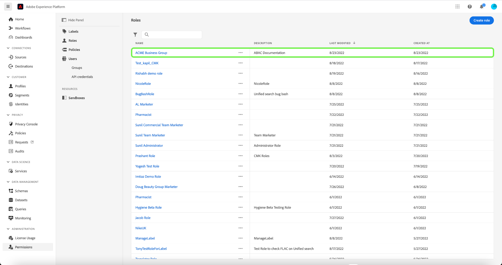
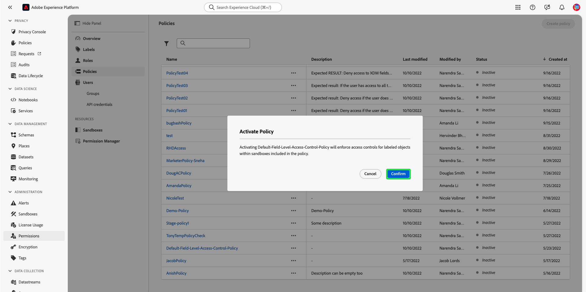
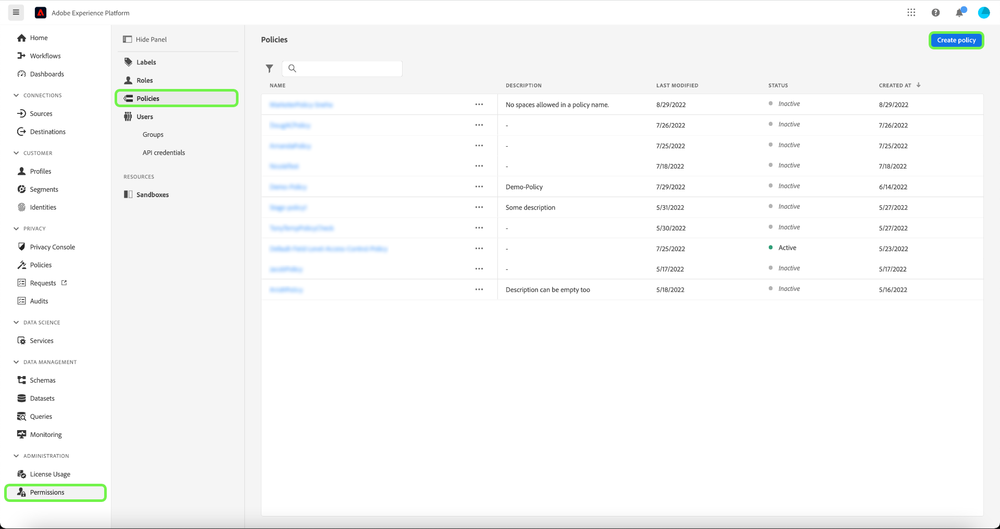
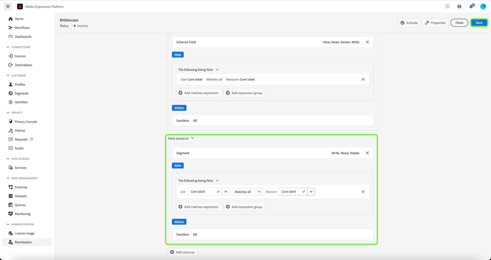
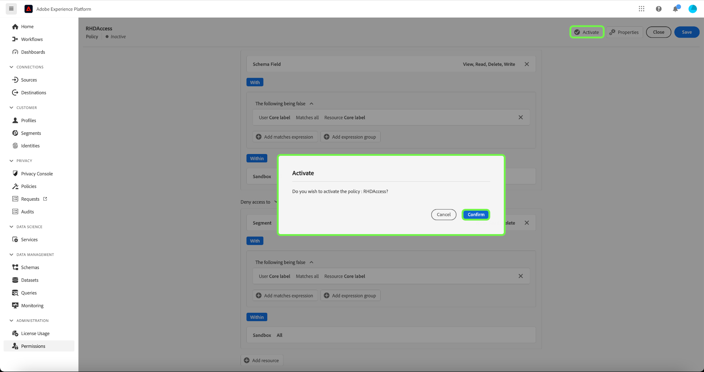

# Guida end-to-end al controllo degli accessi basato su attributi

Il controllo degli accessi basato sugli attributi è una funzionalità di Adobe Experience Platform che offre ai clienti multimarca e attenti alla privacy una maggiore flessibilità per gestire l’accesso degli utenti. L’accesso a singoli oggetti, come campi e segmenti dello schema, può essere concesso/negato con criteri basati sugli attributi e sul ruolo dell’oggetto. Questa funzione ti consente di concedere o revocare l’accesso a singoli oggetti per specifici utenti di Platform nella tua organizzazione.

Questa funzionalità consente di categorizzare campi schema, segmenti e così via con etichette che definiscono ambiti di utilizzo organizzativi o dei dati. Puoi applicare queste stesse etichette a percorsi, Offerte e altri oggetti in Adobe Journey Optimizer. Parallelamente, gli amministratori possono definire i criteri di accesso relativi ai campi dello schema Experience Data Model (XDM) e gestire meglio quali utenti o gruppi (interni, esterni o di terze parti) possono accedere a tali campi.

>[!NOTE]
>
>Questo documento si concentra sul caso d’uso dei criteri di controllo degli accessi. Se stai tentando di impostare criteri per gestire **utilizzare** dei dati, anziché gli utenti di Platform che vi hanno accesso, consulta la guida end-to-end su [governance dei dati](../../data-governance/e2e.md) invece.

## Introduzione

Questo tutorial richiede una buona conoscenza dei seguenti componenti di Platform:

* [[!DNL Experience Data Model (XDM)] Sistema](../../xdm/home.md): framework standardizzato tramite il quale Experienci Platform organizza i dati sull’esperienza del cliente.
   * [Nozioni di base sulla composizione dello schema](../../xdm/schema/composition.md): scopri gli elementi di base degli schemi XDM, compresi i principi chiave e le best practice nella composizione dello schema.
   * [Esercitazione sull’editor di schemi](../../xdm/tutorials/create-schema-ui.md): scopri come creare schemi personalizzati utilizzando l’interfaccia utente dell’Editor di schema.
* [Servizio di segmentazione di Adobe Experience Platform](../../segmentation/home.md): il motore di segmentazione in [!DNL Platform] utilizzato per creare segmenti di pubblico dai profili dei clienti in base ai comportamenti e agli attributi dei clienti.

### Panoramica del caso d’uso

Seguirai un esempio di flusso di lavoro di controllo degli accessi basato su attributi in cui potrai creare e assegnare ruoli, etichette e criteri per configurare se gli utenti possono o meno accedere a risorse specifiche dell’organizzazione. Questa guida utilizza un esempio di limitazione dell’accesso ai dati sensibili per illustrare il flusso di lavoro. Questo caso d’uso è descritto di seguito:

I professionisti del settore sanitario desiderano configurare l’accesso alle risorse dell’organizzazione.

* Il team marketing interno deve essere in grado di accedere **[!UICONTROL PHI/Dati sanitari regolamentati]** dati.
* L’agenzia esterna non dovrebbe poter accedere **[!UICONTROL PHI/Dati sanitari regolamentati]** dati.

A questo scopo, devi configurare ruoli, risorse e criteri.

Effettua le seguenti operazioni:

* [Etichettare i ruoli per gli utenti](#label-roles): utilizza l’esempio di un fornitore di assistenza sanitaria (ACME Business Group) il cui gruppo di marketing lavora con agenzie esterne.
* [Etichettare le risorse (campi e segmenti dello schema)](#label-resources): assegna il **[!UICONTROL PHI/Dati sanitari regolamentati]** assegnare un’etichetta alle risorse e ai segmenti dello schema.
* 
   * [Attiva i criteri che li collegheranno:](#policy): abilita il criterio predefinito per impedire l’accesso ai campi e ai segmenti dello schema collegando le etichette delle risorse alle etichette del ruolo. Gli utenti con etichette corrispondenti avranno quindi accesso al campo e al segmento dello schema in tutte le sandbox.

## Autorizzazioni

[!UICONTROL Autorizzazioni] è l’area di Experience Cloud in cui gli amministratori possono definire ruoli utente e criteri per gestire le autorizzazioni per funzioni e oggetti all’interno di un’applicazione di prodotto.

Da a [!UICONTROL Autorizzazioni], puoi creare e gestire i ruoli e assegnare le autorizzazioni per le risorse desiderate per tali ruoli. [!UICONTROL Le autorizzazioni ti consentono inoltre di gestire le etichette, le sandbox e gli utenti associati a un ruolo specifico.]

Se non disponi dei privilegi di amministratore, contatta l’amministratore di sistema per ottenere l’accesso.

Una volta che hai i privilegi di amministratore, vai a [Adobe Experience Cloud](https://experience.adobe.com/) e accedi utilizzando le tue credenziali di Adobe. Una volta effettuato l’accesso, il **[!UICONTROL Panoramica]** viene visualizzata per la tua organizzazione per la quale disponi dei privilegi di amministratore. Questa pagina mostra i prodotti a cui la tua organizzazione è abbonata, insieme ad altri controlli per aggiungere utenti e amministratori all’organizzazione. Seleziona **[!UICONTROL Autorizzazioni]** per aprire l’area di lavoro per l’integrazione con Platform.

Viene visualizzata l’area di lavoro Autorizzazioni per l’interfaccia utente di Platform, che si apre su **[!UICONTROL Ruoli]** pagina.

## Applicare etichette a un ruolo {#label-roles}

>[!CONTEXTUALHELP]
>id="platform_permissions_labels_about"
>title="Cosa sono le etichette?"
>abstract="Le etichette consentono di classificare set di dati e campi in base ai criteri di utilizzo applicati a tali dati. Platform fornisce diverse etichette di utilizzo dei dati principali definite da Adobe, che coprono un’ampia gamma di restrizioni comuni applicabili alla governance dei dati. Ad esempio, le etichette “S” per dati sensibili (ad esempio, dati RHD, Regulated Health Data) consentono di classificare i dati che fanno riferimento a informazioni sanitarie protette (PHI, Protected Health Information). Puoi anche definire etichette personalizzate che soddisfino le esigenze della tua organizzazione."
>additional-url="https://experienceleague.adobe.com/docs/experience-platform/data-governance/labels/overview.html#understanding-data-usage-labels" text="Panoramica delle etichette di utilizzo dei dati"

>[!CONTEXTUALHELP]
>id="platform_permissions_labels_about_create"
>title="Creare una nuova etichetta"
>abstract="Puoi creare etichette personalizzate per adattarle alle esigenze della tua organizzazione. Le etichette personalizzate possono essere utilizzate per applicare ai dati sia le configurazioni di governance dei dati che di controllo degli accessi."
>additional-url="https://experienceleague.adobe.com/docs/experience-platform/data-governance/labels/overview.html#manage-labels" text="Gestire le etichette personalizzate"

>[!CONTEXTUALHELP]
>id="platform_permissions_roles_about"
>title="Cosa sono i ruoli?"
>abstract="I ruoli consentono di classificare i tipi di utenti che interagiscono con l’istanza Platform e sono elementi fondamentali nei criteri di controllo degli accessi. Un ruolo dispone di un determinato set di autorizzazioni e i membri dell’organizzazione possono essere assegnati a uno o più ruoli, a seconda dell’ambito di accesso di visualizzazione o scrittura necessario."
>additional-url="https://experienceleague.adobe.com/docs/experience-platform/access-control/abac/permissions-ui/roles.html" text="Gestire i ruoli"

>[!CONTEXTUALHELP]
>id="platform_permissions_roles_about_create"
>title="Creare un nuovo ruolo"
>abstract="Puoi creare un nuovo ruolo per classificare meglio gli utenti che accedono all’istanza Platform. Ad esempio, puoi creare un ruolo per un gruppo marketing interno e applicare l’etichetta RHD a tale ruolo, consentendo al gruppo di accedere a informazioni sanitarie protette (PHI). In alternativa, puoi anche creare un ruolo per un ente esterno e negargli l’accesso ai dati PHI non applicando l’etichetta RHD a quel ruolo."
>additional-url="https://experienceleague.adobe.com/docs/experience-platform/access-control/abac/permissions-ui/roles.html#create-a-new-role" text="Creare un nuovo ruolo"

>[!CONTEXTUALHELP]
>id="platform_permissions_roles_details"
>title="Panoramica del ruolo"
>abstract="Nella finestra di dialogo della panoramica del ruolo vengono visualizzate le risorse e le sandbox a cui un determinato ruolo può accedere."

I ruoli sono modi per categorizzare i tipi di utenti che interagiscono con l’istanza Platform e sono blocchi predefiniti dei criteri di controllo degli accessi. Un ruolo dispone di un determinato set di autorizzazioni e i membri dell’organizzazione possono essere assegnati a uno o più ruoli, a seconda dell’ambito di accesso di cui hanno bisogno.

Per iniziare, seleziona **[!UICONTROL Gruppo aziendale ACME]** da da **[!UICONTROL Ruoli]** pagina.

Quindi, seleziona **[!UICONTROL Etichette]** e quindi seleziona **[!UICONTROL Aggiungi etichette]**.

Viene visualizzato un elenco di tutte le etichette dell’organizzazione. Seleziona **[!UICONTROL RHD]** per aggiungere l&#39;etichetta per **[!UICONTROL PHI/Dati sanitari regolamentati]**. Attendere qualche istante per visualizzare un segno di spunta blu accanto all&#39;etichetta, quindi selezionare **[!UICONTROL Salva]**.

>[!NOTE]
>
>Quando si aggiunge un gruppo organizzazione a un ruolo, tutti gli utenti di tale gruppo verranno aggiunti al ruolo. Eventuali modifiche apportate al gruppo di organizzazioni (utenti rimossi o aggiunti) verranno automaticamente aggiornate all’interno del ruolo.

## Applica etichette ai campi schema {#label-resources}

Ora che hai configurato un ruolo utente con [!UICONTROL RHD] , il passaggio successivo consiste nell&#39;aggiungere la stessa etichetta alle risorse che si desidera controllare per quel ruolo.

Seleziona **[!UICONTROL Schemi]** dal menu di navigazione a sinistra, quindi seleziona **[!UICONTROL ACME Healthcare]** dall’elenco degli schemi visualizzati.

Quindi, seleziona **[!UICONTROL Etichette]** per visualizzare un elenco in cui sono visualizzati i campi associati allo schema. Da qui è possibile assegnare le etichette a uno o più campi alla volta. Seleziona la **[!UICONTROL Glucosio ematico]** e **[!UICONTROL InsulinLevel]** e quindi selezionare **[!UICONTROL Applica etichette di accesso e governance dei dati]**.

Il **[!UICONTROL Modifica etichette]** viene visualizzata una finestra di dialogo che consente di scegliere le etichette da applicare ai campi schema. Per questo caso d’uso, seleziona la **[!UICONTROL PHI/Dati sanitari regolamentati]** etichetta, quindi seleziona **[!UICONTROL Salva]**.

>[!NOTE]
>
>Quando un’etichetta viene aggiunta a un campo, viene applicata alla risorsa principale del campo (una classe o un gruppo di campi). Se la classe o il gruppo di campi padre è utilizzato da altri schemi, questi ereditano la stessa etichetta.

## Applicare etichette ai segmenti

Dopo aver completato l’etichettatura dei campi dello schema, ora puoi iniziare a etichettare i segmenti.

Seleziona **[!UICONTROL Segmenti]** dal menu di navigazione a sinistra. Viene visualizzato un elenco dei segmenti disponibili nell’organizzazione. In questo esempio, i due segmenti seguenti devono essere etichettati in quanto contengono dati sanitari sensibili:

* Glucosio ematico > 100
* Insulina &lt; 50

Seleziona **[!UICONTROL Glucosio ematico > 100]** per iniziare a etichettare il segmento.

Il segmento **[!UICONTROL Dettagli]** viene visualizzata la schermata. Seleziona **[!UICONTROL Gestisci accesso]**.

Il **[!UICONTROL Modifica etichette]** viene visualizzata una finestra di dialogo che consente di scegliere le etichette da applicare al segmento. Per questo caso d’uso, seleziona la **[!UICONTROL PHI/Dati sanitari regolamentati]** etichetta, quindi seleziona **[!UICONTROL Salva]**.

Ripeti i passaggi precedenti con **[!UICONTROL Insulina &lt; 50]**.

## Attivare il criterio di controllo degli accessi {#policy}

I criteri di controllo di accesso predefiniti sfrutteranno le etichette per definire quali ruoli utente hanno accesso a risorse Platform specifiche. In questo esempio, l’accesso ai campi e ai segmenti dello schema verrà negato in tutte le sandbox per gli utenti che non si trovano in un ruolo con le etichette corrispondenti nel campo schema.

Per attivare il criterio di controllo degli accessi, selezionare [!UICONTROL Autorizzazioni] dal menu di navigazione a sinistra, quindi seleziona **[!UICONTROL Criteri]**.

Quindi, seleziona i puntini di sospensione (`...`) accanto al nome del criterio e un menu a discesa visualizza i controlli per modificare, attivare, eliminare o duplicare il ruolo. Seleziona **[!UICONTROL Attiva]** dal menu a discesa.

Viene visualizzata la finestra di dialogo attiva criterio, in cui viene richiesto di confermare l’attivazione. Seleziona **[!UICONTROL Conferma]**.

Viene ricevuta la conferma dell’attivazione del criterio e l’utente viene reindirizzato al [!UICONTROL Criteri] pagina.

<!-- ## Create an access control policy {#policy}

>[!CONTEXTUALHELP]
>id="platform_permissions_policies_about"
>title="What are policies?"
>abstract="Policies are statements that bring attributes together to establish permissible and impermissible actions. Every organization comes with a default policy that you must activate to define rules for resources like segments and schema fields. Default policies can neither be edited nor deleted. However, default policies can be activated or deactivated."
>additional-url="https://experienceleague.adobe.com/docs/experience-platform/access-control/abac/permissions-ui/policies.html" text="Manage policies"

>[!CONTEXTUALHELP]
>id="platform_permissions_policies_about_create"
>title="Create a policy"
>abstract="Create a policy to define the actions that your users can and cannot take against your segments and schema fields."
>additional-url="https://experienceleague.adobe.com/docs/experience-platform/access-control/abac/permissions-ui/policies.html#create-a-new-policy" text="Create a policy"

>[!CONTEXTUALHELP]
>id="platform_permissions_policies_edit_permitdeny"
>title="Configure permissible and impermissible actions for a policy"
>abstract="A <b>deny access to</b> policy will deny users access when the criteria is met. Combined with <b>The following being false</b> - all users will be denied access unless they meet the matching criteria set. This type of policy allows you to protect a sensitive resource and only allow access to users with matching labels.  A <b>permit access to</b> policy will permit users access when the criteria are met. When combined with <b>The following being true</b> - users will be given access if they meet the matching criteria set. This does not explicitly deny access to users, but adds a permit access. This type of policy allows you to give additional access to resource and in addition to those users who might already have access through role permissions."
>additional-url="https://experienceleague.adobe.com/docs/experience-platform/access-control/abac/permissions-ui/policies.html#edit-a-policy" text="Edit a policy"

>[!CONTEXTUALHELP]
>id="platform_permissions_policies_edit_resource"
>title="Configure permissions for a resource"
>abstract="A resource is the asset or object that a user can or cannot access. Resources can be segments or schemas fields. You can configure write, read, or delete permissions for segments and schema fields."

>[!CONTEXTUALHELP]
>id="platform_permissions_policies_edit_condition"
>title="Edit conditions"
>abstract="Apply conditional statements to your policy to configure user access to certain resources. Select match all to require users to have roles with the same labels as a resource to be permitted access. Select match any to require users to have a role with just one label matching a label on a resource. Labels can either be defined as core or custom labels, with core labels representing labels created and provided by Adobe and custom labels representing labels that you created for your organization."

Access control policies leverage labels to define which user roles have access to specific Platform resources. Policies can either be local or global and can override other policies. In this example, access to schema fields and segments will be denied in all sandboxes for users who don't have the corresponding labels in the schema field.

>[!NOTE]
>
>A "deny policy" is created to grant access to sensitive resources because the role grants permission to the subjects. The written policy in this example **denies** you access if you are missing the required labels.

To create an access control policy, select **[!UICONTROL Permissions]** from the left navigation and then select **[!UICONTROL Policies]**. Next, select **[!UICONTROL Create policy]**.

The **[!UICONTROL Create new policy]** dialog appears, prompting you to enter a name and an optional description. Select **[!UICONTROL Confirm]** when finished.

To deny access to the schema fields, use the dropdown arrow and select **[!UICONTROL Deny access to]** and then select **[!UICONTROL No resource selected]**. Next, select **[!UICONTROL Schema Field]** and then select **[!UICONTROL All]**.

The table below shows the conditions available when creating a policy:

| Conditions | Description |
| --- | --- |
| The following being false| When 'Deny access to' is set, access will be restricted if the user does not meet the criteria selected. |
| The following being true| When 'Permit access to' is set, access will be permitted if the user meets the selected criteria. |
| Matches any| The user has a label that matches any label applied to a resource. |
| Matches all| The user has all labels that matches all labels applied to a resource. |
| Core label| A core label is an Adobe-defined label that is available in all Platform instances.|
| Custom label| A custom label is a label that has been created by your organization.|

Select **[!UICONTROL The following being false]** and then select **[!UICONTROL No attribute selected]**. Next, select the user **[!UICONTROL Core label]**, then select **[!UICONTROL Matches all]**. Select the resource **[!UICONTROL Core label]** and finally select **[!UICONTROL Add resource]**.

>[!TIP]
>
>A resource is the asset or object that a subject can or cannot access. Resources can be segments or schemas.

To deny access to the segments, use the dropdown arrow and select **[!UICONTROL Deny access to]** and then select **[!UICONTROL No resource selected]**. Next, select **[!UICONTROL Segment]** and then select **[!UICONTROL All]**.

Select **[!UICONTROL The following being false]** and then select **[!UICONTROL No attribute selected]**. Next, select the user **[!UICONTROL Core label]**, then select **[!UICONTROL Matches all]**. Select the resource **[!UICONTROL Core label]** and finally select **[!UICONTROL Save]**.

Select **[!UICONTROL Activate]** to activate the policy, and a dialog appears which prompts you to confirm activation. Select **[!UICONTROL Confirm]** and then select **[!UICONTROL Close]**.

 -->

## Passaggi successivi

Hai completato l’applicazione delle etichette a un ruolo, ai campi dello schema e ai segmenti. L’agenzia esterna assegnata a questi ruoli non può visualizzare queste etichette e i relativi valori nella vista schema, set di dati e profilo. Inoltre, questi campi non possono essere utilizzati nella definizione del segmento quando si utilizza il Generatore di segmenti.

Per ulteriori informazioni sul controllo degli accessi basato su attributi, vedere [panoramica sul controllo degli accessi basato su attributi](./overview.md).

Il video seguente ha lo scopo di illustrare il controllo degli accessi basato su attributi e illustra come configurare ruoli, risorse e criteri.

>[!VIDEO](https://video.tv.adobe.com/v/345641?learn=on)
