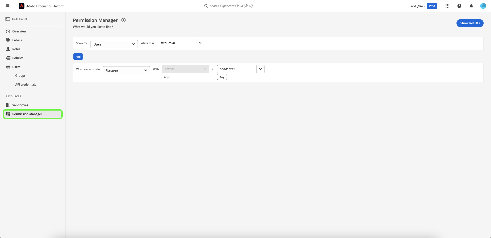

# Panoramica di Gestione autorizzazioni {#attribute-based-access-control-overview}

>[!NOTE]
>
>Per accedere a [!UICONTROL Gestione autorizzazioni], è necessario essere un amministratore di prodotto. Se non disponi dei privilegi di amministratore, contatta l’amministratore di sistema per ottenere l’accesso.

La funzionalità [!UICONTROL Gestione autorizzazioni] fornisce report e consente di visualizzare l&#39;ambiente di controllo degli accessi completo. Utilizzando query semplici, puoi generare rapporti chiari che ti aiuteranno a comprendere la gestione degli accessi e a dedicare meno tempo alla verifica delle autorizzazioni di accesso in numerosi flussi di lavoro e livelli di granularità.

Con [!UICONTROL Gestione autorizzazioni], puoi eseguire ricerche in base a:

* [Utenti e gruppo di utenti](./permissions.md)
* [Ruoli ed etichette](./permissions.md)

Puoi limitare la ricerca selezionando risorse, azioni e sandbox specifiche.

Per accedere a [!UICONTROL Gestione autorizzazioni] per [!DNL Experience Platform], è necessario essere un amministratore per un&#39;organizzazione con accesso a Platform. Sebbene Adobe consenta gerarchie di amministratori personalizzabili all&#39;interno dell&#39;organizzazione, è necessario essere un amministratore di prodotto per [!DNL Adobe Experience Platform]. Per ulteriori dettagli, consulta l&#39;articolo di Adobe Help Center su [ruoli di amministrazione](https://helpx.adobe.com/it/enterprise/using/admin-roles.html).

Accedi a [Adobe Experience Platform](https://experience.adobe.com/) utilizzando le tue credenziali [!DNL Adobe].  Dopo aver effettuato l&#39;accesso, verrà visualizzata la pagina **[!UICONTROL Panoramica]** per la tua organizzazione. In questa pagina vengono visualizzati i prodotti a cui la tua organizzazione è abbonata. Per avviare l&#39;area di lavoro di controllo degli accessi basata su attributi per l&#39;integrazione con la piattaforma, selezionare **[!UICONTROL Autorizzazioni]**.

Viene visualizzata l&#39;area di lavoro di controllo degli accessi basata su attributi per Platform, che si apre nella pagina **[!UICONTROL Panoramica]**. Questa pagina consente di visualizzare tutti i ruoli e di gestire le varie impostazioni come descritto in questo documento.

Seleziona **[!UICONTROL Gestione autorizzazioni]** dal menu di navigazione a sinistra.

## Passaggi successivi

Dopo aver visitato l&#39;area di lavoro [!UICONTROL Gestione autorizzazioni], passare al passaggio successivo per ulteriori informazioni su come [cercare utenti e ruoli](./permissions.md).
