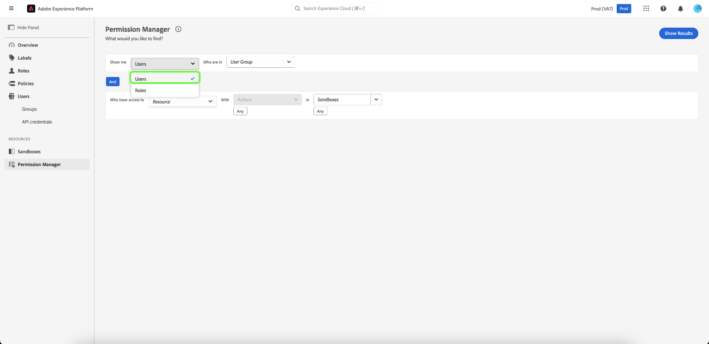
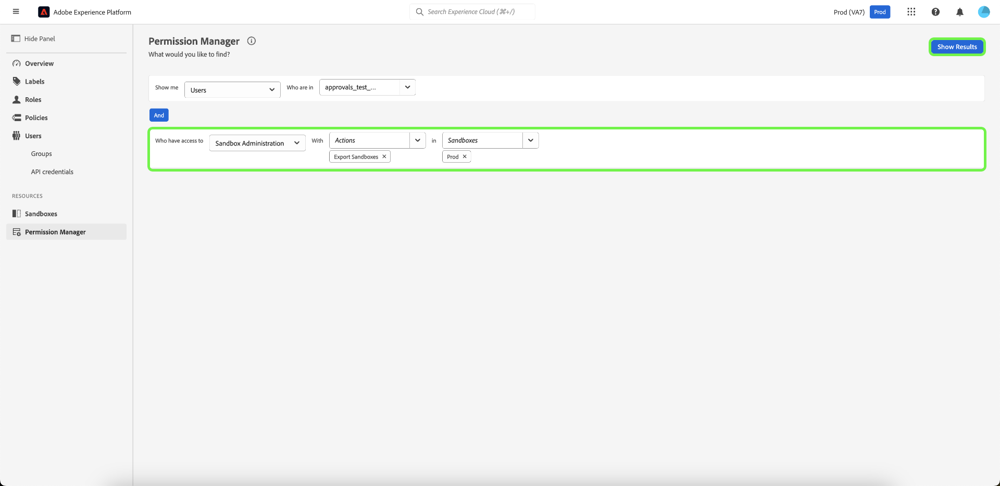

# Gestione autorizzazioni

>[!NOTE]
>
>Per accedere a [!UICONTROL Gestione autorizzazioni], è necessario essere un amministratore di prodotto. Se non disponi dei privilegi di amministratore, contatta l’amministratore di sistema per ottenere l’accesso.

Utilizza query semplici in [!UICONTROL Gestione autorizzazioni] per creare rapporti concisi che ti aiuteranno a comprendere la gestione degli accessi e a risparmiare tempo nella convalida delle autorizzazioni di accesso in molti flussi di lavoro e livelli di granularità. È possibile utilizzare [!UICONTROL Gestione autorizzazioni] per trovare gli utenti che appartengono a un gruppo di utenti e dispongono dei privilegi di accesso specificati, nonché i ruoli con etichette specifiche.

## Eseguire una ricerca di utenti all&#39;interno di un gruppo di utenti specificato {#search-users}

>[!CONTEXTUALHELP]
>id="platform_permission_manager"
>title="Gestione autorizzazioni"
>abstract="Utilizza i selettori a discesa nella pagina per ottenere rapporti sul livello di accesso di diversi livelli di granularità per utenti e ruoli."
<!-- >additional-url="https://experienceleague.adobe.com/docs/experience-platform/access-control/abac/permissions-manager/permissions.html" text="Permission manager" -->

Utilizzando il menu a discesa, selezionare l&#39;attributo **[!UICONTROL Utenti]**.

Selezionare quindi il **[!UICONTROL gruppo utenti]** che si desidera cercare utilizzando il menu a discesa.

>[!INFO]
>
>[!UICONTROL Il gruppo utenti] non è un campo obbligatorio. Puoi selezionare un solo gruppo di utenti per ogni rapporto.

Per un rapporto più granulare, puoi specificare la risorsa con le azioni in una particolare sandbox. Seleziona **[!UICONTROL Risorsa]**, **[!UICONTROL Azioni]** e **[!UICONTROL Sandbox]** dal menu a discesa, quindi seleziona **[!UICONTROL Mostra risultati]**.

>[!INFO]
>
>[!UICONTROL Risorsa], [!UICONTROL Azioni] e [!UICONTROL Sandbox] non sono campi obbligatori. È possibile selezionare una sola [!UICONTROL risorsa] per ogni report. Una volta aggiunta, è possibile rimuovere un&#39;azione o una sandbox selezionando **&#39;x&#39;** accanto alla selezione da rimuovere.

Un elenco di utenti e il loro indirizzo e-mail vengono segnalati in base ai criteri selezionati. Utilizza il menu dei filtri a sinistra per aggiornare gli attributi e i risultati. Per ulteriori informazioni su un utente specifico, selezionare il nome utente dall&#39;elenco.

## Cerca ruoli con etichette specifiche {#search-roles}

Utilizzando il menu a discesa, seleziona l&#39;attributo **[!UICONTROL Ruoli]**.

>[!INFO]
>
>[!UICONTROL Etichette] non è un campo obbligatorio. Puoi selezionare più etichette, che verranno elencate sotto questo elenco a discesa una volta selezionate. Una volta aggiunta, è possibile rimuovere un&#39;etichetta selezionando **&#39;x&#39;** accanto all&#39;azione.

Quindi, seleziona le **[!UICONTROL etichette]** che desideri cercare utilizzando il menu a discesa.

Per un rapporto più granulare, puoi specificare la risorsa con le azioni in una particolare sandbox. Seleziona **[!UICONTROL Risorsa]**, **[!UICONTROL Azioni]** e **[!UICONTROL Sandbox]** dal menu a discesa, quindi seleziona **[!UICONTROL Mostra risultati]**.

>[!INFO]
>
>[!UICONTROL Risorsa], [!UICONTROL Azioni] e [!UICONTROL Sandbox] non sono campi obbligatori. È possibile selezionare una sola [!UICONTROL risorsa] per ogni report. Una volta aggiunta, è possibile rimuovere un&#39;azione o una sandbox selezionando **&#39;x&#39;** accanto alla selezione da rimuovere.

Viene segnalato un elenco di ruoli in base ai criteri selezionati. Utilizza il menu dei filtri a sinistra per aggiornare gli attributi e i risultati. Per ulteriori informazioni su un ruolo specifico, selezionarlo dall&#39;elenco.

Per ogni ruolo corrispondente ai criteri specificati vengono visualizzate le seguenti informazioni:

| Attributo | Descrizione |
| --- | --- |
| Descrizione | Breve descrizione del ruolo. |
| Etichette | Elenco di etichette associate al ruolo. |
| Sandbox | Un elenco di Sanbox contenenti questo ruolo. |
| Modificato | La data e la marca temporale dell’ultimo aggiornamento del ruolo. |
| Creato a | La data e la marca temporale di creazione del ruolo. |
| Creato da | Dettagli del creatore del ruolo. |

## Passaggi successivi

Ora hai imparato a generare rapporti per utenti e ruoli. Per ulteriori informazioni sul controllo degli accessi basato su attributi, vedere la [panoramica sul controllo degli accessi basato su attributi](../overview.md).
