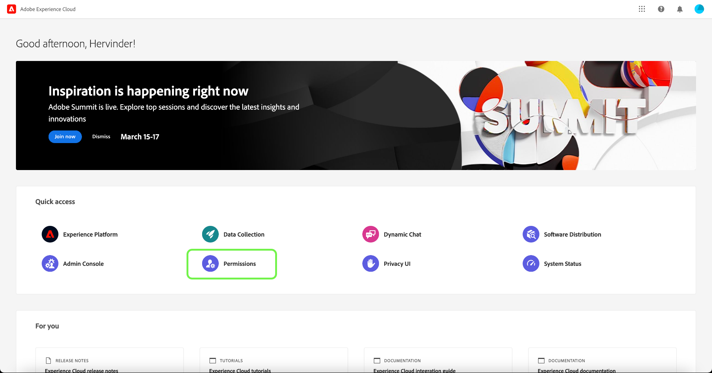

# Guida alle autorizzazioni

>[!IMPORTANT]
>
>Il controllo dell&#39;accesso basato su attributi è attualmente disponibile in una versione limitata per i clienti del settore sanitario negli Stati Uniti. Questa funzionalità sarà disponibile per tutti i clienti Real-time Customer Data Platform una volta rilasciata.

Le autorizzazioni sono l’area di Adobe Experience Cloud in cui gli amministratori possono definire ruoli utente e criteri di accesso per gestire le autorizzazioni di accesso per funzioni e oggetti all’interno di un’applicazione di prodotto.

Con le autorizzazioni, puoi configurare:

* [Etichette](./labels.md)
* [Autorizzazioni](./permissions.md)
* [Criteri](./permissions.md)
* [Ruoli](./roles.md)
* [Sandbox](./sandboxes.md)
* [Utenti](./users.md)

Per accedere alle autorizzazioni di controllo degli accessi basate su attributi per [!DNL Experience Cloud], devi essere un amministratore per la tua organizzazione con una sottoscrizione a [!DNL Experience Cloud]. Sebbene Adobe supporti gerarchie di amministratori flessibili per le organizzazioni, per configurare le autorizzazioni è necessario essere un amministratore di prodotto per Adobe Experience Platform. Consulta l’articolo Adobe Help Center su [ruoli amministrativi](https://helpx.adobe.com/enterprise/using/admin-roles.html) per ulteriori informazioni.

Se non disponi di privilegi di amministratore, contatta l’amministratore di sistema per ottenere l’accesso.

Una volta disponibili i privilegi di amministratore, vai a [Adobe Experience Cloud](https://experience.adobe.com/) e accedi utilizzando le tue credenziali Adobe. Una volta effettuato l&#39;accesso, il **[!UICONTROL Panoramica]** viene visualizzata la pagina della tua organizzazione per la quale disponi dei privilegi di amministratore. Questa pagina mostra i prodotti a cui l’organizzazione è abbonata, insieme ad altri controlli per aggiungere utenti e amministratori all’organizzazione nel suo complesso. Seleziona **[!UICONTROL Autorizzazioni]** per aprire l’area di lavoro di controllo accessi basata sugli attributi per l’integrazione con Platform.

Viene visualizzata l&#39;area di lavoro di controllo accessi basata sugli attributi per Adobe Experience Cloud, che si apre nella **[!UICONTROL Ruoli]** pagina. Questa pagina ti consente di visualizzare tutti i ruoli e di gestire diverse impostazioni come descritto in questo documento.

>[!IMPORTANT]
>
>Una volta che l’organizzazione è abilitata per il controllo degli accessi basato su attributi, puoi iniziare a utilizzare Autorizzazioni su Adobe Experience Cloud, invece dei profili di prodotto in Adobe Admin Console, per gestire le autorizzazioni per utenti, funzionalità, etichette e altre risorse dell’organizzazione.

Questa guida utente si concentra su come utilizzare [!DNL Experience Cloud] per assegnare le autorizzazioni di accesso a Platform. Per informazioni più generali sulla navigazione nel [!DNL Admin Console], vedi [Guida utente di Admin Console](https://helpx.adobe.com/it/enterprise/using/admin-console.html).

## Passaggi successivi

Dopo aver navigato nell&#39;area di lavoro delle autorizzazioni, procedi al passaggio successivo a [creare un nuovo ruolo](roles.md).
