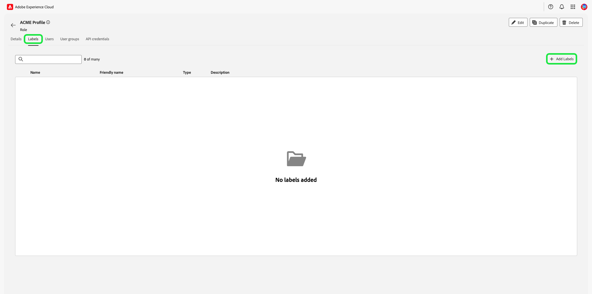
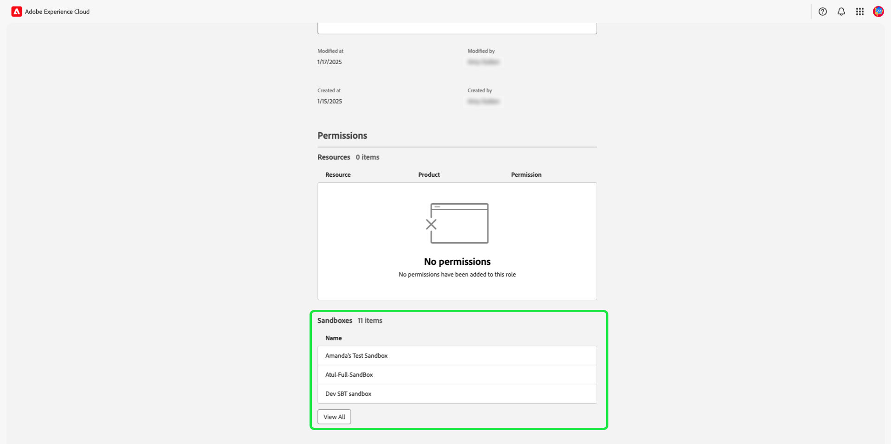

# Gestire le autorizzazioni per un ruolo {#manage-role-permissions}

>[!CONTEXTUALHELP]
>id="platform_permissions_roles_about"
>title="Che cosa sono i ruoli?"
>abstract="I ruoli definiscono l’accesso di un amministratore, uno specialista o un utente finale alle risorse della tua organizzazione. Categorizzano gli utenti che interagiscono con l’istanza di Experience Platform e sono gli elementi alla base dei criteri di controllo degli accessi. Un ruolo dispone di un determinato set di autorizzazioni e i membri dell’organizzazione possono essere assegnati a uno o più ruoli, a seconda dell’ambito di accesso di visualizzazione o scrittura necessario."
>additional-url="https://experienceleague.adobe.com/docs/experience-platform/access-control/abac/permissions-ui/roles.html?lang=it" text="Gestire i ruoli"

>[!IMPORTANT]
>
>Per la concessione delle autorizzazioni, il controllo degli accessi utilizza l’ID utente (un ID univoco interno assegnato a un utente). Quando un’organizzazione viene migrata da Adobe ID a Business ID, tutte le autorizzazioni impostate per i relativi utenti andranno perse perché l’ID utente viene modificato e il controllo degli accessi utilizzerà l’ID utente appena generato. Se l’organizzazione viene migrata al Business ID, contatta il rappresentante Adobe per migrare l’ID utente da Adobe ID al Business ID.

Autorizzazioni è l’area di Experience Cloud in cui gli amministratori possono definire i ruoli utente e i criteri di accesso per gestire le autorizzazioni di accesso per funzioni e oggetti all’interno di un’applicazione di prodotto.

Tramite le Autorizzazioni, puoi creare e gestire i ruoli, nonché assegnare le autorizzazioni per le risorse desiderate per tali ruoli. Le autorizzazioni ti consentono inoltre di gestire le etichette, le sandbox e gli utenti associati a un ruolo specifico.

Immediatamente dopo la [creazione di una nuova mansione](#create-a-new-role), si ritorna alla scheda **[!UICONTROL Roles]**. Se si stanno modificando le autorizzazioni per un ruolo esistente, selezionare il ruolo dalla scheda **[!UICONTROL Roles]**. In alternativa, utilizza l’opzione di filtro per filtrare i risultati e trovare un ruolo.

## Filtra ruoli

Selezionare l&#39;icona funnel () per visualizzare un elenco di controlli filtro per limitare i risultati.

Nell’interfaccia utente sono disponibili i seguenti filtri per i ruoli:

| Filtro | Descrizione |
| --- | --- |
| [!UICONTROL Created between] | Seleziona una data di inizio e/o una data di fine per definire un intervallo di date in base al quale filtrare i risultati. |
| [!UICONTROL Created by] | Filtra per creatore di ruoli selezionando un utente dal menu a discesa. |
| [!UICONTROL Modified between] | Seleziona una data di inizio e/o una data di fine per definire un intervallo di date in base al quale filtrare i risultati. |
| [!UICONTROL Modified by] | Filtra per modificatore di ruolo selezionando un utente dal menu a discesa. |

Per rimuovere un filtro, selezionare la &quot;X&quot; sull&#39;icona della pillola per il filtro in questione, oppure selezionare **[!UICONTROL Clear all]** per rimuovere tutti i filtri.

## Dettagli del ruolo {#role-details}

>[!CONTEXTUALHELP]
>id="platform_permissions_roles_details"
>title="Panoramica del ruolo"
>abstract="La finestra di dialogo della panoramica sui ruoli mostra i dettagli del ruolo, incluse le risorse e le sandbox a cui un determinato ruolo può accedere. Per gestire etichette, utenti, gruppi di utenti e credenziali API per il ruolo, passa alla scheda corrispondente dell’area di lavoro del ruolo."
>additional-url="https://experienceleague.adobe.com/it/docs/experience-platform/access-control/abac/permissions-ui/permissions#manage-labels-for-a-role" text="Gestire le etichette per un ruolo"
>additional-url="https://experienceleague.adobe.com/it/docs/experience-platform/access-control/abac/permissions-ui/permissions#manage-users-for-a-role" text="Gestire gli utenti per un ruolo"

Selezionare il ruolo dalla scheda **[!UICONTROL Roles]**, che aprirà il dashboard [!UICONTROL Details] del ruolo.

Il dashboard [!UICONTROL Details] fornisce una panoramica del ruolo. Nella panoramica vengono visualizzati il nome del ruolo, la descrizione, l’autore e l’ultimo modificatore, oltre alle date di creazione e modifica. Vengono inoltre visualizzate le autorizzazioni associate al ruolo e l’elenco delle sandbox assegnate. Se necessario, è possibile modificare il nome e la descrizione del ruolo.

## Gestire le etichette per un ruolo

Selezionare la scheda **[!UICONTROL Labels]** per aprire l&#39;area di lavoro delle etichette dei ruoli, quindi selezionare **[!UICONTROL Add labels]** per assegnare le etichette al ruolo.

Viene visualizzata la finestra di dialogo **[!UICONTROL Apply Access and Data Governance Labels]**, che presenta un elenco di etichette. Nell&#39;elenco vengono visualizzati il nome dell&#39;etichetta, il nome descrittivo, la categoria e la relativa descrizione.

Selezionare le etichette dall&#39;elenco da aggiungere al ruolo, quindi selezionare **[!UICONTROL Save]**

Le etichette aggiunte vengono visualizzate nella scheda **[!UICONTROL Labels]**.

Per rimuovere un&#39;etichetta da un ruolo, selezionare l&#39;etichetta, quindi selezionare **[!UICONTROL Remove Labels]**.

## Gestire le sandbox per un ruolo

Selezionare la scheda **[!UICONTROL Details]** e passare alla sezione **[!UICONTROL Sandboxes]**. Selezionare **[!UICONTROL View All]** per visualizzare l&#39;elenco completo delle sandbox aggiunte al ruolo.

Per aggiungere altre sandbox a un ruolo, seleziona **[!UICONTROL Edit]** in alto a destra nell&#39;interfaccia utente.

Nella schermata successiva viene richiesto di scegliere le risorse sandbox da includere nel ruolo utilizzando il menu a discesa. Al termine, selezionare **[!UICONTROL Save]** e quindi **[!UICONTROL Close]**.

## Gestire gli utenti per un ruolo

Selezionare la scheda **[!UICONTROL Users]** per aprire l&#39;area di lavoro ruoli [!UICONTROL Users], quindi selezionare **[!UICONTROL Add Users]** per assegnare gli utenti al ruolo.

Viene visualizzata la finestra di dialogo **[!UICONTROL Add Users]**. Selezionare gli utenti dall&#39;elenco che si desidera aggiungere al ruolo. In alternativa, utilizzare la barra di ricerca per cercare l&#39;utente immettendo il proprio nome o indirizzo di posta elettronica, quindi selezionare **[!UICONTROL Save]**

Gli utenti aggiunti vengono visualizzati nella scheda **[!UICONTROL Users]**.

Per rimuovere un utente da un ruolo, selezionare l&#39;icona **X** accanto al nome dell&#39;utente.

Il video seguente ha lo scopo di aiutare a comprendere come creare un nuovo ruolo e come gestire gli utenti per tale ruolo.

>[!VIDEO](https://video.tv.adobe.com/v/336081/?learn=on)

## Gestire le credenziali API per un ruolo {#manage-api-credentials-for-role}

>[!CONTEXTUALHELP]
>id="platform_permissions_apicredentials_about"
>title="Che cosa sono le credenziali API?"
>abstract="Le credenziali API vengono assegnate ai ruoli per concedere a utenti e sviluppatori l’accesso alle API di Experience Platform. Utilizzando le API di Experience Platform, puoi eseguire in modo programmatico operazioni CRUD (Create, Read, Update, Delete) di base sui dati, ad esempio la configurazione di attributi calcolati, l’accesso a dati/entità, l’esportazione di dati, l’eliminazione di dati o batch non necessari e altro ancora."
>additional-url="https://experienceleague.adobe.com/it/docs/experience-platform/landing/platform-apis/api-guide" text="Guida delle API di Experience Platform"

>[!IMPORTANT]
>
> Per utilizzare e gestire le credenziali API in [!UICONTROL Permissions], gli utenti devono disporre dei privilegi di amministratore di sistema.

Per utilizzare le API di Experience Platform come utente o sviluppatore, un amministratore di sistema deve aggiungere credenziali API oltre al set di autorizzazioni assegnato da un ruolo. Per una guida completa sulla creazione e l&#39;assegnazione delle credenziali API e sulle autorizzazioni necessarie, consulta l&#39;esercitazione dettagliata in [autenticare e accedere alle API di Experience Platform](../../../landing/api-authentication.md#generate-credentials).

Selezionare la scheda **[!UICONTROL API credentials]** per aprire l&#39;area di lavoro delle credenziali API dei ruoli, quindi selezionare **[!UICONTROL Add API credentials]** per assegnare le credenziali API al ruolo.

Viene visualizzata la finestra di dialogo **[!UICONTROL Add API credentials]**. Selezionare le credenziali API dall&#39;elenco da aggiungere al ruolo, quindi selezionare **[!UICONTROL Save]**

Le credenziali API aggiunte vengono visualizzate nella scheda **[!UICONTROL API credentials]**.

Per rimuovere una credenziale API da un ruolo, selezionare l&#39;icona **X** accanto al nome della credenziale API.

Viene visualizzata la finestra di dialogo **[!UICONTROL Remove API credentials]** in cui viene richiesto di confermare l&#39;eliminazione. Selezionare **[!UICONTROL Confirm]** per completare la rimozione delle credenziali selezionate.

Verrà visualizzata di nuovo la scheda **[!UICONTROL API credentials]**.

## Gestire gruppi di utenti per un ruolo {#manage-user-groups}

>[!CONTEXTUALHELP]
>id="platform_permissions_usergroups_about"
>title="Che cosa sono i gruppi di utenti?"
>abstract="I gruppi di utenti sono insiemi di più utenti che condividono l’accesso alle stesse funzioni. L’accesso alle risorse all’interno di un’organizzazione viene gestito tramite i ruoli assegnati ai gruppi di utenti."
>additional-url="https://experienceleague.adobe.com/it/docs/experience-platform/access-control/abac/permissions-ui/roles" text="Gestire i ruoli"

I gruppi di utenti sono utenti multipli che sono stati raggruppati e hanno accesso per eseguire le stesse funzioni.

Selezionare la scheda **[!UICONTROL User groups]** per aprire l&#39;area di lavoro dei gruppi di utenti del ruolo, quindi selezionare **[!UICONTROL Add Groups]** per assegnare gruppi di utenti al ruolo.

Viene visualizzata la finestra di dialogo **[!UICONTROL Add Groups]**. Selezionare i gruppi di utenti dall&#39;elenco che si desidera aggiungere al ruolo. In alternativa, utilizzare la barra di ricerca per cercare il gruppo di utenti immettendo il nome del gruppo, quindi selezionare **[!UICONTROL Save]**

Il gruppo di utenti aggiunto viene visualizzato nella scheda **[!UICONTROL User groups]**.

Per rimuovere un gruppo utenti da un ruolo, selezionare l&#39;icona **X** accanto al nome del gruppo utenti.

Viene visualizzata la finestra di dialogo **[!UICONTROL Remove user group]** in cui viene richiesto di confermare l&#39;eliminazione. Selezionare **[!UICONTROL Confirm]** per rimuovere il gruppo utenti selezionato.

Verrà visualizzata di nuovo la scheda **[!UICONTROL User groups]**.

## Aggiungere utenti ad Experience Platform

In qualità di amministratore di sistema, puoi concedere agli sviluppatori l&#39;accesso a un utente in modo che possano [creare integrazioni](../../../landing/api-authentication.md#generate-credentials) in Adobe Developer Console.

Per aggiungere un Experience Platform utente, accedi a [Admin Console](https://adminconsole.adobe.com) e seleziona **[!UICONTROL Add users]**.

Viene visualizzata la finestra di dialogo **[!UICONTROL Add users to your team]**. Immettere l&#39;indirizzo di posta elettronica, il nome (facoltativo) e il cognome (facoltativo) dell&#39;utente. Quindi selezionare **[!UICONTROL Products]**.

Viene visualizzata la finestra di dialogo **[!UICONTROL Select products]**. Seleziona **[!UICONTROL Adobe Experience Platform]**.

Viene visualizzata la finestra di dialogo **[!UICONTROL Select product profiles]**. Seleziona **[!UICONTROL AEP-Default-All-Users]**, quindi seleziona **[!UICONTROL Save]**.

Rivedere le informazioni, quindi selezionare **[!UICONTROL Save]** per aggiungere l&#39;utente.

## Passaggi successivi

Una volta stabilite le autorizzazioni, puoi passare al passaggio successivo per [gestire gli utenti](users.md).
