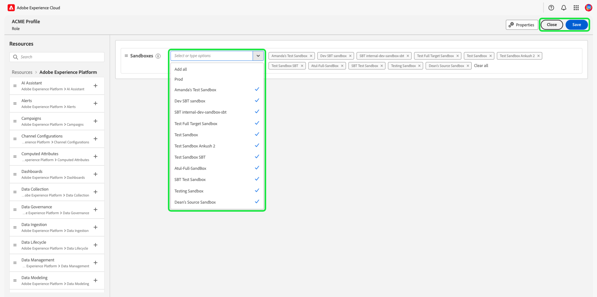
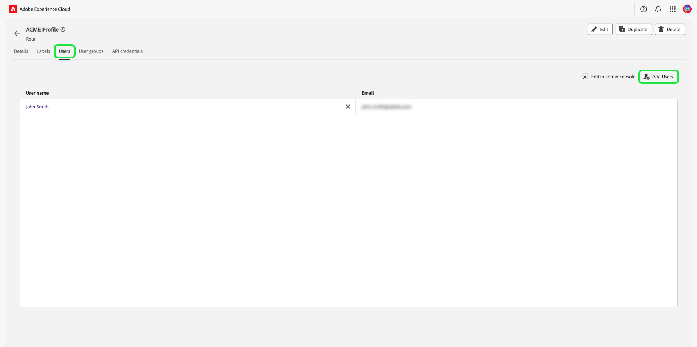

# Gestire le autorizzazioni per un ruolo

>[!IMPORTANT]
>
>Il controllo di accesso utilizza l&#39;ID utente (un ID univoco interno assegnato a un utente) per concedere le autorizzazioni. Quando un&#39;organizzazione viene migrata da Adobe ID a Business ID, tutte le autorizzazioni impostate per i suoi utenti andranno perse perché l&#39;ID utente cambia e il controllo degli accessi utilizza l&#39;ID utente appena generato. Se la tua organizzazione viene migrata a Business ID, contatta il tuo rappresentante di Adobe per migrare il tuo ID utente da Adobe ID a Business ID.

Le autorizzazioni sono l’area di Experience Cloud in cui gli amministratori possono definire ruoli utente e criteri di accesso per gestire le autorizzazioni di accesso per funzioni e oggetti all’interno di un’applicazione di prodotto.

Mediante le Autorizzazioni di , , puoi creare e gestire i ruoli, nonché assegnare le autorizzazioni per le risorse desiderate per tali ruoli. Le autorizzazioni ti consentono inoltre di gestire le etichette, le sandbox e gli utenti associati a un ruolo specifico.

Immediatamente dopo [creazione di un nuovo ruolo](#create-a-new-role), viene restituita la **[!UICONTROL Ruoli]** scheda . Se stai modificando le autorizzazioni per un ruolo esistente, seleziona il ruolo dal **[!UICONTROL Ruoli]** scheda . In alternativa, utilizza l’opzione filtro per filtrare i risultati e trovare un ruolo.

## Filtrare i ruoli

Seleziona l’icona funnel () per visualizzare un elenco di controlli filtro per limitare i risultati.

I seguenti filtri sono disponibili per i ruoli nell’interfaccia utente di :

| Filtro | Descrizione |
| --- | --- |
| [!UICONTROL Creato tra] | Seleziona una data di inizio e/o una data di fine per definire un intervallo di date in cui filtrare i risultati. |
| [!UICONTROL Creato da] | Filtrare per creatore di ruoli selezionando un utente dal menu a discesa. |
| [!UICONTROL Modificato tra] | Seleziona una data di inizio e/o una data di fine per definire un intervallo di date in cui filtrare i risultati. |
| [!UICONTROL Modificato da] | Filtrare per modificatore di ruolo selezionando un utente dal menu a discesa. |

Per rimuovere un filtro, seleziona la &quot;X&quot; sull&#39;icona della pillola per il filtro in questione o seleziona **[!UICONTROL Cancella tutto]** per rimuovere tutti i filtri.

## Dettagli del ruolo

Seleziona il ruolo dal **[!UICONTROL Ruoli]** , che aprirà la pagina dei dettagli del ruolo.

La scheda dei dettagli fornisce una panoramica del ruolo. Nella panoramica vengono visualizzati il nome del ruolo, la descrizione del ruolo, il nome dell’utente che ha creato e modificato il ruolo, quando il ruolo è stato creato e modificato e le autorizzazioni associate al ruolo. Se necessario, è possibile modificare il nome del ruolo e la descrizione del ruolo.

## Gestione delle etichette per un ruolo

Seleziona la **[!UICONTROL Etichette]** per aprire la pagina delle etichette dei ruoli, quindi selezionare **[!UICONTROL Aggiungi etichette]** per assegnare etichette al ruolo.

Le etichette sono elencate in questa pagina. Nell’elenco sono visualizzati il nome dell’etichetta, il nome descrittivo, la categoria e la relativa descrizione.

Seleziona le etichette dall’elenco da aggiungere al ruolo, quindi seleziona **[!UICONTROL Salva]**

Le etichette aggiunte vengono visualizzate in **[!UICONTROL Etichette]** scheda .

Per rimuovere un’etichetta da un ruolo, seleziona la **X** accanto al nome delle etichette.

## Gestione delle sandbox per il ruolo

Seleziona la **[!UICONTROL Sandbox]** per aprire la pagina sandbox dei ruoli . Qui puoi vedere un elenco delle sandbox che sono state aggiunte al ruolo .

Per aggiungere più sandbox a un ruolo seleziona **[!UICONTROL Modifica]**.

Nella schermata successiva viene richiesto di scegliere le autorizzazioni di risorse esistenti nelle sandbox da includere nel ruolo utilizzando il menu a discesa . Al termine, seleziona **[!UICONTROL Salva e chiudi]**.

## Gestione degli utenti per il ruolo

Seleziona la **[!UICONTROL Utenti]** per aprire la pagina ruoli utenti , quindi seleziona **[!UICONTROL Aggiungi utenti]** per assegnare gli utenti al ruolo.

Seleziona gli utenti dall’elenco da aggiungere al ruolo. In alternativa, utilizza la barra di ricerca per cercare l’utente inserendo il proprio nome o indirizzo e-mail, quindi seleziona **[!UICONTROL Salva]**

Gli utenti aggiunti vengono visualizzati in **[!UICONTROL Utenti]** scheda .

Per rimuovere un utente da un ruolo, seleziona la **X** accanto al nome utente.

## Gestione delle credenziali API per il ruolo

Seleziona la **[!UICONTROL Credenziali API]** per aprire la pagina delle credenziali API dei ruoli, quindi seleziona **[!UICONTROL Aggiungi credenziali API]** per assegnare le credenziali API al ruolo.

Seleziona le credenziali API dall’elenco che desideri aggiungere al ruolo, quindi seleziona **[!UICONTROL Salva]**

Le credenziali API aggiunte vengono visualizzate in **[!UICONTROL Credenziali API]** scheda .

Per rimuovere le credenziali API da un ruolo, seleziona la **X** accanto al nome della credenziale API.

La **[!UICONTROL Rimuovere le credenziali API]** viene visualizzata una finestra di dialogo in cui viene richiesto di confermare l’eliminazione.

Verrà restituito al **[!UICONTROL Credenziali API]** scheda .

## Gestione dei gruppi di utenti per i ruoli

I gruppi di utenti sono più utenti che sono stati raggruppati insieme e hanno l&#39;accesso per eseguire le stesse funzioni.

Seleziona la **[!UICONTROL Gruppi di utenti]** per aprire la pagina gruppi utente ruoli , quindi selezionare **[!UICONTROL Aggiungi gruppi]** per assegnare gruppi di utenti al ruolo.

Seleziona i gruppi di utenti dall’elenco da aggiungere al ruolo. In alternativa, utilizza la barra di ricerca per cercare il gruppo di utenti immettendo il nome del gruppo, quindi seleziona **[!UICONTROL Salva]**

Il gruppo di utenti aggiunto viene visualizzato in **[!UICONTROL Gruppi di utenti]** scheda .

Per rimuovere un gruppo di utenti da un ruolo, seleziona la **X** accanto al nome del gruppo di utenti.

La **[!UICONTROL Rimuovi gruppo utenti]** viene visualizzata una finestra di dialogo in cui viene richiesto di confermare l’eliminazione.

Verrà restituito al **[!UICONTROL Gruppi di utenti]** scheda .

## Aggiunta di utenti all’Experience Platform tramite un profilo di prodotto

Per aggiungere un utente a un profilo di prodotto, accedi all’Admin Console e seleziona **[!UICONTROL Aggiungi utenti]**

La **[!UICONTROL Aggiungi utenti al tuo team]** viene visualizzata la finestra di dialogo . Immetti l’indirizzo e-mail, il nome (facoltativo) e il cognome degli utenti (facoltativo).

Seleziona l’icona a forma di matita per selezionare prodotti e gruppi di utenti, seleziona **[!UICONTROL Adobe Experience Platform]**, quindi seleziona **[!UICONTROL AEP-Default-All-Users]**, quindi seleziona  **[!UICONTROL Salva]**.

## Passaggi successivi

Con le autorizzazioni stabilite, puoi procedere al passaggio successivo a [gestire gli utenti](users.md).
