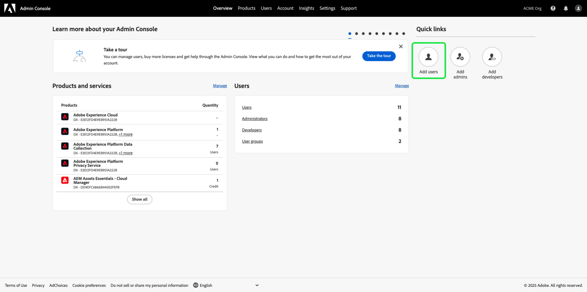

# Gestire le autorizzazioni per un ruolo

>[!IMPORTANT]
>
>Per la concessione delle autorizzazioni, il controllo degli accessi utilizza l’ID utente (un ID univoco interno assegnato a un utente). Quando un’organizzazione viene migrata da Adobe ID a Business ID, tutte le autorizzazioni impostate per i relativi utenti andranno perse perché l’ID utente viene modificato e il controllo degli accessi utilizzerà l’ID utente appena generato. Se la tua organizzazione è stata migrata al Business ID, contatta il rappresentante del tuo Adobe per migrare il tuo ID utente da Adobe ID al Business ID.

Autorizzazioni è l’area di Experience Cloud in cui gli amministratori possono definire i ruoli utente e i criteri di accesso per gestire le autorizzazioni di accesso per funzioni e oggetti all’interno di un’applicazione di prodotto.

Mediante le Autorizzazioni di , , puoi creare e gestire i ruoli, nonché assegnare le autorizzazioni per le risorse desiderate per tali ruoli. Le autorizzazioni ti consentono inoltre di gestire le etichette, le sandbox e gli utenti associati a un ruolo specifico.

Immediatamente dopo [creazione di un nuovo ruolo](#create-a-new-role), si ritorna al **[!UICONTROL Ruoli]** scheda. Se si stanno modificando le autorizzazioni per un ruolo esistente, selezionare il ruolo dall&#39; **[!UICONTROL Ruoli]** scheda. In alternativa, utilizza l’opzione di filtro per filtrare i risultati e trovare un ruolo.

## Filtra ruoli

Seleziona l’icona funnel () per visualizzare un elenco di controlli filtro che consentono di limitare i risultati.

Nell’interfaccia utente sono disponibili i seguenti filtri per i ruoli:

| Filtro | Descrizione |
| --- | --- |
| [!UICONTROL Creato tra] | Seleziona una data di inizio e/o una data di fine per definire un intervallo di date in base al quale filtrare i risultati. |
| [!UICONTROL Creato da] | Filtra per creatore di ruoli selezionando un utente dal menu a discesa. |
| [!UICONTROL Modificato tra] | Seleziona una data di inizio e/o una data di fine per definire un intervallo di date in base al quale filtrare i risultati. |
| [!UICONTROL Modificato da] | Filtra per modificatore di ruolo selezionando un utente dal menu a discesa. |

Per rimuovere un filtro, seleziona la &quot;X&quot; sull’icona della pillola per il filtro in questione, oppure seleziona **[!UICONTROL Cancella tutto]** per rimuovere tutti i filtri.

## Dettagli ruolo

Seleziona il ruolo dal **[!UICONTROL Ruoli]** , che apre la pagina dei dettagli del ruolo.

La scheda dei dettagli fornisce una panoramica del ruolo. Nella panoramica vengono visualizzati il nome del ruolo, la descrizione del ruolo, il nome dell&#39;utente che ha creato e modificato il ruolo, la data di creazione e modifica del ruolo e le autorizzazioni associate al ruolo. Se necessario, è possibile modificare il nome e la descrizione del ruolo.

## Gestire le etichette per un ruolo

Seleziona la **[!UICONTROL Etichette]** per aprire la pagina delle etichette dei ruoli, quindi selezionare **[!UICONTROL Aggiungi etichette]** per assegnare etichette al ruolo.

Le etichette sono elencate in questa pagina. Nell&#39;elenco vengono visualizzati il nome dell&#39;etichetta, il nome descrittivo, la categoria e la relativa descrizione.

Seleziona le etichette dall’elenco che desideri aggiungere al ruolo, quindi seleziona **[!UICONTROL Salva]**

Le etichette aggiunte vengono visualizzate in **[!UICONTROL Etichette]** scheda.

Per rimuovere un&#39;etichetta da un ruolo, selezionare **X** accanto al nome delle etichette.

## Gestione delle sandbox per il ruolo

Seleziona la **[!UICONTROL Sandbox]** per aprire la pagina sandbox ruoli. Qui puoi vedere un elenco di sandbox che sono state aggiunte al ruolo.

Per aggiungere più sandbox a un ruolo, seleziona **[!UICONTROL Modifica]**.

Nella schermata successiva viene richiesto di scegliere le autorizzazioni per le risorse esistenti nelle sandbox da includere nel ruolo utilizzando il menu a discesa. Al termine, seleziona **[!UICONTROL Salva ed esci]**.

## Gestione degli utenti per il ruolo

Seleziona la **[!UICONTROL Utenti]** per aprire la pagina ruoli utenti, quindi selezionare **[!UICONTROL Aggiungi utenti]** per assegnare utenti al ruolo.

Selezionare gli utenti dall&#39;elenco che si desidera aggiungere al ruolo. In alternativa, utilizza la barra di ricerca per cercare l’utente immettendo il suo nome o indirizzo e-mail, quindi seleziona **[!UICONTROL Salva]**

Gli utenti aggiunti vengono visualizzati in **[!UICONTROL Utenti]** scheda.

Per rimuovere un utente da un ruolo, selezionare **X** accanto al nome dell’utente.

## Gestione delle credenziali API per il ruolo

Seleziona la **[!UICONTROL Credenziali API]** per aprire la pagina ruoli: Credenziali API, quindi seleziona **[!UICONTROL Aggiungi credenziali API]** per assegnare le credenziali API al ruolo.

Seleziona le credenziali API dall’elenco che desideri aggiungere al ruolo, quindi seleziona **[!UICONTROL Salva]**

Le credenziali API aggiunte vengono visualizzate in **[!UICONTROL Credenziali API]** scheda.

Per rimuovere le credenziali API da un ruolo, seleziona la **X** accanto al nome delle credenziali API.

Il **[!UICONTROL Rimuovi credenziali API]** viene visualizzata una finestra di dialogo che richiede di confermare l’eliminazione.

Verrai reindirizzato al **[!UICONTROL Credenziali API]** scheda.

## Gestione dei gruppi di utenti per i ruoli

I gruppi di utenti sono utenti multipli che sono stati raggruppati e hanno l’accesso per eseguire le stesse funzioni.

Seleziona la **[!UICONTROL Gruppi di utenti]** per aprire la pagina gruppi di utenti ruoli, quindi selezionare **[!UICONTROL Aggiungi gruppi]** per assegnare gruppi di utenti al ruolo.

Selezionare i gruppi di utenti dall&#39;elenco che si desidera aggiungere al ruolo. In alternativa, utilizza la barra di ricerca per cercare il gruppo di utenti immettendo il nome del gruppo, quindi seleziona **[!UICONTROL Salva]**

Il gruppo di utenti aggiunto viene visualizzato in **[!UICONTROL Gruppi di utenti]** scheda.

Per rimuovere un gruppo di utenti da un ruolo, selezionare **X** accanto al nome del gruppo di utenti.

Il **[!UICONTROL Rimuovi gruppo utenti]** viene visualizzata una finestra di dialogo che richiede di confermare l’eliminazione.

Verrai reindirizzato al **[!UICONTROL Gruppi di utenti]** scheda.

## Aggiunta di utenti all’Experience Platform tramite un profilo di prodotto

Per aggiungere un utente a un profilo di prodotto, accedi all’Admin Console e seleziona **[!UICONTROL Aggiungi utenti]**

Il **[!UICONTROL Aggiungere utenti al team]** viene visualizzata. Immetti l’indirizzo e-mail degli utenti, il nome (facoltativo) e il cognome (facoltativo).

Seleziona l’icona a forma di matita per selezionare prodotti e gruppi di utenti, seleziona **[!UICONTROL Adobe di Experience Platform]**, quindi seleziona **[!UICONTROL AEP-Default-All-Users]**, quindi seleziona  **[!UICONTROL Salva]**.

## Passaggi successivi

Una volta stabilite le autorizzazioni, puoi procedere al passaggio successivo a [gestire gli utenti](users.md).
