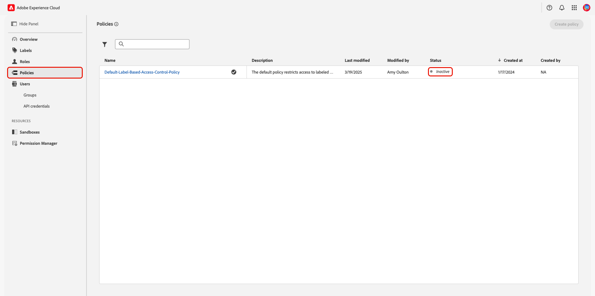

# Gestire i criteri di controllo dell’accesso

I criteri di controllo degli accessi sono istruzioni che riuniscono attributi per stabilire azioni consentite e inammissibili. Adobe fornisce un criterio predefinito che può essere attivato immediatamente o quando l&#39;organizzazione è pronta per iniziare a controllare l&#39;accesso a oggetti specifici in base a [etichette](./labels.md){target="_blank"}. Il criterio predefinito **[!UICONTROL Default-Label-Based-Access-Control-Policy]** sfrutta le etichette applicate alle risorse per negare l&#39;accesso, a meno che gli utenti non abbiano un ruolo con un&#39;etichetta corrispondente.

>[!IMPORTANT]
>
>I criteri di controllo degli accessi non devono essere confusi con i criteri di utilizzo dei dati, che controllano il modo in cui i dati vengono utilizzati in Adobe Experience Platform. Per ulteriori informazioni, consulta la guida sulla creazione di [criteri di utilizzo dei dati](../../../data-governance/policies/create.md){target="_blank"}.

## Configurare i criteri per una sandbox {#configure-policy}

>[!NOTE]
>
>Il criterio **[!UICONTROL Default-Label-Based-Access-Control-Policy]** è attualmente l&#39;unico disponibile per la configurazione.

Per iniziare a configurare un criterio, passa a **[!UICONTROL Permissions]** in [Adobe Experience Cloud](https://experience.adobe.com/){target="_blank"}. Seleziona **[!UICONTROL Policies]** dal pannello a sinistra. Selezionare **[!UICONTROL Default-Label-Based-Access-Control-Policy]** dall&#39;elenco.

{zoomable="yes"}

Verrà visualizzata l’area di lavoro dei dettagli del criterio. Seleziona **[!UICONTROL Sandboxes]**. Viene visualizzato un elenco di sandbox associate al criterio.

{zoomable="yes"}

### Aggiungi criterio a tutte le sandbox {#add-policy-to-all}

>[!IMPORTANT]
>
>Per impostazione predefinita, **[!UICONTROL Auto-include]** è attivato, il che significa che tutte le sandbox attuali e future vengono aggiunte automaticamente al criterio.

Disattiva la funzione **[!UICONTROL Auto-include]** per impedire che le sandbox future vengano aggiunte automaticamente al criterio. La disattivazione della funzionalità **non** rimuoverà alcuna sandbox dal criterio.

{zoomable="yes"}

Se **[!UICONTROL Auto-include]** non è attivo in un criterio, è possibile utilizzare l&#39;interruttore per riattivarlo. Viene visualizzata la finestra di dialogo **[!UICONTROL Enable Auto-include]** in cui viene richiesto di confermare la selezione. Selezionare **[!UICONTROL Enable]** per completare l&#39;impostazione di configurazione.

>[!NOTE]
>
>Tutte le sandbox rimosse dal criterio durante la disattivazione di **[!UICONTROL Auto-include]** verranno nuovamente aggiunte.

{zoomable="yes"}

### Selezionare manualmente le sandbox per un criterio {#manually-select-sandboxes}

Per aggiungere o rimuovere manualmente le sandbox a un criterio, l&#39;opzione **[!UICONTROL Auto-include]** **deve** essere disattivata.

#### Aggiungi sandbox

Per aggiungere sandbox a un criterio, selezionare **[!UICONTROL Add Sandboxes]**.

{zoomable="yes"}

Viene visualizzata la finestra di dialogo **[!UICONTROL Add Sandboxes]**. Selezionare le sandbox da aggiungere al criterio, quindi selezionare **[!UICONTROL Save]**.

{zoomable="yes"}

>[!NOTE]
>
>Se al criterio sono già state aggiunte tutte le sandbox disponibili, nella finestra di dialogo viene visualizzato il messaggio &quot;Non hai nulla nella libreria&quot;.

#### Rimuovi sandbox

Per rimuovere le sandbox da un criterio, individua la sandbox da rimuovere dall&#39;elenco, quindi seleziona l&#39;icona **X**.

{zoomable="yes"}

Viene visualizzata una finestra di dialogo di conferma. Seleziona **[!UICONTROL Confirm]** per completare la rimozione della sandbox dal criterio.

{zoomable="yes"}

## Attivare un criterio {#activate-policy}

>[!CONTEXTUALHELP]
>id="platform_permissions_policies_about"
>title="Cosa sono i criteri?"
>abstract="I criteri sono dichiarazioni che riuniscono alcuni attributi al fine di definire azioni ammissibili e non ammissibili. A ogni organizzazione viene fornito un criterio predefinito che è necessario attivare per iniziare a controllare l’accesso a oggetti specifici in base alle etichette. Le etichette applicate alle risorse negano l’accesso a meno che gli utenti non siano assegnati a un ruolo con un’etichetta corrispondente. Non è possibile modificare o eliminare i criteri, ma è possibile attivarli o disattivarli."
>additional-url="https://experienceleague.adobe.com/it/docs/experience-platform/access-control/abac/permissions-ui/labels" text="Gestire le etichette"

Per attivare un criterio esistente, selezionarlo dalla scheda **[!UICONTROL Policies]** in **[!UICONTROL Permissions]**. Lo stato di attivazione del criterio è visibile nella sezione **[!UICONTROL Status]**.

{zoomable="yes"}

Verrà visualizzata l’area di lavoro dei dettagli del criterio. Seleziona **[!UICONTROL Activate]**.

{zoomable="yes"}

Viene visualizzata la finestra di dialogo **[!UICONTROL Activate Policy]**. Selezionare **[!UICONTROL Confirm]** per completare l&#39;attivazione del criterio.

{zoomable="yes"}

## Passaggi successivi

Attivando un criterio, puoi passare al passaggio successivo per [gestire le autorizzazioni per un ruolo](permissions.md).

<!--Policies are applied at the sandbox level to control which sandboxes enforce label-based access control. By default, the **[!UICONTROL Auto-include]** feature is turned on, which means all current and future sandboxes are automatically added to the policy. When **[!UICONTROL Auto-include]** is turned off, only the sandboxes you manually add will be subject to the policy's access control rules.

To begin configuring a policy's sandboxes, navigate to **[!UICONTROL Permissions]** in [Adobe Experience Cloud](https://experience.adobe.com/){target="_blank"}. Select **[!UICONTROL Policies]** from the left panel, then select the **[!UICONTROL Default-Label-Based-Access-Control-Policy]** from the list.

The policy's details workspace appears. Select the **[!UICONTROL Sandboxes]** tab to view the list of sandboxes associated with the policy and access the sandbox configuration options.

### Manage Auto-include {#manage-auto-include}

To control which sandboxes are included in a policy, you can toggle the **[!UICONTROL Auto-include]** feature on or off. When you toggle off **[!UICONTROL Auto-include]**, future sandboxes will not be automatically added to the policy. However, toggling off the feature **will not** remove any sandboxes that are already included in the policy.

To re-enable **[!UICONTROL Auto-include]**, use the toggle to turn it back on. The **[!UICONTROL Enable Auto-include]** dialog appears prompting you to confirm your selection. Select **[!UICONTROL Enable]** to complete the configuration setting.

>[!NOTE]
>
>When you re-enable **[!UICONTROL Auto-include]**, any sandboxes you previously removed from the policy will be re-added.

### Manually manage sandboxes {#manually-manage-sandboxes}

When **[!UICONTROL Auto-include]**is turned off, you can manually add or remove specific sandboxes from the policy. This gives you precise control over which sandboxes enforce the policy's access control rules.

>[!NOTE]
>
>To manually add or remove sandboxes, the **[!UICONTROL Auto-include]** toggle **must** be off.

**To add sandboxes:**

Select **[!UICONTROL Add Sandboxes]** from the policy's sandbox workspace.

The **[!UICONTROL Add Sandboxes]** dialog appears, displaying your library of available sandboxes. Select the sandbox(es) you wish to add to the policy and then select **[!UICONTROL Save]**.

>[!NOTE]
>
>If all available sandboxes are already included in the policy, you will see a "You have nothing in your library" message within the dialog.

**To remove sandboxes:**

Find the sandbox you wish to remove from the list and select the **X** icon next to its name.

A confirmation dialog will appear. Select **[!UICONTROL Confirm]** to finish removing the sandbox from the policy.

-->