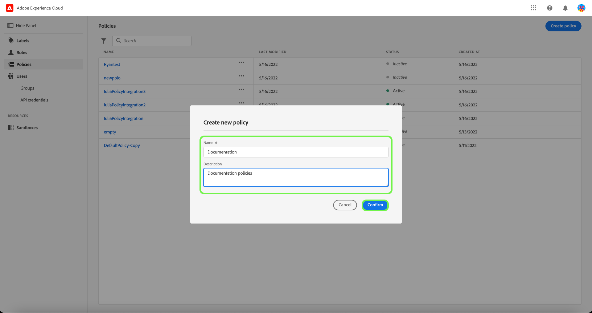
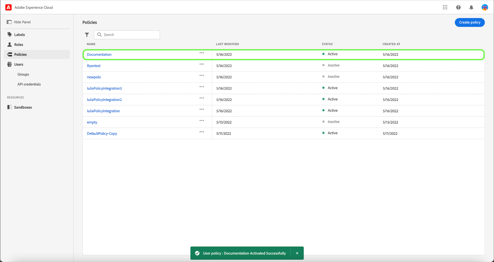

# Gestire i criteri

>[!IMPORTANT]
>
>Il controllo dell&#39;accesso basato su attributi è attualmente disponibile in una versione limitata per i clienti del settore sanitario negli Stati Uniti. Questa funzionalità sarà disponibile per tutti i clienti Real-time Customer Data Platform una volta rilasciata.

Le politiche sono dichiarazioni che riuniscono gli attributi per stabilire azioni ammissibili e non ammissibili. I criteri possono essere locali o globali e possono sostituire altri criteri.

## Crea un nuovo criterio

Per creare un nuovo criterio, seleziona la **[!UICONTROL Criteri]** nella barra laterale e seleziona **[!UICONTROL Crea criterio]**.

La **[!UICONTROL Crea un nuovo criterio]** viene visualizzata una finestra di dialogo in cui viene richiesto di immettere un nome e una descrizione facoltativa. Al termine, seleziona **[!UICONTROL Conferma]**.

Utilizzando la freccia a discesa seleziona se desideri **Autorizzare l&#39;accesso a** () una risorsa o **Nega l&#39;accesso a** () una risorsa.

Quindi, seleziona la risorsa da includere nel criterio utilizzando il menu a discesa e il tipo di accesso alla ricerca, lettura o scrittura.

Quindi, utilizzando la freccia a discesa, seleziona la condizione che desideri applicare a questo criterio, **Il seguente è vero** () o **Il seguente è falso** ().

Seleziona l’icona più a **Aggiungi espressione corrisponde** o **Aggiungi gruppo di espressioni** per la risorsa .

Utilizzando il menu a discesa , seleziona la **Risorsa**.

Quindi, seleziona il menu a discesa **Corrisponde**.

Quindi, seleziona il menu a discesa **Utente**.

Infine, seleziona la **Sandbox** a cui si desidera applicare le condizioni dei criteri, utilizzando il menu a discesa.

Seleziona **Aggiungi risorsa** per aggiungere altre risorse. Al termine, seleziona **[!UICONTROL Salva e chiudi]**.

Il nuovo criterio viene creato correttamente e viene reindirizzato al **[!UICONTROL Criteri]** , in cui verrà visualizzato il criterio appena creato nell’elenco.

## Modificare un criterio

Per modificare un criterio esistente, selezionalo nella **[!UICONTROL Criteri]** scheda . In alternativa, utilizza l’opzione filtro per filtrare i risultati e trovare il criterio da modificare.

Quindi, seleziona i puntini di sospensione (`…`) accanto al nome dei criteri e un elenco a discesa visualizza i controlli per modificare, disattivare, eliminare o duplicare il ruolo. Seleziona modifica dal menu a discesa.

Viene visualizzata la schermata delle autorizzazioni dei criteri. Effettua gli aggiornamenti e seleziona **[!UICONTROL Salva e chiudi]**.

Il criterio viene aggiornato correttamente e viene reindirizzato al **[!UICONTROL Criteri]** scheda .

## Duplicare un criterio

Per duplicare un criterio esistente, selezionalo nella **[!UICONTROL Criteri]** scheda . In alternativa, utilizza l’opzione filtro per filtrare i risultati e trovare il criterio da modificare.

Quindi, seleziona i puntini di sospensione (`…`) accanto al nome di un criterio e un elenco a discesa visualizza i controlli per modificare, disattivare, eliminare o duplicare il ruolo. Seleziona duplica dal menu a discesa.

La **[!UICONTROL Criterio duplicato]** viene visualizzata una finestra di dialogo in cui viene richiesto di confermare la duplicazione.

Il nuovo criterio viene visualizzato nell&#39;elenco come copia dell&#39;originale nel **[!UICONTROL Criteri]** scheda .

## Eliminare un criterio

Per eliminare un criterio esistente, selezionalo nella **[!UICONTROL Criteri]** scheda . In alternativa, utilizza l’opzione filtro per filtrare i risultati e trovare il criterio da eliminare.

Quindi, seleziona i puntini di sospensione (`…`) accanto al nome di un criterio e un elenco a discesa visualizza i controlli per modificare, disattivare, eliminare o duplicare il ruolo. Seleziona Elimina dal menu a discesa.

La **[!UICONTROL Elimina criterio utente]** viene visualizzata una finestra di dialogo in cui viene richiesto di confermare l’eliminazione.

Viene restituito al **[!UICONTROL politiche]** appare una scheda e una conferma dell’eliminazione.

## Attivare un criterio

Per attivare un criterio esistente, selezionarlo dalla **[!UICONTROL Criteri]** scheda . In alternativa, utilizza l’opzione filtro per filtrare i risultati e trovare il criterio da eliminare.

Quindi, seleziona i puntini di sospensione (`…`) accanto al nome di un criterio e un elenco a discesa visualizza i controlli per modificare, attivare, eliminare o duplicare il ruolo. Seleziona attiva dal menu a discesa.

La **[!UICONTROL Attiva criterio utente]** viene visualizzata una finestra di dialogo in cui viene richiesto di confermare l’attivazione.

Viene restituito al **[!UICONTROL politiche]** appare una scheda e una conferma dell’attivazione. Lo stato del criterio viene visualizzato come attivo.

## Passaggi successivi

Con la creazione di un nuovo criterio, puoi procedere al passaggio successivo per [gestire le autorizzazioni per un ruolo](permissions.md).
