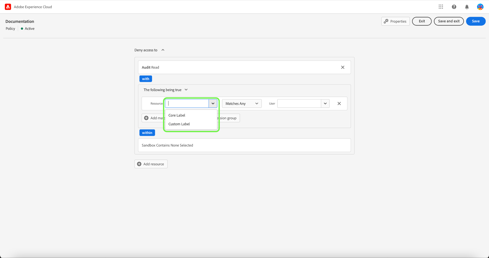

# Gestire i criteri di controllo dell’accesso

I criteri di controllo degli accessi sono istruzioni che riuniscono attributi per stabilire azioni consentite e inammissibili. I criteri di accesso possono essere locali o globali e possono ignorare altri criteri. Adobe fornisce una policy predefinita che può essere attivata immediatamente o ogni volta che l’organizzazione è pronta per iniziare a controllare l’accesso a oggetti specifici in base alle etichette. Il criterio predefinito sfrutta le etichette applicate alle risorse per negare l’accesso, a meno che gli utenti non abbiano un ruolo con un’etichetta corrispondente.

>[!IMPORTANT]
>
>I criteri di accesso non devono essere confusi con i criteri di utilizzo dei dati, che controllano il modo in cui i dati vengono utilizzati in Adobe Experience Platform anziché gli utenti dell’organizzazione che vi hanno accesso. Consulta la guida alla creazione di [criteri di utilizzo dati](../../../data-governance/policies/create.md) per ulteriori informazioni.

<!-- ## Create a new policy

To create a new policy, select the **[!UICONTROL Policies]** tab in the sidebar and select **[!UICONTROL Create Policy]**.

The **[!UICONTROL Create a new policy]** dialog appears, prompting you to enter a name, and an optional description. When finished, select **[!UICONTROL Confirm]**.

Using the dropdown arrow select if you would like to **Permit access to** () a resource or **Deny access to** () a resource.

Next, select the resource that you would like to include in the policy using the dropdown menu and search access type, read or write.

Next, using the dropdown arrow select the condition you would like to apply to this policy, **The following being true** () or **The following being false** ().

Select the plus icon to **Add matches expression** or **Add expression group** for the resource. 

Using the dropdown, select the **Resource**.

Next, using the dropdown select the **Matches**.

Next, using the dropdown, select the type of label (**[!UICONTROL Core label]** or **[!UICONTROL Custom label]**) to match the label assigned to the User in roles.

Finally, select the **Sandbox** that you would like the policy conditions to apply to, using the dropdown menu.

Select **Add resource** to add more resources. Once finished, select **[!UICONTROL Save and exit]**.

The new policy is successfully created, and you are redirected to the **[!UICONTROL Policies]** tab, where you will see the newly created policy appear in the list. 

## Edit a policy

To edit an existing policy, select the policy from the **[!UICONTROL Policies]** tab. Alternatively, use the filter option to filter the results to find the policy you want to edit.

Next, select the ellipsis (`…`) next to the policies name, and a dropdown displays controls to edit, deactivate, delete, or duplicate the role. Select edit from the dropdown.

The policy permissions screen appears. Make the updates then select **[!UICONTROL Save and exit]**.

The policy is successfully updated, and you are redirected to the **[!UICONTROL Policies]** tab.

## Duplicate a policy

To duplicate an existing policy, select the policy from the **[!UICONTROL Policies]** tab. Alternatively, use the filter option to filter the results to find the policy you want to edit.

Next, select the ellipsis (`…`) next to a policies name, and a dropdown displays controls to edit, deactivate, delete, or duplicate the role. Select duplicate from the dropdown.

The **[!UICONTROL Duplicate policy]** dialog appears, prompting you to confirm the duplication. 

The new policy appears in the list as a copy of the original on the **[!UICONTROL Policies]** tab.

## Delete a policy

To delete an existing policy, select the policy from the **[!UICONTROL Policies]** tab. Alternatively, use the filter option to filter the results to find the policy you want to delete.

Next, select the ellipsis (`…`) next to a policies name, and a dropdown displays controls to edit, deactivate, delete, or duplicate the role. Select delete from the dropdown.

The **[!UICONTROL Delete user policy]** dialog appears, prompting you to confirm the deletion. 

You are returned to the **[!UICONTROL policies]** tab and a confirmation of deletion pop over appears.

 -->

## Attivare un criterio

Per attivare un criterio esistente, selezionalo da **[!UICONTROL Criteri]** scheda.

Quindi, seleziona i puntini di sospensione (`…`) accanto al nome di un criterio e un menu a discesa visualizza i controlli per modificare, attivare, eliminare o duplicare il ruolo. Seleziona attiva dal menu a discesa.

Il **[!UICONTROL Attiva criterio]** viene visualizzata una finestra di dialogo che richiede di confermare l&#39;attivazione.

Viene visualizzata di nuovo la **[!UICONTROL criteri]** e viene visualizzata una conferma del pop-over di attivazione. Lo stato del criterio viene visualizzato come attivo.

## Passaggi successivi

Attivando un criterio, puoi procedere al passaggio successivo per [gestire le autorizzazioni per un ruolo](permissions.md).
