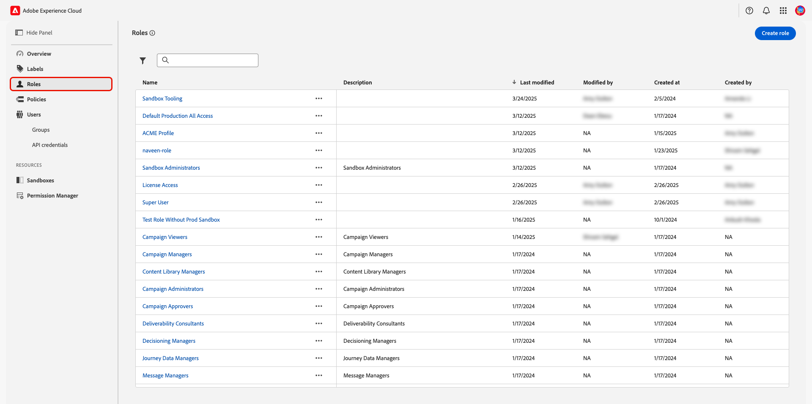
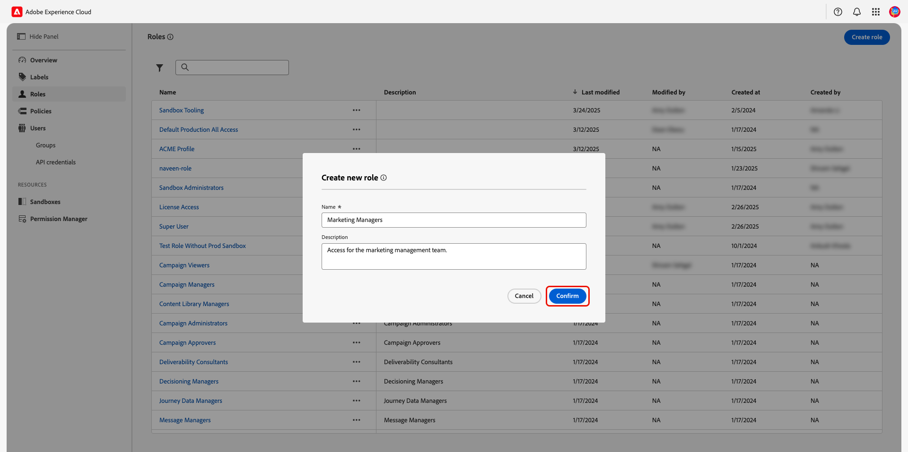
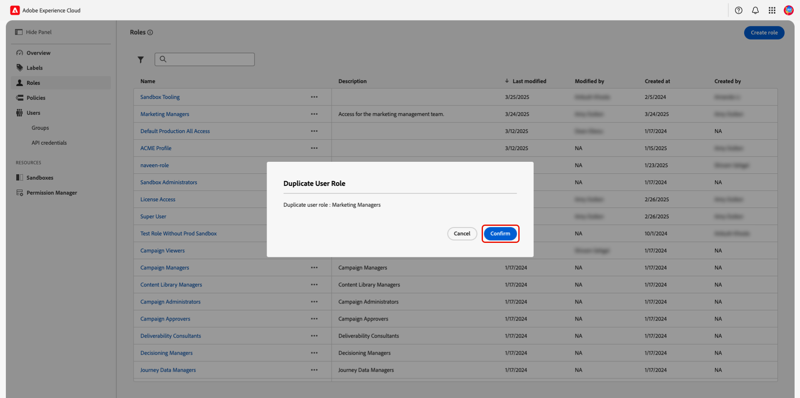
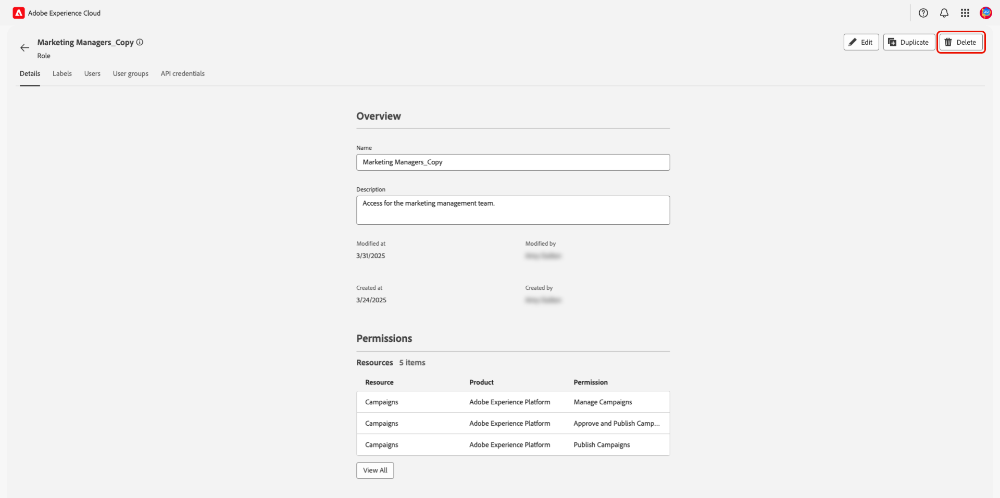
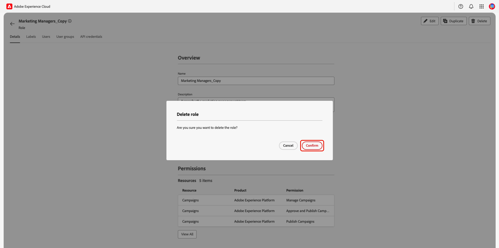

# Gestire i ruoli

<!-- UPDATE ROLES WITH A MORE COMPREHENSIVE EXPLANATION -->

Per iniziare a gestire i ruoli, passa a **[!UICONTROL Permissions]** in [Adobe Experience Cloud](https://experience.adobe.com/){target="_blank"} e seleziona **[!UICONTROL Roles]** nel pannello a sinistra.

## Creare un nuovo ruolo {#create-new-role}

>[!CONTEXTUALHELP]
>id="platform_permissions_roles_about_create"
>title="Creare un nuovo ruolo"
>abstract="Crea nuovi ruoli per categorizzare meglio gli utenti che interagiscono con l’istanza di Experience Platform. Ad esempio, puoi creare un ruolo per un team di marketing interno e applicare l’etichetta per dati sanitari regolamentati (RHD, Regulated Health Data) a tale ruolo, consentendo al team di accedere alle informazioni sanitarie protette (PHI, Protected Health Information). In alternativa, è possibile anche creare un ruolo per un’agenzia esterna e negargli l’accesso ai dati PHI non applicando l’etichetta RHD per quel ruolo."
>additional-url="https://experienceleague.adobe.com/docs/experience-platform/access-control/abac/permissions-ui/roles.html?lang=it" text="Gestire un ruolo"
>additional-url="https://experienceleague.adobe.com/it/docs/experience-platform/access-control/abac/end-to-end-guide#label-roles" text="Applicare etichette a un ruolo"

Per creare un nuovo ruolo, selezionare **[!UICONTROL Create role]**.

>[!TIP]
>
>I ruoli di sola lettura sono disponibili come predefiniti. Un ruolo di sola lettura è un ruolo che consente a un utente di visualizzare dati, configurazione e funzioni dell’interfaccia utente senza la possibilità di modificare lo stato del sistema. Gli amministratori non possono modificare questi ruoli, ma possono associare gli utenti ai ruoli.

Viene visualizzata la finestra di dialogo **[!UICONTROL Create new role]**. Immettere **[!UICONTROL Name]** per il ruolo e, facoltativamente, **[!UICONTROL Description]**, quindi selezionare **[!UICONTROL Confirm]**.

Verrà visualizzata l&#39;area di lavoro **[!UICONTROL Resources]**. Individua la risorsa necessaria scorrendo o immettendo il nome della risorsa nella barra di ricerca nel pannello a sinistra. Aggiungi le risorse selezionando l&#39;icona  accanto al nome della risorsa.

<!-- ADD IN NOTE ABOUT THE DEFAULT SANDBOX - THIS SHOULD BE MENTIONED IN THE HIGHER LEVEL DOCS, WE MAY BE ABLE TO LINK TO IT -->

La risorsa viene aggiunta all’area di lavoro principale. Seleziona il menu a discesa accanto al nome della risorsa e quindi le autorizzazioni da aggiungere al ruolo. È possibile sceglierli singolarmente, selezionare **[!UICONTROL Add all]** o individuare autorizzazioni specifiche immettendo il nome dell&#39;autorizzazione nella barra di ricerca.

Continua a selezionare tutte le risorse e le autorizzazioni che desideri aggiungere al ruolo. Al termine, selezionare **[!UICONTROL Save]**.

Verrà visualizzato un avviso che indica che il ruolo è stato salvato correttamente. Selezionare **[!UICONTROL Close]** per tornare all&#39;area di lavoro **[!UICONTROL Roles]**.

Il nuovo ruolo è stato creato e si è reindirizzati alla pagina **[!UICONTROL Roles]**, in cui il nuovo ruolo creato verrà visualizzato nell&#39;elenco.

<!-- The following video is intended to support your understanding of creating a new role and managing users for that role.

>[!VIDEO](https://video.tv.adobe.com/v/336081/?learn=on) -->

## Duplicare un ruolo

La duplicazione di un ruolo copia i dettagli, le autorizzazioni, le etichette e le sandbox. Utenti, gruppi di utenti e credenziali API **non sono stati copiati** e dovranno essere aggiunti manualmente al ruolo.

Per duplicare un ruolo esistente, trovare il ruolo da duplicare nella scheda **[!UICONTROL Roles]**. Selezionare l&#39;icona  accanto al nome della mansione, quindi selezionare **[!UICONTROL Duplicate]** dal menu a discesa.

Viene visualizzata la finestra di dialogo di conferma del duplicato. Selezionare **[!UICONTROL Confirm]** per completare la duplicazione del ruolo. Il nuovo ruolo verrà salvato con lo stesso nome e `_Copy` verrà aggiunto come suffisso.

In alternativa, è possibile duplicare un ruolo dall&#39;area di lavoro di un singolo ruolo. Selezionare il ruolo da duplicare dall&#39;area di lavoro **[!UICONTROL Roles]**, quindi selezionare **[!UICONTROL Duplicate]**.

Viene visualizzata la finestra di dialogo di conferma del duplicato. Selezionare **[!UICONTROL Confirm]** per completare la duplicazione del ruolo. Verrai reindirizzato al nuovo ruolo.

## Eliminare una mansione

Per eliminare un ruolo, trovare il ruolo da eliminare nella scheda **[!UICONTROL Roles]**. Selezionare l&#39;icona  accanto al nome della mansione, quindi selezionare **[!UICONTROL Delete]** dal menu a discesa.

Viene visualizzata la finestra di dialogo di conferma dell’eliminazione. Selezionare **[!UICONTROL Confirm]** per completare l&#39;eliminazione del ruolo.

In alternativa, è possibile eliminare un ruolo dall&#39;area di lavoro di un singolo ruolo. Selezionare il ruolo da eliminare dall&#39;area di lavoro **[!UICONTROL Roles]**, quindi selezionare **[!UICONTROL Delete]**.

Viene visualizzata la finestra di dialogo di conferma dell’eliminazione. Selezionare **[!UICONTROL Confirm]** per completare l&#39;eliminazione del ruolo.

<!-- ADD PERMISSIONS TO THIS PAGE -->

## Passaggi successivi

Dopo aver creato un nuovo ruolo, puoi passare al passaggio successivo per [gestire le autorizzazioni per un ruolo](permissions.md).
