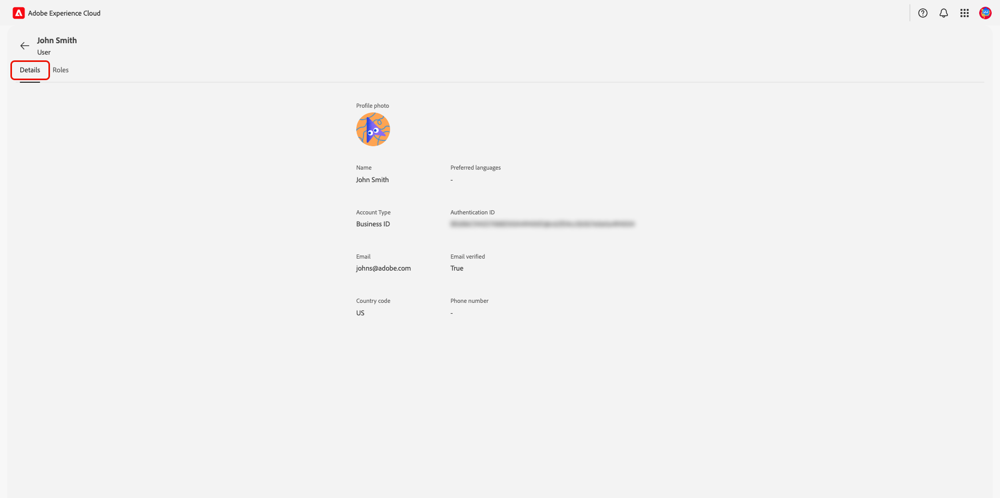
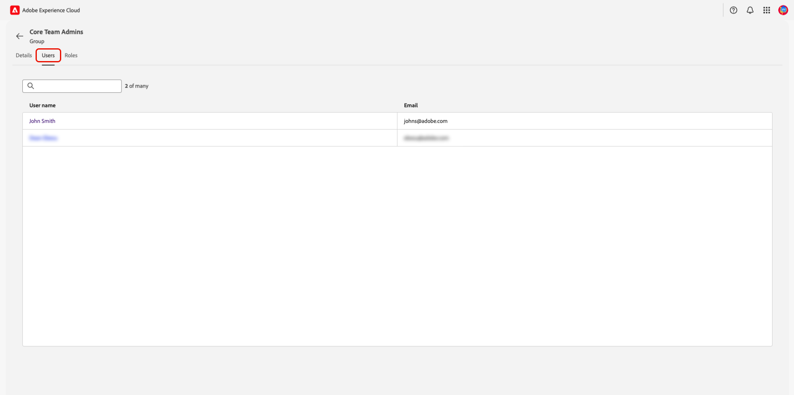

# Gestire gli utenti e aggiungere gruppi di utenti {#manage-users}

>[!CONTEXTUALHELP]
>id="platform_permissions_users_about"
>title="Che cosa sono gli utenti?"
>abstract="Gli utenti costituiscono le persone che hanno accesso a Experience Platform. L’accesso di un singolo utente alle risorse di un’organizzazione viene gestito tramite i ruoli."
>additional-url="https://experienceleague.adobe.com/it/docs/experience-platform/access-control/abac/permissions-ui/roles" text="Gestire i ruoli"

Gli utenti sono i singoli utenti che hanno accesso a Adobe Experience Platform. L&#39;accesso di un singolo utente alle risorse di un&#39;organizzazione viene gestito tramite [ruoli](./roles.md){target="_blank"}. Un&#39;organizzazione può anche creare [gruppi di utenti](#user-groups) per consentire l&#39;accesso continuo a più utenti contemporaneamente. Gli utenti vengono gestiti in Admin Console e quelli associati alla scheda prodotto di Adobe Experience Platform vengono visualizzati come parte dell’elenco degli utenti in Experience Platform.

## Gestisci utenti

<!-- ADD LINKS INTO IMPORTANT NOTE BELOW
>[!IMPORTANT]
>
>[!UICONTROL Permissions] manages access control for existing Experience Platform users. To add users to Experience Platform, navigate to Adobe Admin Console through the **[!UICONTROL Edit in admin console]** option. To learn how to add users through the Admin Console, follow the [adding users to Experience Platform](...){#target="_blank"} guide.
-->

Per visualizzare gli utenti della tua organizzazione, passa a **[!UICONTROL Permissions]** in [Adobe Experience Cloud](https://experience.adobe.com/){target="_blank"}. Seleziona **[!UICONTROL Users]** nel pannello a sinistra.

{zoomable="yes"}

Viene visualizzato un elenco di utenti. Seleziona dall’elenco l’utente che desideri visualizzare. In alternativa, utilizza la barra di ricerca per cercare l’utente immettendo il suo nome o indirizzo e-mail.

La scheda **[!UICONTROL Details]** fornisce una panoramica dell&#39;utente. Nella panoramica vengono visualizzati lo stato **[!UICONTROL Name]**, **[!UICONTROL Preferred languages]**, **[!UICONTROL Account Type]**, **[!UICONTROL Authentication ID]**, **[!UICONTROL Email]**, **[!UICONTROL Email verified]**, **[!UICONTROL Country code]** e **[!UICONTROL Phone number]** dell&#39;utente.

{zoomable="yes"}

Selezionare la scheda **[!UICONTROL Roles]** per visualizzare i ruoli a cui l&#39;utente è assegnato.

{zoomable="yes"}

### Aggiungere un ruolo a un utente {#add-user-role}

Per aggiungere un ruolo all&#39;utente, selezionare **[!UICONTROL Add Roles]**.

{zoomable="yes"}

Viene visualizzata la finestra di dialogo **[!UICONTROL Add Roles]**. Selezionare i ruoli da aggiungere all&#39;utente, quindi selezionare **[!UICONTROL Save]**.

{zoomable="yes"}

### Rimuovere un ruolo da un utente {#remove-user-role}

Per rimuovere un ruolo dall&#39;utente, selezionare **X** accanto al nome del ruolo.

<!-- ADD LINKS INTO IMPORTANT NOTE BELOW

>[!NOTE]
>
>Role's that have been added to a user through a user group cannot be removed through the user's role workspace. Role's that have been added through a user group will have an [!Info icon](/help/images/icons/info.png) beside the **X** containing information about the associated user group. To remove the role, the role would need to be [removed from the user group](#remove-user-group-role).
-->

{zoomable="yes"}

Viene visualizzata una finestra di dialogo di conferma. Selezionare **[!UICONTROL Confirm]** per completare la rimozione del ruolo.

{zoomable="yes"}

## Gestire i gruppi di utenti {#user-groups}

I gruppi di utenti sono utenti multipli che sono stati raggruppati e hanno l’accesso per eseguire le stesse funzioni.

<!-- ADD LINKS INTO IMPORTANT NOTE BELOW
>[!IMPORTANT]
>
>[!UICONTROL Permissions] manages access control for existing Experience Platform user groups. To add user groups to Experience Platform, navigate to Admin Console through the **[!UICONTROL Edit in admin console]** option. To learn how to add user groups in the Admin Console, follow the [adding user groups to Experience Platform](...){#target="_blank"} guide.
 -->

Per visualizzare gli utenti della tua organizzazione, passa a **[!UICONTROL Permissions]** in [Adobe Experience Cloud](https://experience.adobe.com/){target="_blank"}.Seleziona **[!UICONTROL Groups]** dalla sezione **[!UICONTROL Users]** nel pannello a sinistra.

{zoomable="yes"}

Viene visualizzato un elenco di gruppi di utenti. Selezionare dall&#39;elenco il gruppo che si desidera visualizzare.

La scheda **[!UICONTROL Details]** fornisce una panoramica del gruppo di utenti. Nella panoramica vengono visualizzati i gruppi **[!UICONTROL Name]**, **[!UICONTROL Description]**, **[!UICONTROL User Count]** e **[!UICONTROL Admin count]**.

{zoomable="yes"}

Selezionare la scheda **[!UICONTROL Users]** per visualizzare l&#39;elenco degli utenti assegnati al gruppo.

{zoomable="yes"}

Selezionare la scheda **[!UICONTROL Roles]** per visualizzare l&#39;elenco dei ruoli attualmente assegnati al gruppo.

{zoomable="yes"}

### Aggiungere ruoli a un gruppo di utenti {#add-user-group-role}

Per aggiungere un nuovo ruolo al gruppo, selezionare **[!UICONTROL Add Roles]**.

{zoomable="yes"}

Viene visualizzata la finestra di dialogo **[!UICONTROL Add Roles]**. Selezionare i ruoli da aggiungere, quindi selezionare **[!UICONTROL Save]**. I ruoli verranno aggiunti per tutti gli utenti appartenenti al gruppo di utenti.

{zoomable="yes"}

### Rimuovere ruoli da un gruppo di utenti {#remove-user-group-role}

Per rimuovere un ruolo dal gruppo di utenti, selezionare **X** accanto al nome del ruolo.

{zoomable="yes"}

Viene visualizzata una finestra di dialogo di conferma. Selezionare **[!UICONTROL Confirm]** per completare la rimozione del ruolo.

{zoomable="yes"}

## Credenziali API

>[!IMPORTANT]
>
>Solo gli amministratori di sistema possono visualizzare e gestire le credenziali API in Autorizzazioni.

Per utilizzare le API di Experience Platform come utente o sviluppatore, un amministratore di sistema deve aggiungere credenziali API oltre al set di autorizzazioni assegnato da un ruolo. Le autorizzazioni ti consentono di assegnare ai ruoli le credenziali API create in precedenza e assegnate al prodotto Experience Platform. Per una guida completa sulla creazione e l&#39;assegnazione delle credenziali API e sulle autorizzazioni necessarie, consulta l&#39;esercitazione dettagliata in [autenticare e accedere alle API di Experience Platform](/help/landing/api-authentication.md){target="_blank"}.

Per visualizzare le credenziali API delle organizzazioni associate ad Experience Platform, passa a **[!UICONTROL Permissions]** in [Adobe Experience Cloud](https://experience.adobe.com/){target="_blank"}. Seleziona **[!UICONTROL API Credentials]** dalla sezione **[!UICONTROL Users]** nel pannello a sinistra.

{zoomable="yes"}

>[!NOTE]
>
> Per visualizzare le credenziali API dell&#39;organizzazione in tutti i prodotti dell&#39;organizzazione o per ulteriori informazioni sulle credenziali, selezionare **[!UICONTROL Edit in admin console]**.

Viene visualizzato un elenco di credenziali API. Seleziona dall’elenco le credenziali API che desideri visualizzare.

La scheda **[!UICONTROL Details]** fornisce una panoramica delle credenziali API. Nella panoramica vengono visualizzati l&#39;attributo **[!UICONTROL Name]**, la data **[!UICONTROL Modified]**, l&#39;attributo **[!UICONTROL Modified By]**, la data **[!UICONTROL Created]**, l&#39;attributo **[!UICONTROL Created by]**, l&#39;attributo **[!UICONTROL API key]**, l&#39;attributo **[!UICONTROL Technical ID]** e l&#39;attributo **[!UICONTROL Email]** delle credenziali.

{zoomable="yes"}

Seleziona la scheda **[!UICONTROL Roles]**. Viene visualizzato un elenco dei ruoli associati alle credenziali API.

{zoomable="yes"}

### Aggiungere un ruolo a una credenziale API {#add-api-credential-role}

Per aggiungere un ruolo alle credenziali API, selezionare **[!UICONTROL Add Roles]**.

{zoomable="yes"}

Viene visualizzata la finestra di dialogo **[!UICONTROL Add Roles]**. Selezionare i ruoli da aggiungere all&#39;utente, quindi selezionare **[!UICONTROL Save]**.

{zoomable="yes"}

### Rimuovere un ruolo dalle credenziali API {#remove-api-credential-role}

Per rimuovere un ruolo dalle credenziali API, selezionare **X** accanto al nome delle credenziali API.

{zoomable="yes"}

Viene visualizzata una finestra di dialogo di conferma. Selezionare **[!UICONTROL Confirm]** per completare la rimozione del ruolo.

{zoomable="yes"}

## Passaggi successivi

Ora sai come visualizzare i dettagli e i ruoli di un utente, un gruppo di utenti e una credenziale API. Per ulteriori informazioni sul controllo degli accessi basato su attributi, vedere la [panoramica sul controllo degli accessi basato su attributi](../overview.md).

<!--
The following video is intended to support your understanding of developer and API credentials.

>[!VIDEO](https://video.tv.adobe.com/v/3426407/?learn=on)
-->