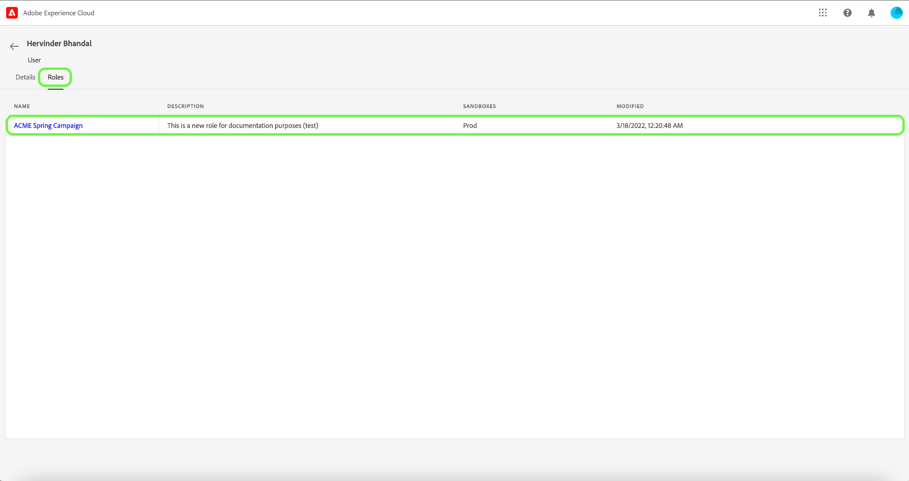

# Gestisci utenti

Per visualizzare i dettagli utente e i ruoli a cui sono assegnati, seleziona la **[!UICONTROL Utenti]** scheda .

Viene visualizzato un elenco di utenti. Seleziona dall’elenco l’utente da visualizzare. In alternativa, utilizza la barra di ricerca per cercare l’utente inserendo il suo nome o indirizzo e-mail.

La scheda dei dettagli fornisce una panoramica dell’utente. La panoramica mostra il nome utente, il tipo di account, l’e-mail, l’ID di autenticazione, le informazioni di contatto e i dettagli della posizione.

Seleziona la **[!UICONTROL Ruoli]** per visualizzare i ruoli a cui è assegnato l’utente.

## Controllo degli accessi per sviluppatori e API con autorizzazioni di Experience Platform

>[!NOTE]
>
>Solo gli amministratori di sistema possono visualizzare e gestire le credenziali API in Autorizzazioni.

La transizione alle autorizzazioni Adobe Experience Platform prevede passaggi aggiuntivi da completare per il flusso di lavoro API per sviluppatori che in precedenza si basava sui profili di prodotto. Consulta la guida su [Autenticazione API](../../../landing/api-authentication.md) per ulteriori informazioni.

## Passaggi successivi

Ora hai imparato a visualizzare i dettagli utente e i ruoli a cui sono attualmente aggiunti. Per ulteriori informazioni sul controllo degli accessi basato sugli attributi, consulta la sezione [panoramica sul controllo dell&#39;accesso basato sugli attributi](../overview.md).
