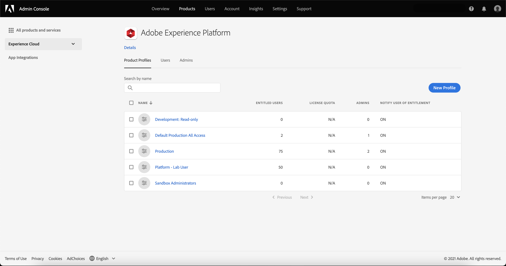

# Selezionare un profilo di prodotto per gestire le relative autorizzazioni di controllo degli accessi

Per configurare il controllo di accesso per [!DNL Experience Platform] tramite Adobe Admin Console, devi essere un amministratore per un&#39;organizzazione con una sottoscrizione a [!DNL Experience Platform]. Sebbene Adobe supporti gerarchie di amministratori flessibili per le organizzazioni, per configurare il controllo di accesso è necessario disporre dei privilegi di amministratore di sistema, amministratore di prodotto o amministratore del profilo di prodotto. Consulta l’articolo Adobe Help Center su [ruoli amministrativi](https://helpx.adobe.com/enterprise/using/admin-roles.html) per ulteriori informazioni.

Se non disponi di privilegi di amministratore, contatta l’amministratore di sistema per ottenere l’accesso.

Una volta disponibili i privilegi di amministratore, vai a [Adobe Admin Console](https://adminconsole.adobe.com) e accedi utilizzando le tue credenziali Adobe. Una volta effettuato l&#39;accesso, il **[!UICONTROL Panoramica]** viene visualizzata la pagina relativa all’organizzazione per la quale disponi dei privilegi di amministratore. Questa pagina mostra i prodotti a cui l’organizzazione è abbonata, insieme ad altri controlli per aggiungere utenti e amministratori all’organizzazione nel suo complesso. Seleziona **[!UICONTROL Adobe Experience Platform]** per aprire l’area di lavoro del controllo accessi per l’integrazione con Platform.

Viene visualizzata l&#39;area di lavoro di controllo accessi per Adobe Experience Platform, che si apre nella **[!UICONTROL Profili di prodotto]** scheda . Questa scheda ti consente di visualizzare tutti i profili di prodotto e di gestire diverse impostazioni come descritto in questo documento.

Questa guida utente si concentra su come utilizzare [!DNL Admin Console] per assegnare le autorizzazioni di accesso a Platform. Per informazioni più generali sulla navigazione nel [!DNL Admin Console], vedi [Guida utente di Admin Console](https://helpx.adobe.com/it/enterprise/using/admin-console.html).

## Passaggi successivi

Dopo aver navigato nell’area di lavoro del controllo accessi, procedi al passaggio successivo alla [creare un nuovo profilo di prodotto](create-profile.md)
