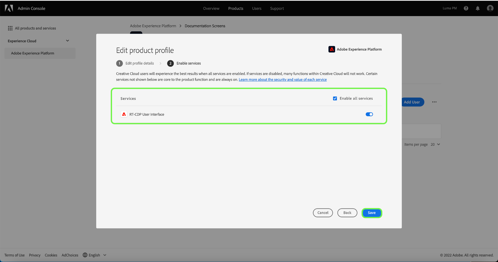

# Gestire dettagli e servizi aggiuntivi per un profilo di prodotto

Puoi configurare i dettagli di un profilo e l’accesso a servizi aggiuntivi da **[!UICONTROL Impostazioni profilo]** menu. Per accedere al menu, seleziona **[!UICONTROL Impostazioni]** dal **[!UICONTROL Profilo prodotto]** pagina.

La **[!UICONTROL Modificare il profilo di prodotto]** viene visualizzato il menu , a partire da **[!UICONTROL Modificare i dettagli del profilo]** scheda . Questa scheda ti consente di inserire e modificare il nome e la descrizione del profilo. Puoi anche modificare il tuo nome visualizzato e le impostazioni di notifica e-mail per il tuo account.

Seleziona **[!UICONTROL Successivo]** per accedere al **[!UICONTROL Abilita servizi]** pagina.

La **[!UICONTROL Abilita servizi]** consente di modificare l’accesso di un profilo a [!DNL Platform] servizi inizialmente configurati al momento della creazione del profilo. A seconda del [!DNL Platform] abbonamento, questi servizi possono includere:

- [!DNL Data Science Workspace]
- [!DNL Query Service]
- [!DNL Adobe Real-Time Customer Data Platform] Interfaccia utente (solo per Real-Time CDP)
- Interfaccia B2B

Fai clic sull’interruttore a destra di un particolare servizio per attivarlo o disattivarlo. Puoi anche selezionare la **[!UICONTROL Tutto su]** per abilitare o disabilitare tutti i servizi elencati.

Al termine, seleziona **[!UICONTROL Salva]**.

I clienti autorizzati all’edizione B2B o B2P hanno accesso all’interfaccia utente B2B. È possibile eseguire il provisioning dell’interfaccia utente B2B per gli utenti tramite [!UICONTROL Menu Abilita servizi]. Seleziona l&#39;interruttore accanto [!UICONTROL Interfaccia B2B] per abilitare il servizio per un particolare profilo di prodotto, quindi seleziona **[!UICONTROL Salva]**.

L’interruttore dell’interfaccia utente B2B consente agli utenti di visualizzare i flussi di lavoro B2B sulla gestione di account e opportunità, nonché di creare segmenti relativi a B2B. Per ulteriori informazioni, consulta la documentazione su [[!DNL Adobe Real-Time Customer Data Platform B2B Edition]](../../rtcdp/b2b-overview.md).

