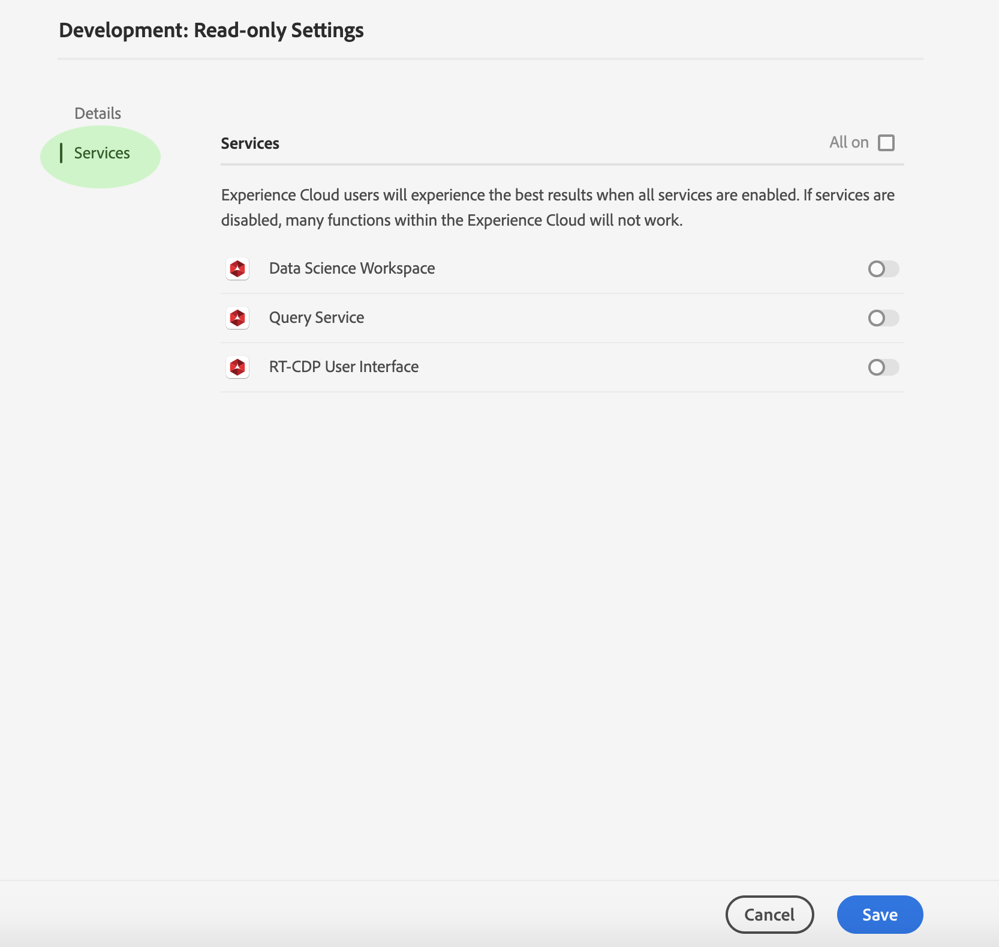

# Gestione di dettagli e servizi aggiuntivi per un profilo di prodotto

Puoi configurare i dettagli di un profilo e accedere ad altri servizi direttamente dal *[!UICONTROL Profile Settings]* menu. Per accedere al menu, fare clic **[!UICONTROL Settings]** sulla *[!UICONTROL Product Profile]* pagina.

Viene visualizzato il *[!UICONTROL Profile Settings]* menu a partire dalla *[!UICONTROL Details]* scheda. Questa scheda consente di inserire e modificare il **[!UICONTROL Profile Name]** e **[!UICONTROL Description]**. Potete anche modificare le impostazioni **[!UICONTROL Display Name]** e-mail di notifica per l’account.

Click **[!UICONTROL Services]** to access the *[!UICONTROL Services]* page.

Il *[!UICONTROL Services]* menu consente di modificare l&#39;accesso di un profilo a [!DNL Platform] servizi aggiuntivi che erano stati inizialmente configurati al momento della creazione del profilo. A seconda dell’ [!DNL Platform] iscrizione, questi servizi possono includere:

- [!DNL Data Science Workspace]
- [!DNL Query Service]
- [!DNL Real-Time Customer Data Platform] Interfaccia utente (solo per CDP in tempo reale)

Fate clic sull&#39;interruttore a destra di un particolare servizio per attivarlo o disattivarlo. Potete anche fare clic sulla **[!UICONTROL All on]** casella di controllo per attivare o disattivare tutti i servizi elencati.

Al termine, fate clic **[!UICONTROL Save]**.

