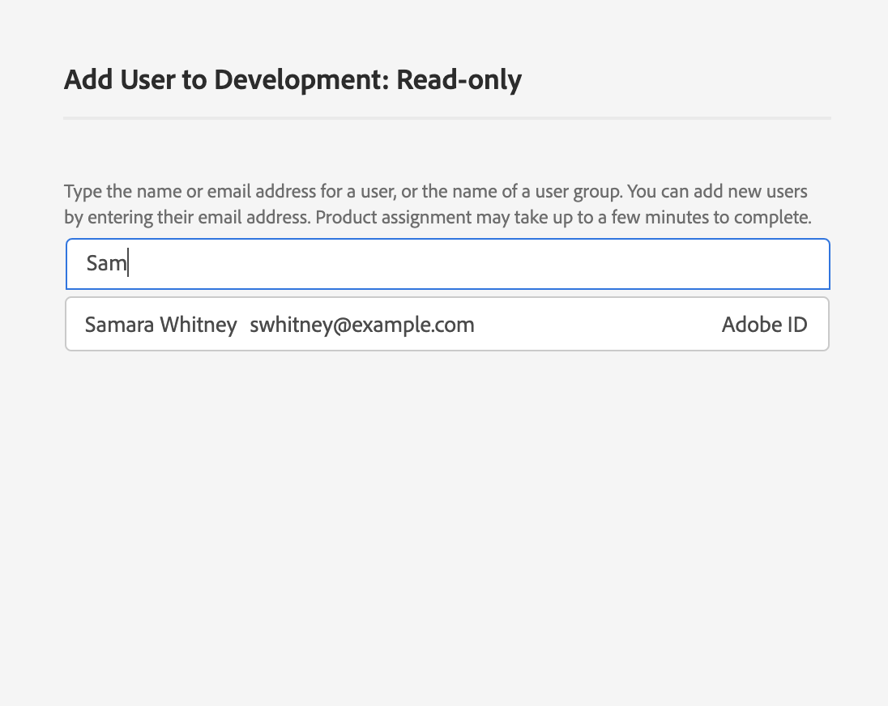

# Gestione degli utenti per un profilo di prodotto

Per assegnare o rimuovere utenti da un profilo di prodotto, aprite la pagina dei dettagli del profilo e andate alla *[!UICONTROL Users]* scheda. Da qui, clicca **[!UICONTROL Add User]**.

Viene visualizzata *[!UICONTROL Add User]* la finestra di dialogo. Utilizzando il campo di ricerca, potete cercare gli utenti da aggiungere sia per nome che per e-mail. Mentre digitate, gli utenti corrispondenti verranno visualizzati in una finestra autocompleta sotto la casella di testo.

>[!NOTE]
>
>Se un utente non compare nella finestra di completamento automatico, immettete il proprio indirizzo e-mail completo nella barra di ricerca. Verrà inviato un invito all&#39;e-mail con istruzioni sulla configurazione di un account di Adobe ID .

Dopo aver selezionato un utente, fai clic **[!UICONTROL Save]** per aggiungerlo al profilo di prodotto.

Viene nuovamente visualizzata la *[!UICONTROL Users]* scheda del profilo di prodotto, in cui è ora elencato l&#39;utente aggiunto.

## Passaggi successivi

Ora che hai imparato a controllare l&#39;accesso alle [!DNL Platform] funzioni attraverso [!DNL Admin Console], consulta la sezione appendice della panoramica [del controllo degli](../home.md) accessi per ulteriori informazioni su ogni singola autorizzazione e sulle [!DNL Platform] funzionalità a cui concedono l&#39;accesso.