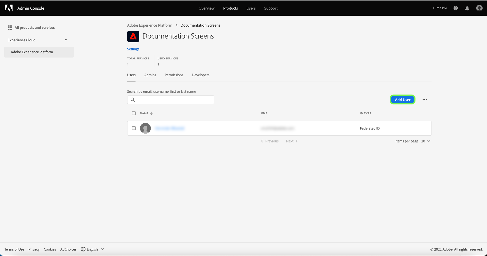

# Gestione degli utenti per un profilo di prodotto

Per assegnare o rimuovere utenti da un profilo di prodotto, apri la pagina dei dettagli del profilo e passa alla scheda **[!UICONTROL Utenti]** . Da qui, seleziona **[!UICONTROL Aggiungi utente]**.

Viene visualizzata la finestra di dialogo **[!UICONTROL Aggiungi utente]**. Utilizzando il campo di ricerca, puoi cercare gli utenti da aggiungere per nome o per e-mail. Mentre si digita, gli utenti corrispondenti verranno visualizzati in una finestra di completamento automatico sotto la casella di testo.

>[!NOTE]
>
>Se un utente non viene visualizzato nella finestra di completamento automatico, inserisci il proprio indirizzo e-mail completo nella barra di ricerca. Verrà inviato un invito all’e-mail con le istruzioni sulla configurazione di un account Adobe ID.

Dopo aver selezionato un utente, seleziona **[!UICONTROL Salva]** per aggiungerlo al profilo di prodotto.

## Passaggi successivi

Ora che hai imparato a controllare l’accesso alle funzioni di Platform tramite la sezione [!DNL Admin Console], consulta la sezione dell’appendice nella [panoramica sul controllo degli accessi](../home.md) per ulteriori informazioni su ogni singola autorizzazione e sulle funzionalità di Platform a cui concedono l’accesso.
