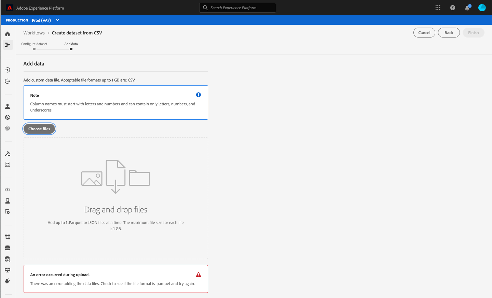

# Soluzioni di accessibilità personalizzate, ad Experience Platform

Adobe Experience Platform viene continuamente migliorato per soddisfare le esigenze di tutti i tipi di utenti e aderire agli standard mondiali che includono le persone con disabilità visive, uditive, di mobilità o di altro tipo. Questo documento illustra le soluzioni di accessibilità personalizzate all’interno dell’interfaccia utente di Experience Platform.

## Panoramica della pagina principale e dell’interfaccia utente

L’interfaccia utente di Experience Platform soddisfa le proporzioni di contrasto richieste per i componenti normali di testo, grafica e interfaccia utente. I colori dell’interfaccia utente sono stati scelti anche per supportare l’accessibilità per tutti gli utenti, inclusi quelli con disabilità visive.

In Platform, gli elementi dell’interfaccia utente cliccabili o utilizzabili con un puntatore possono essere attivati anche utilizzando una tastiera. Ciò include la navigazione a sinistra, lettori video, tabelle e altro ancora.

Experience Platform si impegna a soddisfare gli standard internazionali di accessibilità, tra cui le linee guida per l’accessibilità dei contenuti web 2.1, di livello A e AA, e gli standard web WAI-ARIA (Accessible Rich Internet Applications) dell’iniziativa per l’accessibilità dei contenuti web.

## Pannello di navigazione a sinistra

La barra di navigazione a sinistra nell’interfaccia utente di Experience Platform è accessibile da tastiera e fornisce un contrasto del colore negli stati normale, al passaggio del mouse e di selezione che soddisfano gli standard di accessibilità.

Dalla schermata Home, gli utenti possono passare alla navigazione a sinistra. Selezionando **Maiusc + Tab** l&#39;utente torna alla schermata iniziale.

Attivando la barra di navigazione a sinistra, **Tab** porta gli utenti all&#39;interazione di espansione e compressione. La possibilità di espandere o comprimere la navigazione a sinistra è attivata con **Invio (restituito)**.

Attivando la barra di navigazione a sinistra, i tasti freccia su e freccia giù consentono di passare a ciascun elemento della barra di navigazione e di scorrere continuamente (in altre parole, lo stato attivo non si sposta finché l&#39;utente non si sposta dalla barra di navigazione a sinistra). Se questa opzione è selezionata, lo stato attivo viene visualizzato per gli elementi di navigazione. La selezione corrente viene visualizzata con un testo evidenziato e in grassetto. Quando si seleziona un elemento di navigazione a sinistra, **Invio (restituito)** apre l&#39;elemento di interfaccia utente selezionato nel pannello di destra, tuttavia lo stato attivo rimane nella navigazione a sinistra finché l&#39;utente non si sposta.

Alcune funzioni di Platform non sono abilitate per tutti gli utenti. Questi elementi vengono visualizzati nella navigazione ma non possono essere selezionati. Durante la navigazione con una tastiera, questi elementi vengono ignorati durante la navigazione con le frecce e non possono essere selezionati utilizzando **Invio**.

## Finestra di dialogo del video incorporato

I video possono essere visualizzati in Experience Platform utilizzando la navigazione da tastiera per evidenziare e selezionare un collegamento video disponibile. Viene aperta una finestra di dialogo con video incorporato nell’interfaccia utente di Platform.

## Accessibilità da tastiera della finestra di dialogo per video

La finestra di dialogo del video incorporato può essere visualizzata anche utilizzando la tastiera. La tabella seguente illustra la navigazione completa da tastiera disponibile per la finestra di dialogo del video incorporato.

| Elemento finestra di dialogo | Accessibilità da tastiera | Descrizione |
|---|---|---|
| Riproduci e Pausa | Scheda  Barra spaziatrice | Utilizza **Tab** per impostare lo stato attivo sul pulsante di riproduzione. **La barra spaziatrice** avvia la riproduzione del video e ne mette in pausa. |
| Scrubber | Scheda Freccia sinistra Freccia destra | Durante la riproduzione del video, usa **Tab** per attivare lo scorrimento. Con lo scorrimento attivo, **i tasti freccia sinistra e destra** salta la riproduzione video rispettivamente avanti e indietro di 5 secondi. |
| Audio disattivato | Scheda  Barra spaziatrice | Utilizza **Tab** per attivare l&#39;elemento volume disattivato. Utilizza **la barra spaziatrice** per disattivare o attivare la riproduzione video. |
| Volume | Scheda Freccia sinistra Freccia destra | Utilizza **Tab** per concentrarti sull&#39;elemento del volume. **Freccia sinistra e freccia destra** spostano rispettivamente il volume verso l&#39;alto e verso il basso. |
| [!UICONTROL Sottotitoli] (&quot;cc&quot;) | Tab Invio Freccia su Freccia giù | **Scheda** in [!UICONTROL Elemento sottotitoli] (&quot;cc&quot;). Utilizza **Invio** per aprire il menu e **i tasti freccia su e giù** per selezionare una lingua per i sottotitoli. **Invio** conferma la selezione. |
| [!UICONTROL Qualità] | Tab Invio Freccia su Freccia giù | Utilizza **Tab** per attivare l&#39;elemento [!UICONTROL Quality]. Utilizza **Invio** per aprire il menu e i **tasti freccia su e giù** per selezionare la qualità video. **Invio** conferma la selezione. |
| Schermo intero | Tab Barra spaziatrice o Invio Esc | Utilizza **Tab** per attivare l&#39;elemento a schermo intero. Utilizza **barra spaziatrice o Invio** per attivare la visualizzazione a schermo intero. **Escape** (&quot;esc&quot;) esce dalla modalità a schermo intero. |
| Chiudi | Tab Barra spaziatrice o Invio | Utilizza **Tab** per attivare il pulsante di chiusura. Utilizza la barra spaziatrice **o il tasto Invio** per uscire dalla finestra di dialogo del video. |

>[!NOTE]
>
>In qualsiasi momento durante la riproduzione, è possibile utilizzare il tasto Esc per chiudere la finestra di dialogo del video incorporato.

## Trascinamento file

Ad Experience Platform, tutte le zone di trascinamento della selezione dei file sono accessibili da tastiera. Se si utilizza **Tab** per evidenziare **[!UICONTROL Scegli i file]** e si utilizza **Invio o la barra spaziatrice** per selezionarla, viene richiamata l&#39;interfaccia utente di selezione dei file del sistema operativo.

Dopo il caricamento di un file, l’icona Elimina diventa navigabile da tastiera per rimuovere il file selezionato e caricarne uno nuovo. Gli utenti possono utilizzare **Tab** per concentrarsi sull&#39;icona di eliminazione e **Invio o barra spaziatrice** per selezionarla. Una volta rimosso il file, **[!UICONTROL Scegli i file]** è automaticamente attivo ed è possibile selezionarlo.

In alternativa, se il file caricato non è nel formato corretto, viene visualizzata un&#39;icona di errore insieme a un messaggio di errore e il pulsante **[!UICONTROL Scegli file]** è attivo e selezionabile.

L’utilizzo del mouse per selezionare la zona di trascinamento attiva anche l’interfaccia utente per la selezione dei file, in modo che un utente del mouse possa selezionare un file e trascinarlo nella zona per iniziare il caricamento.

## Sfoglia tabella

Tutte le tabelle all’interno dell’interfaccia utente di Experience Platform sono accessibili da tastiera. È possibile navigare e interagire con le righe e le colonne della tabella tramite una serie di scelte rapide da tastiera:

* Dall&#39;intestazione della tabella, utilizzare la **freccia giù** per sfogliare la tabella. Le intestazioni di tabella sono selezionabili quando si naviga tramite **Tab** ed è possibile modificare l&#39;ordinamento utilizzando **spacebar**.
* **I tasti freccia su e giù** si spostano verso l&#39;alto e verso il basso nelle righe della tabella.
* Quando una riga è selezionata o attivata, l&#39;utilizzo di **Invio** nella riga fornisce dettagli nella barra a destra.
* Quando una riga è selezionata o attiva, utilizzare **i tasti freccia** per spostarsi tra gli elementi della riga.
* Utilizza **Invio** per selezionare un elemento nella riga. Gli utenti con utilità per la lettura dello schermo vengono avvisati se è necessario aprire una nuova finestra.
* Quando si esegue lo zoom al 200% o più, è possibile visualizzare l&#39;icona **barra di ispezione** mentre la barra a destra si comprime per fornire più spazio di visualizzazione per la tabella.

### Accesso facilitato alla tastiera per la navigazione in tabella

| Accessibilità da tastiera | Descrizione |
|---|---|
| HOME (Funzione + freccia sinistra) | Quando si attiva la riga, porta gli utenti al primo elemento della riga |
| END (Funzione + freccia destra) | Quando si attiva la riga, porta gli utenti all&#39;ultimo elemento della riga |
| Pagina su | Attraversa 10 righe verso l’alto nella tabella (per pagina) |
| Pagina successiva | Attraversa 10 righe verso il basso nella tabella (per pagina) |
| Ctrl + HOME | Passa alla prima riga della tabella |
| Ctrl + FINE | Passa alla prima funzione nella tabella per pagina |

## Interfaccia utente dell’editor schema

L’interfaccia utente dell’Editor schema è resa accessibile dalle seguenti funzionalità:

* L&#39;Editor schema supporta la navigazione da tastiera, incluso l&#39;utilizzo di **Tab** per la navigazione tra gli elementi dell&#39;interfaccia utente.
* **La scheda** immette il campo di ricerca, quindi nella struttura dello schema.
* La struttura dello schema supporta l&#39;utilizzo dei tasti freccia per spostarsi nell&#39;interfaccia utente della struttura dello schema
   * È possibile utilizzare **Frecce su e giù** per scorrere l&#39;albero.
   * È possibile utilizzare le **frecce a sinistra e a destra** per espandere e comprimere i nodi o spostarsi tra le azioni in linea nella struttura dello schema.
* **Invio (restituito)** attiva i dettagli dei singoli nodi nel pannello dei dettagli a destra.
* La chiave **Home** torna all&#39;inizio della struttura.
* La chiave **End** passa alla parte inferiore della struttura.
* La struttura dello schema include anche etichette ARIA per gli assistenti vocali.

## Interfaccia utente di Segment Builder

Quando utilizzi l’interfaccia utente del Generatore di segmenti per creare, modificare e interagire con i segmenti all’interno di Experience Platform, le seguenti funzioni migliorano l’accessibilità:

* L’interfaccia utente del Generatore di segmenti è accessibile tramite navigazione da tastiera.
* Gli assistenti vocali devono riconoscere i tag di markup per i titoli e possono annunciare l’intestazione e il relativo livello.
* Altre tecnologie per l’accessibilità possono modificare la visualizzazione visiva di una pagina utilizzando intestazioni codificate in modo appropriato per visualizzare una struttura o una vista alternativa.

Ora puoi comprimere o espandere le barre sinistra e destra dell’area di lavoro del generatore di segmenti per aumentare lo spazio disponibile sullo schermo. Questa funzione è particolarmente utile in quanto offre una funzionalità completa con uno zoom del 200%.

## Editor servizio query

Nell’editor di Query Service sono disponibili le seguenti funzioni di accessibilità:

* Il contrasto cromatico nell’interfaccia utente dell’editor di Query Service è conforme all’accessibilità.
* La navigazione tramite tastiera è supportata al di fuori dell’interfaccia utente dell’editor. L’interfaccia utente dell’editor è un Code Mirror incorporato.

>[!NOTE]
>
>Per impostazione predefinita, l&#39;editor delle query non gestisce la chiave **Tab**. Per richiamare la funzionalità **Tab** nell&#39;editor, è necessario premere il tasto **Escape**, quindi premere **Tab** subito dopo. Premere di nuovo **Tab** per spostare lo stato attivo oltre l&#39;editor.

## Scheda Vista sistema in Origini e destinazioni

Durante l&#39;esplorazione della **[!UICONTROL Vista sistema]** in Origini e Destinazioni, le seguenti funzionalità migliorano l&#39;accessibilità:

* **La scheda** imposta lo stato attivo sulla prima scheda di connessione di origine
   * **Scheda** di nuovo per concentrarti sul pulsante all&#39;interno della scheda
   * Seleziona **Invio** per attivare il pulsante di invito all&#39;azione all&#39;interno della scheda
* Selezionando **Invio** sulla scheda di connessione si attivano anche ulteriori dettagli nella barra a destra
   * Quando la barra a destra è attivata, lo stato attivo è impostato su tale area. **La scheda** si concentra su **Chiudi** per il riquadro della barra a destra. Selezionando di nuovo **Scheda**, lo stato attivo passa attraverso il pannello nella barra a destra
   * Se sono presenti più schede di connessione di origine, **Scheda** si sposta tra le connessioni
   * Utilizza **tasti freccia (su, giù, sinistra e destra)** per spostarti nell&#39;elenco delle origini
   * Seleziona **Scheda** per attivare il pannello nella barra a destra
