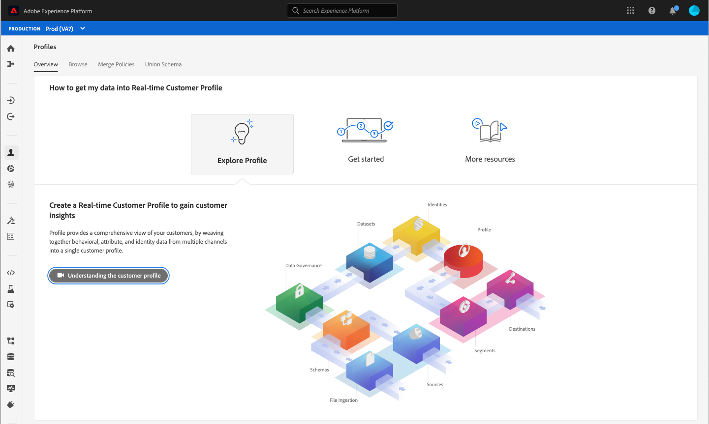

# Funzioni di accessibilità in Experience Platform

Adobe Experience Platform si impegna a fornire funzionalità accessibili e complete a tutti gli utenti, inclusi gli utenti che utilizzano dispositivi per l’accessibilità quali software di riconoscimento vocale e assistenti vocali. Questo documento illustra le funzioni di accessibilità generali supportate da Platform, tra cui la navigazione da tastiera, la struttura semantica, il contrasto sufficiente tra elementi in primo piano ed elementi in background e il supporto per le tecnologie per l’accessibilità.

## Tecnologie di assistenza

Gli utenti con disabilità spesso si affidano a hardware e software, noti come tecnologie per l’accessibilità, per accedere ai contenuti digitali e utilizzare prodotti software. Adobe Experience Platform supporta diversi tipi di tecnologie per l’accessibilità (TA), ad esempio assistenti vocali, software per lo zoom e il riconoscimento vocale, seguendo le best practice di accessibilità, ad esempio l’utilizzo di codice semantico, equivalenti di testo, etichette e, se necessario, ARIA. Gli elementi interattivi nell’interfaccia utente di Experience Platform utilizzano le etichette corrispondenti, i nomi accessibili e i ruoli che identificano sia il loro scopo che lo stato corrente. In questo modo le tecnologie per l’accessibilità, come gli assistenti vocali, possono leggere le etichette e altre informazioni agli utenti in modo che possano interagire facilmente con i controlli dell’applicazione.

## Accessibilità da tastiera

Experience Platform si impegna a supportare l’accessibilità completa della tastiera.

I seguenti elementi di navigazione facilitano l’accessibilità:
* Il tasto Tab consente di spostarsi tra gli elementi dell’interfaccia utente, le sezioni e i gruppi di menu.
* I tasti freccia si spostano all’interno dei gruppi di menu per impostare lo stato attivo su singoli elementi attivi.
* Maiusc + Tab consente di spostarsi all’indietro nell’ordine di tabulazione.
* I tasti Invio (Invio) e Barra spaziatrice attivano gli elementi selezionati.
* Il tasto Esc (ESC) funge da pulsante Annulla per chiudere una finestra di dialogo se presente.
* In Experience Platform viene visualizzato un bordo blu intorno a un elemento selezionato per visualizzare un’indicazione chiara dell’elemento dell’interfaccia attualmente attivo.

## Palette di colori e contrasto

Experience Platform per [WCAG 2.1 AA](https://www.w3.org/TR/WCAG/) conformità, compresi i requisiti per il contrasto del colore. L’interfaccia utente di Experience Platform fornisce un contrasto sufficiente nell’applicazione per garantire un’esperienza di visualizzazione accessibile agli utenti con problemi di vista o di colore insufficienti.

## Convalida del campo obbligatoria

Quando si aggiungono dati, si creano schemi o si definiscono segmenti, i campi obbligatori vengono visualizzati sia visivamente, utilizzando un asterisco accanto all’etichetta di testo di un campo, sia a livello di programmazione. Questi campi attivano la convalida quando si immettono dati non validi nei campi e al momento del salvataggio. Se un campo obbligatorio non supera la convalida, viene evidenziato in rosso con un’icona di errore e viene visualizzata anche una descrizione scritta del problema da risolvere.

