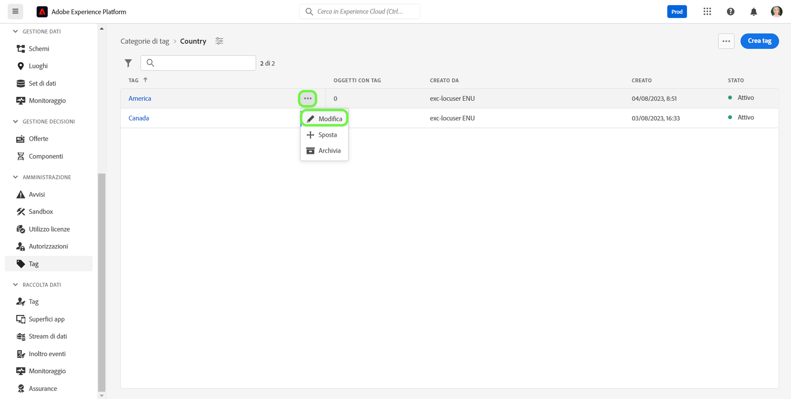

# Guida alla gestione dei tag

I tag consentono di gestire le tassonomie dei metadati al fine di classificare gli oggetti aziendali per semplificarne l’individuazione e la classificazione. I tag possono aiutare a identificare importanti attributi tassonomici per i tipi di pubblico con cui i tuoi team lavoreranno, in modo da poterli trovare più rapidamente e anche raggruppare i tipi di pubblico comuni in un descrittore. È necessario identificare categorie di tag comuni, come aree geografiche, business unit, linee di prodotto, progetti, team, intervalli di tempo (trimestri, mesi, anni) o qualsiasi altra cosa che possa contribuire ad attribuire un significato e a facilitare l’individuazione del pubblico per il team. 

## Creare un tag {#create-tag}

Per creare un nuovo tag, seleziona **[!UICONTROL tag]** nel menu di navigazione a sinistra, seleziona la categoria di tag desiderata.

Seleziona **[!UICONTROL Creare un tag]** per creare un nuovo tag.

La **[!UICONTROL Creare un tag]** viene visualizzata una finestra di dialogo in cui viene richiesto di immettere un nome di tag univoco. Al termine, seleziona **[!UICONTROL Salva]**.

Il nuovo tag viene creato correttamente e vieni reindirizzato alla schermata dei tag, dove il tag appena creato viene visualizzato nell’elenco.

## Modificare un tag {#edit-tag}

La modifica di un tag aiuta in caso di errori di ortografia, aggiornamenti delle convenzioni di denominazione o aggiornamenti terminologici. La modifica di un tag mantiene l’associazione del tag a tutti gli oggetti in cui sono attualmente applicati.

Per modificare un tag esistente, seleziona i puntini di sospensione nell’elenco della categoria di tag (`...`) accanto al nome del tag da modificare. Un elenco a discesa visualizza i controlli per modificare, spostare o archiviare il tag. Seleziona **[!UICONTROL Modifica]** dal menu a discesa .

La **[!UICONTROL Modifica tag]** viene visualizzata una finestra di dialogo in cui viene richiesto di modificare il nome del tag. Al termine, seleziona **[!UICONTROL Salva]**.

Il nome del tag viene aggiornato correttamente e vieni reindirizzato alla schermata dei tag, dove verrà visualizzato il tag aggiornato nell’elenco.

## Spostare un tag tra categorie {#move-tag}

I tag possono essere spostati in altre categorie di tag. Lo spostamento di un tag mantiene l’associazione del tag a tutti gli oggetti in cui sono attualmente applicati.

Per spostare un tag esistente, seleziona i puntini di sospensione nell’elenco della categoria di tag (`...`) accanto al nome del tag da spostare. Un elenco a discesa visualizza i controlli per modificare, spostare o archiviare il tag. Seleziona **[!UICONTROL Modifica]** dal menu a discesa .

La **[!UICONTROL Sposta tag]** viene visualizzata una finestra di dialogo in cui viene richiesto di selezionare la categoria di tag in cui spostare il tag selezionato.

È possibile scorrere e selezionare dall’elenco oppure, in alternativa, utilizzare la funzione di ricerca per immettere il nome della categoria. Al termine, seleziona **[!UICONTROL Sposta]**.

Il tag viene spostato correttamente e vieni reindirizzato alla schermata dei tag, dove verrà visualizzato l’elenco dei tag aggiornati, in cui il tag non viene più visualizzato.

Il tag verrà ora visualizzato nella categoria di tag precedentemente selezionata.

## Archiviare un tag {#archive-tag}

Lo stato di un tag può essere commutato tra attivo e archiviato. I tag archiviati non vengono rimossi dagli oggetti già applicati, ma non possono più essere applicati ai nuovi oggetti. Per ogni tag, lo stesso stato si riflette in tutti gli oggetti. Questa funzione è particolarmente utile quando desideri mantenere le associazioni tag-object correnti ma non desideri che il tag venga utilizzato in futuro.

Per archiviare un tag esistente, seleziona i puntini di sospensione nell’elenco della categoria di tag (`...`) accanto al nome del tag da archiviare. Un elenco a discesa visualizza i controlli per modificare, spostare o archiviare il tag. Seleziona **[!UICONTROL Archivia]** dal menu a discesa .

La **[!UICONTROL Tag di archiviazione]** viene visualizzata una finestra di dialogo in cui viene richiesto di confermare l’archiviazione dei tag. Seleziona **[!UICONTROL Archivia]**.

Il tag viene archiviato correttamente e viene reindirizzato alla schermata dei tag. L’elenco aggiornato dei tag mostra lo stato del tag come `Archived`.

## Ripristinare un tag archiviato {#restore-archived-tag}

Se si desidera applicare un `Archived` ai nuovi oggetti, il tag deve trovarsi in un `Active` stato. Il ripristino di un tag archiviato restituirà un tag a `Active` stato.

Per ripristinare un tag archiviato, seleziona i puntini di sospensione nell’elenco della categoria di tag (`...`) accanto al nome del tag da ripristinare. Un elenco a discesa visualizza i controlli per ripristinare o eliminare il tag. Seleziona **[!UICONTROL Ripristina]** dal menu a discesa .

La **[!UICONTROL Ripristina tag]** viene visualizzata una finestra di dialogo in cui viene richiesto di confermare il ripristino dei tag. Seleziona **[!UICONTROL Ripristina]**.

Il tag viene ripristinato correttamente e viene reindirizzato alla schermata dei tag. L’elenco aggiornato dei tag mostra lo stato del tag come `Active`.

## Eliminare un tag {#delete-tag}

>[!NOTE]
>
>Solo tag presenti in un `Archived` è possibile eliminare lo stato e non sono associati ad alcun oggetto.

Se elimini un tag, questo verrà rimosso completamente dal sistema.

Per eliminare un tag archiviato, seleziona i puntini di sospensione nell’elenco della categoria di tag (`...`) accanto al nome del tag da eliminare. Un elenco a discesa visualizza i controlli per ripristinare o eliminare il tag. Seleziona **[!UICONTROL Elimina]** dal menu a discesa .

La **[!UICONTROL Elimina tag]** viene visualizzata una finestra di dialogo che richiede di confermare l’eliminazione del tag. Seleziona **[!UICONTROL Elimina]**.

Il tag viene eliminato correttamente e viene reindirizzato alla schermata dei tag. Il tag non viene più visualizzato nell’elenco ed è stato rimosso completamente.

## Visualizzazione degli oggetti con tag {#view-tagged}

Ogni tag dispone di una pagina di dettaglio accessibile dall’inventario dei tag. In questa pagina sono elencati tutti gli oggetti a cui è applicato il tag, consentendo agli utenti di visualizzare in un’unica visualizzazione gli oggetti correlati provenienti da app e funzionalità diverse.

Per visualizzare l’elenco degli oggetti con tag, individua il tag all’interno di una categoria di tag e seleziona il tag .

La [!UICONTROL Oggetti con tag] viene visualizzata una pagina che mostra un inventario degli oggetti con tag.

## Passaggi successivi

Ora è possibile imparare a gestire i tag. Per una panoramica ad alto livello dei tag nell’Experience Platform, fai riferimento alla [documentazione sui tag](../overview.md).
