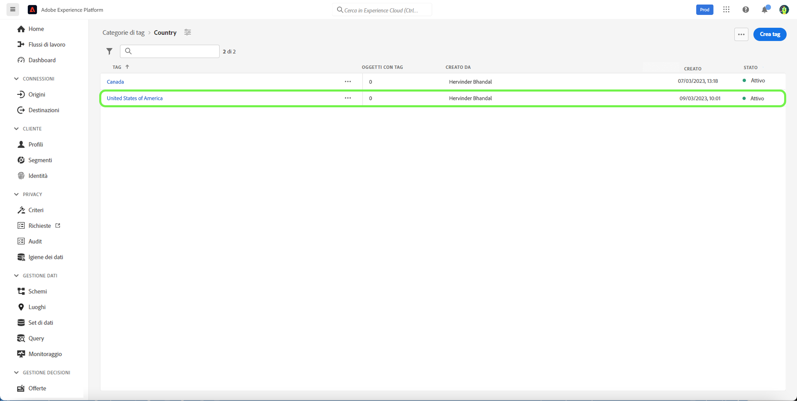

# Guida alla gestione dei tag

I tag consentono di gestire le tassonomie dei metadati al fine di classificare gli oggetti aziendali per facilitarne l’individuazione e la classificazione. I tag possono aiutare a identificare importanti attributi tassonomici per i tipi di pubblico con cui i team lavoreranno, in modo che possano trovarli più rapidamente e anche raggruppare i tipi di pubblico comuni in un descrittore. È necessario identificare categorie di tag comuni, ad esempio aree geografiche, business unit, linee di prodotti, progetti, team, intervalli di tempo (trimestri, mesi, anni) o qualsiasi altra cosa che possa aiutare ad applicare un significato e facilitare l’individuazione del pubblico per il team. 

## Creare un tag {#create-tag}

Per creare un nuovo tag, seleziona **[!UICONTROL tag]** nel menu di navigazione a sinistra, seleziona la categoria di tag desiderata.

Seleziona **[!UICONTROL Crea tag]** per creare un nuovo tag.

Il **[!UICONTROL Crea tag]** viene visualizzata una finestra di dialogo in cui viene richiesto di immettere un nome di tag univoco. Al termine, seleziona **[!UICONTROL Salva]**.

Il nuovo tag viene creato correttamente e si viene reindirizzati alla schermata dei tag, in cui il nuovo tag creato viene visualizzato nell&#39;elenco.

## Modificare un tag {#edit-tag}

La modifica di un tag è utile in caso di errori ortografici, aggiornamenti delle convenzioni di denominazione o aggiornamenti della terminologia. La modifica di un tag mantiene l’associazione del tag con qualsiasi oggetto in cui è attualmente applicato.

Per modificare un tag esistente, seleziona i puntini di sospensione nell’elenco delle categorie di tag (`...`) accanto al nome del tag che desideri modificare. In un elenco a discesa vengono visualizzati i controlli per modificare, spostare o archiviare il tag. Seleziona **[!UICONTROL Modifica]** dal menu a discesa.

Il **[!UICONTROL Modifica tag]** viene visualizzata una finestra di dialogo in cui viene richiesto di modificare il nome del tag. Al termine, seleziona **[!UICONTROL Salva]**.

Il nome del tag è stato aggiornato e si viene reindirizzati alla schermata dei tag, in cui il tag aggiornato viene visualizzato nell&#39;elenco.

## Spostare un tag tra categorie {#move-tag}

I tag possono essere spostati in altre categorie di tag. Se si sposta un tag, l’associazione del tag viene mantenuta con tutti gli oggetti a cui è attualmente applicato.

Per spostare un tag esistente, seleziona i puntini di sospensione nell’elenco delle categorie di tag (`...`) accanto al nome del tag che desideri spostare. In un elenco a discesa vengono visualizzati i controlli per modificare, spostare o archiviare il tag. Seleziona **[!UICONTROL Modifica]** dal menu a discesa.

Il **[!UICONTROL Sposta tag]** viene visualizzata una finestra di dialogo che richiede di selezionare la categoria di tag in cui spostare il tag selezionato.

È possibile scorrere e selezionare dall&#39;elenco oppure utilizzare la funzione di ricerca per immettere il nome della categoria. Al termine, seleziona **[!UICONTROL Sposta]**.

Il tag viene spostato correttamente e si viene reindirizzati alla schermata dei tag, in cui viene visualizzato l&#39;elenco dei tag aggiornato, dove il tag non viene più visualizzato.

Il tag verrà ora visualizzato nella categoria di tag selezionata in precedenza.

## Archiviare un tag {#archive-tag}

Lo stato di un tag può essere cambiato da attivo a archiviato. I tag archiviati non vengono rimossi dagli oggetti a cui sono già stati applicati, ma non possono più essere applicati ai nuovi oggetti. Per ogni tag, lo stesso stato si riflette in tutti gli oggetti. Questa funzione è particolarmente utile quando si desidera mantenere le associazioni tag-oggetto correnti ma non si desidera che il tag venga utilizzato in futuro.

Per archiviare un tag esistente, seleziona i puntini di sospensione dall’elenco delle categorie di tag (`...`) accanto al nome del tag che desideri archiviare. In un elenco a discesa vengono visualizzati i controlli per modificare, spostare o archiviare il tag. Seleziona **[!UICONTROL Archivia]** dal menu a discesa.

Il **[!UICONTROL Archivia tag]** viene visualizzata una finestra di dialogo in cui viene richiesto di confermare l’archivio dei tag. Seleziona **[!UICONTROL Archivia]**.

Il tag è stato archiviato correttamente e l’utente viene reindirizzato alla schermata dei tag. Ora l’elenco dei tag aggiornato mostra lo stato del tag come `Archived`.

## Ripristinare un tag archiviato {#restore-archived-tag}

Se si desidera applicare una `Archived` ai nuovi oggetti, il tag deve trovarsi in un `Active` stato. Il ripristino di un tag archiviato restituirà un tag al relativo `Active` stato.

Per ripristinare un tag archiviato, seleziona i puntini di sospensione nell’elenco delle categorie di tag (`...`) accanto al nome del tag che desideri ripristinare. In un elenco a discesa vengono visualizzati i controlli per ripristinare o eliminare il tag. Seleziona **[!UICONTROL Ripristina]** dal menu a discesa.

Il **[!UICONTROL Ripristina tag]** viene visualizzata una finestra di dialogo in cui viene richiesto di confermare il ripristino dei tag. Seleziona **[!UICONTROL Ripristina]**.

Il tag è stato ripristinato e l’utente viene reindirizzato alla schermata dei tag. Ora l’elenco dei tag aggiornato mostra lo stato del tag come `Active`.

## Eliminare un tag {#delete-tag}

>[!NOTE]
>
>Solo i tag inclusi in un `Archived` e non sono associati ad alcun oggetto possono essere eliminati.

Se si elimina un tag, questo viene rimosso completamente dal sistema.

Per eliminare un tag archiviato, seleziona i puntini di sospensione nell’elenco delle categorie di tag (`...`) accanto al nome del tag che desideri eliminare. In un elenco a discesa vengono visualizzati i controlli per ripristinare o eliminare il tag. Seleziona **[!UICONTROL Elimina]** dal menu a discesa.

Il **[!UICONTROL Elimina tag]** viene visualizzata una finestra di dialogo che richiede di confermare l’eliminazione del tag. Seleziona **[!UICONTROL Elimina]**.

Il tag viene eliminato correttamente e l’utente viene reindirizzato alla schermata dei tag. Il tag non viene più visualizzato nell’elenco ed è stato completamente rimosso.

## Visualizzazione di oggetti con tag {#view-tagged}

Ogni tag dispone di una pagina di dettagli accessibile dall’inventario dei tag. Questa pagina elenca tutti gli oggetti a cui è attualmente applicato il tag, consentendo agli utenti di visualizzare oggetti correlati di app e funzionalità diverse in un’unica vista.

Per visualizzare l&#39;elenco degli oggetti con tag, individuate il tag all&#39;interno di una categoria di tag e selezionate il tag.

Il [!UICONTROL Oggetti con tag] viene visualizzata una pagina che mostra un inventario degli oggetti con tag.

## Passaggi successivi

Ora hai imparato a gestire i tag. Per una panoramica di alto livello dei tag nell’Experience Platform, consulta [documentazione panoramica sui tag](../overview.md).
