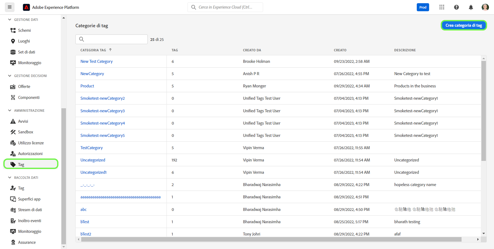
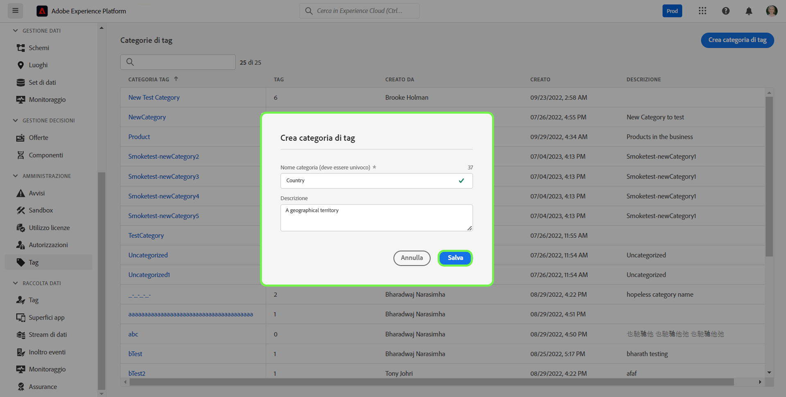
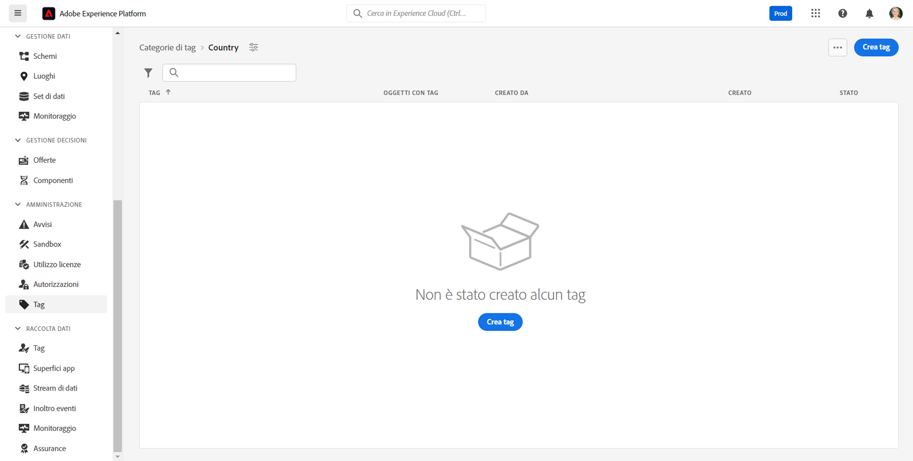
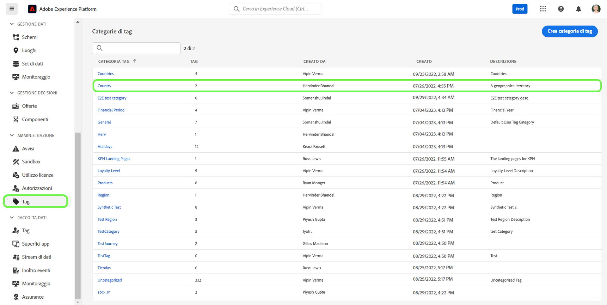
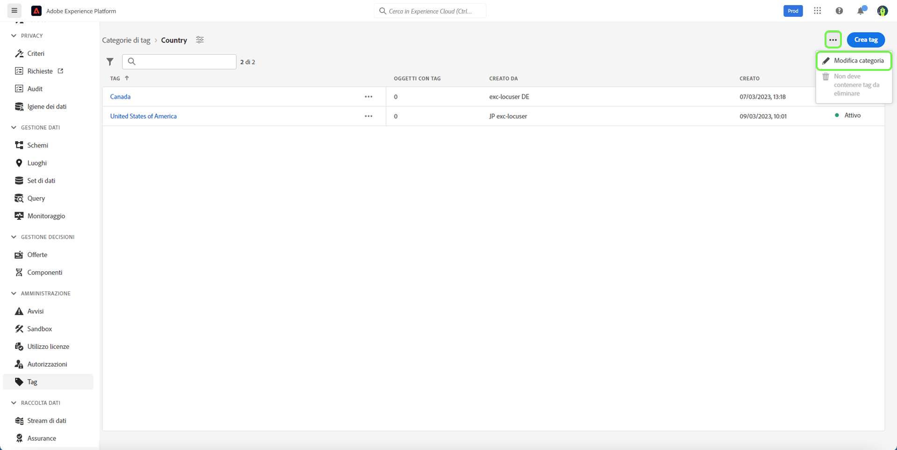
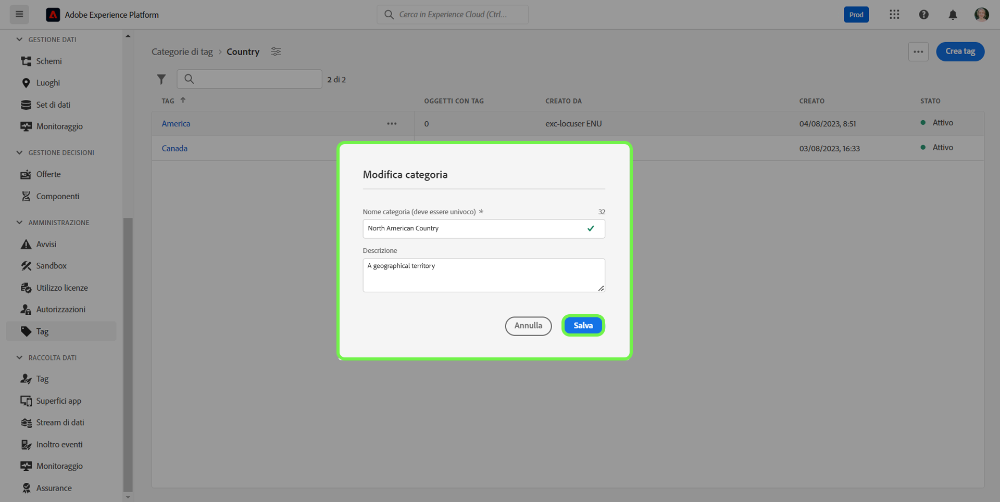
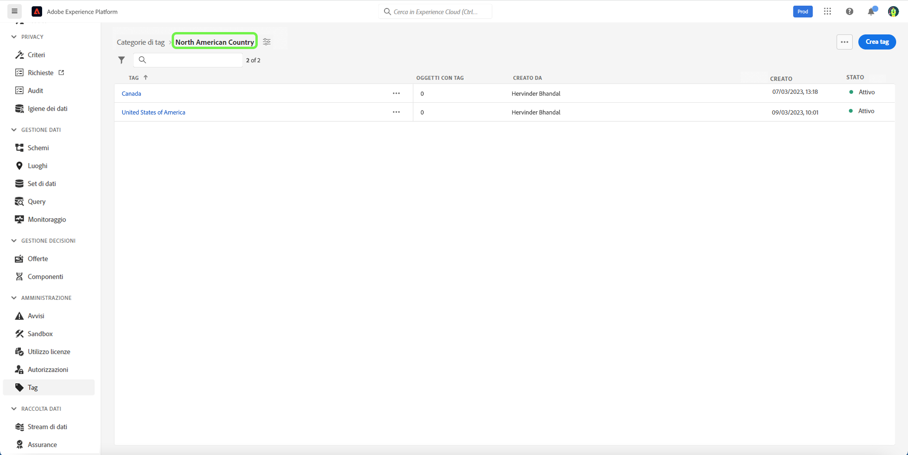
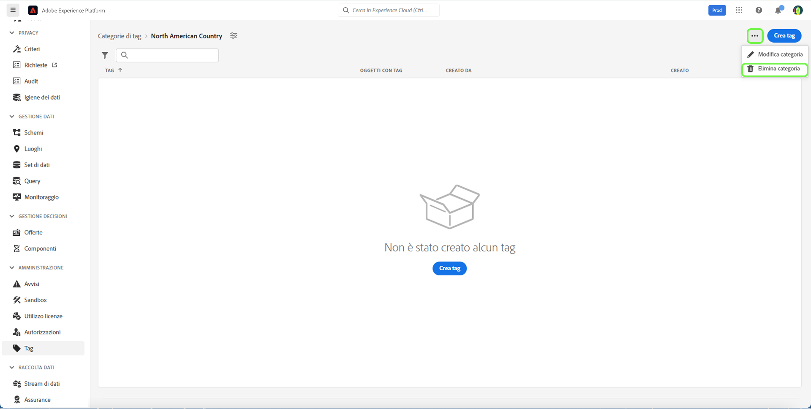
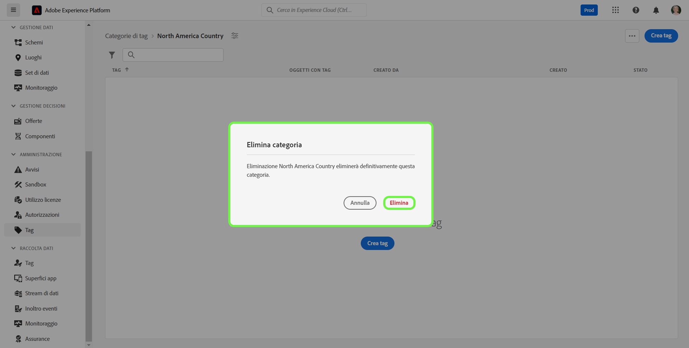

# Guida alle categorie di tag

Assegna tag alle categorie dei tag in set significativi per fornire più contesto e chiarire meglio lo scopo del tag. A ogni tag con una categoria verrà assegnato il nome del tag preceduto dal nome della categoria, quindi i due punti.

## Creare una categoria di tag {#create-tag-category}

Per creare una nuova categoria, seleziona **[!UICONTROL tag]** nel menu di navigazione a sinistra, seleziona [!UICONTROL Creare una categoria di tag].

La **[!UICONTROL Creare una categoria di tag]** viene visualizzata una finestra di dialogo in cui viene richiesto di immettere un nome di categoria univoco e una descrizione facoltativa. Al termine, seleziona **[!UICONTROL Salva]**.

La nuova categoria di tag viene creata correttamente e viene eseguito il reindirizzamento alla pagina di creazione del tag, in cui è possibile assegnare nuovi tag. Per ulteriori informazioni sulla creazione dei tag, consulta [gestione dei tag](./managing-tags.md#create-a-tag-create-tag) documento.

## Modifica categoria tag {#edit-tag-category}

>[!NOTE]
>
>La modifica o la ridenominazione di una categoria di tag mantiene l’associazione del tag a tutti gli oggetti in cui sono attualmente applicati.

Per modificare una categoria di tag, seleziona **[!UICONTROL tag]** nel menu di navigazione a sinistra, seleziona la categoria di tag da modificare.

Nella categoria tag , seleziona i puntini di sospensione (`...`) accanto a [!UICONTROL Crea tag]. Un menu a discesa visualizza i controlli per modificare la categoria o eliminare, seleziona **[!UICONTROL Modifica categoria]**.

La **[!UICONTROL Modifica categoria]** viene visualizzata una finestra di dialogo in cui viene richiesto di aggiornare il nome della categoria e la descrizione facoltativa. Al termine, seleziona **[!UICONTROL Salva]**.

La categoria di tag viene aggiornata correttamente e viene eseguito il reindirizzamento alla categoria di tag.

## Elimina categoria tag {#delete-tag-category}

>[!NOTE]
>
>Prima di poter eliminare una categoria di tag, questa deve essere vuota e priva di tag.

Per eliminare una categoria di tag, seleziona **[!UICONTROL tag]** nel menu di navigazione a sinistra, seleziona la categoria di tag da eliminare.

Nella categoria tag , seleziona i puntini di sospensione (`...`) accanto a [!UICONTROL Crea tag]. Un menu a discesa visualizza i controlli per modificare la categoria o eliminare, seleziona **[!UICONTROL Elimina categoria]**.

La **[!UICONTROL Elimina categoria]** viene visualizzata una finestra di dialogo che richiede di confermare l’eliminazione della categoria di tag. Seleziona **[!UICONTROL Elimina]** per confermare.

La categoria di tag viene eliminata correttamente e viene eseguito il reindirizzamento alla pagina di inventario delle categorie di tag. La categoria di tag non viene più visualizzata nell’elenco ed è stata rimossa completamente.

## Passaggi successivi

Ora hai imparato a gestire le categorie di tag. Procedi al passaggio successivo a [gestione dei tag](./managing-tags.md).
