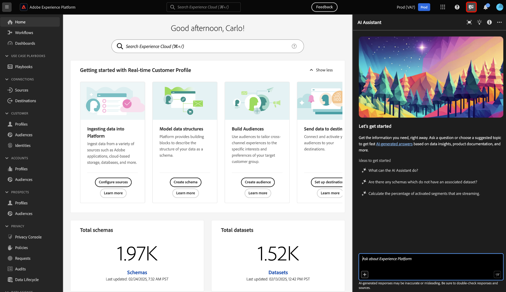

# Accedere all’Assistente AI (legacy) in Experience Platform

>[!IMPORTANT]
>
>Questo documento si applica all’Assistente IA (legacy). Per informazioni sull&#39;Assistente IA (generazione successiva), leggere la [Guida dell&#39;interfaccia utente dell&#39;Assistente IA](https://experienceleague.adobe.com/it/docs/experience-cloud-ai/experience-cloud-ai/ai-assistant/ai-assistant-ui) nella [IA nella documentazione di Experience Cloud](https://experienceleague.adobe.com/it/docs/experience-cloud-ai/experience-cloud-ai/home).

Per un confronto tra Assistente IA (legacy) e Assistente IA (di nuova generazione), consulta la tabella seguente:

| Area funzionale | Assistente AI (legacy) | Assistente AI (di nuova generazione) |
| --- | --- | --- |
| Esperienza utente | L’Assistente AI (legacy) è disponibile solo in un pannello nella barra a destra. | AI Assistant (Next-Gen) è disponibile sia nel pannello della barra a destra che nell’esperienza coinvolgente a schermo intero. |
| Ambito delle funzionalità | È possibile utilizzare l’Assistente AI (legacy) sia per conoscere il prodotto che per acquisire informazioni operative. | Puoi utilizzare l’Assistente all’intelligenza artificiale (di nuova generazione) per conoscere il prodotto, ottenere informazioni operative, acquisire competenze avanzate in ambito agente ed eseguire attività in più fasi. |
| Architettura della piattaforma | L’Assistente IA (legacy) non è basato sullo stack di Agent Orchestrator. | L&#39;Assistente di intelligenza artificiale (di nuova generazione) è basato su [Adobe Experience Platform Agent Orchestrator](https://experienceleague.adobe.com/it/docs/experience-cloud-ai/experience-cloud-ai/agents/agent-orchestrator), che abilita l&#39;estensibilità e il coordinamento avanzato tra le funzionalità. |
| Applicazione coperta | L’Assistente IA (legacy) è un’implementazione specifica per l’applicazione. | È possibile utilizzare AI Assistant (di nuova generazione) per un’esperienza di AI Assistant unificata in tutte le applicazioni Adobe Experience Cloud. |
| Modello di accesso e autorizzazione | Modello di accesso con ambito di applicazione allineato ai limiti dei singoli prodotti. | Tutti gli utenti possono accedere ad AI Assistant (Next-Gen) e agli agenti Experience Platform associati. **Nota**: <ul><li>**Adobe Experience Manager**: l&#39;amministratore deve concedere l&#39;autorizzazione per accedere all&#39;Assistente di intelligenza artificiale (di nuova generazione) tramite [Adobe Admin Console](https://helpx.adobe.com/it/enterprise/using/admin-console.html).</li><li>**Customer Journey Analytics**: l&#39;amministratore deve concedere l&#39;autorizzazione per accedere all&#39;Assistente di intelligenza artificiale tramite [Customer Journey Analytics Access Control](https://experienceleague.adobe.com/it/docs/analytics-platform/using/technotes/access-control?lang=en). Questo consente di porre domande sulla conoscenza del prodotto e sulle informazioni sui dati. |

In Adobe Experience Cloud è possibile accedere all’Assistente AI (legacy) tra diverse applicazioni.

>[!NOTE]
>
>Se ricevi un messaggio pop-up nell’interfaccia utente delle autorizzazioni che ti informa sul fatto che la tua organizzazione deve prima accettare ulteriori termini legali per poter accedere all’Assistente per l’intelligenza artificiale (legacy), contatta il team del tuo account Adobe per ottenere assistenza su tali termini.

## Introduzione {#get-started}

Prima di poter accedere all’Assistente di intelligenza artificiale (legacy), devi completare due passaggi preliminari.

1. La tua organizzazione deve prima accettare i termini legali. Per ulteriori informazioni, contatta il team del tuo account Adobe.
2. Gli amministratori devono concedere autorizzazioni sufficienti per accedere all’Assistente IA (legacy).

Se non hai completato nessuno di questi due passaggi preliminari, quando selezioni l’icona di chat Assistente IA (Legacy) nell’interfaccia utente di Experience Platform visualizzerai i seguenti messaggi.

>[!BEGINTABS]

>[!TAB La tua organizzazione non può utilizzare l&#39;Assistente IA (legacy)]

Se utilizzi un’organizzazione che non è giuridicamente idonea a utilizzare l’Assistente AI (legacy), viene visualizzato il seguente messaggio. In questo caso, devi contattare il team del tuo account Adobe per risolvere l’accesso.

>[!TAB Non si dispone delle autorizzazioni appropriate]

Se la tua organizzazione è legalmente idonea a utilizzare l’Assistente ai (legacy) e non riesci ancora ad accedere alla funzione, verrà visualizzato il seguente messaggio nell’interfaccia utente di Experience Platform. Ciò significa che non disponi delle autorizzazioni necessarie per accedere alla funzione e che devi contattare i tuoi amministratori per risolvere le autorizzazioni.

>[!ENDTABS]

## Accedi a Assistente IA (legacy) {#get-access-to-ai-assistant}

L’accesso a AI Assistant (Legacy) è disciplinato dai seguenti parametri:

* **Accedi all&#39;applicazione:** Puoi accedere all&#39;Assistente IA (legacy) in Adobe Experience Platform, Adobe Real-Time CDP, Adobe Journey Optimizer e [Customer Journey Analytics](https://experienceleague.adobe.com/it/docs/analytics-platform/using/ai-assistant).
<!-- * **Contractual access:** Your company must agree to certain [!DNL GenAI]-related legal terms before your organization can use AI Assistant (Legacy). Contact your organization's administrator or your Adobe Account Team if you are not able to access AI Assistant (Legacy).  -->
* **Autorizzazioni:** Utilizza l&#39;interfaccia utente [Autorizzazioni](../access-control/abac/ui/permissions.md) per concedere o revocare l&#39;accesso all&#39;Assistente IA (legacy) nell&#39;organizzazione. Per utilizzare l&#39;Assistente IA (versione precedente), un determinato utente deve appartenere a un ruolo per il quale è stato eseguito il provisioning con le autorizzazioni **Abilita Assistente IA** e **Visualizza informazioni operative**.
   * In qualità di amministratore, puoi aggiungere **Abilita Assistente IA** a un determinato ruolo e aggiungere un utente a tale ruolo, per consentire loro di accedere all&#39;Assistente AI (legacy) nella tua organizzazione. **Nota**: questa autorizzazione consente a tale utente di accedere all&#39;Assistente di intelligenza artificiale (legacy), non concede capacità amministrative per consentire ad altri utenti di accedere all&#39;Assistente di intelligenza artificiale (legacy).
   * In qualità di amministratore, puoi aggiungere **Visualizza informazioni operative** a un determinato ruolo e aggiungere un utente a tale ruolo, per consentire loro di utilizzare le funzionalità di analisi operative di Assistente IA (legacy).

Utilizza l&#39;[interfaccia utente delle autorizzazioni](../access-control/abac/ui/roles.md) per concedere le autorizzazioni per l&#39;utilizzo dell&#39;Assistente per l&#39;intelligenza artificiale (versione precedente) in Experience Platform e Journey Optimizer. Per informazioni su come accedere all’Assistente AI (legacy) in Customer Journey Analytics. Leggi la documentazione in [Customer Journey Analytics](https://experienceleague.adobe.com/it/docs/analytics-platform/using/ai-assistant).

Una volta ottenute le autorizzazioni necessarie, puoi accedere all’Assistente IA (Legacy) selezionando l’icona Assistente IA (Legacy) nell’intestazione superiore dell’applicazione in uso.

Guarda il video seguente per scoprire come configurare l’accesso a AI Assistant (Legacy) per le organizzazioni e gli utenti.

>[!VIDEO](https://video.tv.adobe.com/v/3475927/?captions=ita&learn=on)

## Passaggi successivi

Dopo aver completato l&#39;accesso a IA Assistant (Legacy), puoi procedere all&#39;utilizzo di questa funzione durante i flussi di lavoro. Per ulteriori informazioni, consulta la [Guida dell&#39;interfaccia utente di AI Assistant (Legacy)](./ui-guide.md).
