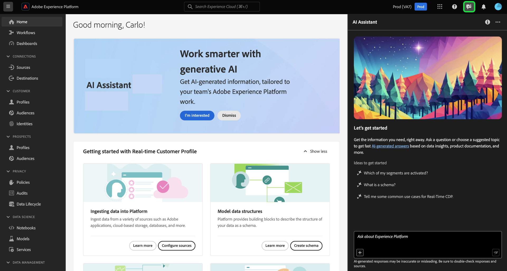

# Accedere all’Assistente AI in Experienci Platform

In Adobe Experience Cloud è possibile accedere all’Assistente IA per diverse applicazioni.

>[!IMPORTANT]
>
>Se ricevi un messaggio pop-up nell’interfaccia utente delle autorizzazioni che ti informa sul fatto che la tua organizzazione deve prima accettare ulteriori condizioni legali per poter accedere all’Assistente AI, contatta il team del tuo account Adobe per ottenere assistenza su tali condizioni.

L’accesso all’Assistente IA è disciplinato dai seguenti parametri:

* **Accedere all’applicazione:** È possibile accedere all’Assistente IA in Adobe Experience Platform, Adobe Real-Time CDP, Adobe Journey Optimizer e [Customer Journey Analytics](https://experienceleague.adobe.com/en/docs/analytics-platform/using/ai-assistant).
<!-- * **Contractual access:** Your company must agree to certain [!DNL GenAI]-related legal terms before your organization can use AI Assistant. Contact your organization's administrator or your Adobe Account Team if you are not able to access AI Assistant.  -->
* **Autorizzazioni:** Utilizza il [Interfaccia utente autorizzazioni](../access-control/abac/ui/permissions.md) per concedere o revocare l’accesso a AI Assistant nell’organizzazione. Per utilizzare l’Assistente IA, un determinato utente deve appartenere a un ruolo fornito con il **Abilita Assistente IA** e **Visualizza informazioni operative** autorizzazioni.
   * Come amministratore, puoi aggiungere **Abilita Assistente IA** a un determinato ruolo e aggiungere un utente a tale ruolo, per consentire loro di accedere all’Assistente AI nella tua organizzazione.
   * Come amministratore, puoi aggiungere **Visualizza informazioni operative** a un determinato ruolo e aggiungere un utente a tale ruolo, per consentire loro di utilizzare le funzionalità di approfondimenti operativi di AI Assistant. Le informazioni operative sono attualmente in versione beta.

Utilizza l’interfaccia utente delle autorizzazioni per concedere le autorizzazioni per utilizzare l’Assistente per l’intelligenza artificiale in Experienci Platform e Journey Optimizer. Per informazioni su come accedere all’Assistente AI nel Customer Journey Analytics. Leggi la documentazione in [Customer Journey Analytics](https://experienceleague.adobe.com/en/docs/analytics-platform/using/ai-assistant).

Una volta ottenute le autorizzazioni necessarie, è possibile accedere ad Assistente IA selezionando l’icona Assistente IA nell’intestazione superiore dell’applicazione in uso.

## Passaggi successivi

Una volta completato l’accesso a AI Assistant, puoi procedere all’utilizzo di questa funzione durante i flussi di lavoro, leggi la sezione [Guida all’interfaccia utente di Assistente IA](./ui-guide.md) per ulteriori informazioni.