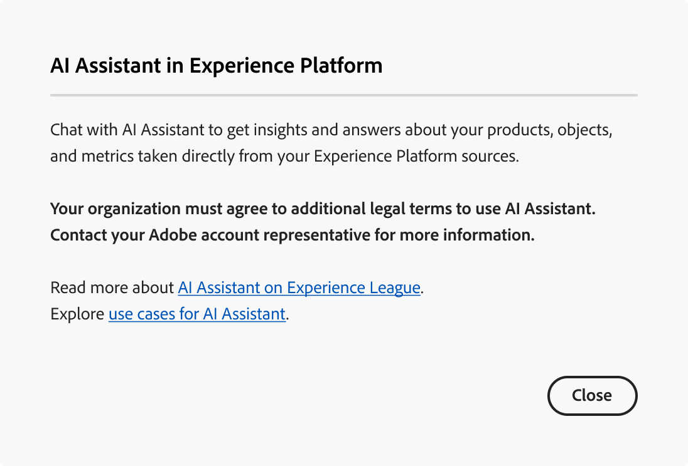

# Accedere all’Assistente AI in Experience Platform

In Adobe Experience Cloud è possibile accedere all’Assistente IA per diverse applicazioni.

>[!IMPORTANT]
>
>Se ricevi un messaggio pop-up nell’interfaccia utente delle autorizzazioni che ti informa sul fatto che la tua organizzazione deve prima accettare ulteriori condizioni legali per poter accedere all’Assistente per l’intelligenza artificiale, contatta il team del tuo account Adobe per ottenere assistenza su tali condizioni.

## Introduzione {#get-started}

Prima di poter accedere all’Assistente AI, devi completare due passaggi preliminari.

1. La tua organizzazione deve prima accettare i termini legali. Per ulteriori informazioni, contatta il team del tuo account Adobe.
2. Gli amministratori devono concedere autorizzazioni sufficienti per accedere all’Assistente di intelligenza artificiale.

Se non hai completato nessuno di questi due passaggi preliminari, quando selezioni l’icona di chat dell’Assistente AI nell’interfaccia utente di Experience Platform visualizzerai i seguenti messaggi.

>[!BEGINTABS]

>[!TAB La tua organizzazione non può utilizzare l&#39;Assistente AI]

Se utilizzi un’organizzazione che non è giuridicamente idonea a utilizzare l’Assistente AI, viene visualizzato il seguente messaggio. In questo caso, devi contattare il team del tuo account Adobe per risolvere l’accesso.

>[!TAB Non si dispone delle autorizzazioni appropriate]

Se l’organizzazione è legalmente idonea a utilizzare l’Assistente IA e non è ancora possibile accedere alla funzione, verrà visualizzato il seguente messaggio nell’interfaccia utente di Experience Platform. Ciò significa che non disponi delle autorizzazioni necessarie per accedere alla funzione e che devi contattare i tuoi amministratori per risolvere le autorizzazioni.

>[!ENDTABS]

## Ottenere l’accesso all’Assistente AI

L’accesso all’Assistente IA è disciplinato dai seguenti parametri:

* **Accedere all&#39;applicazione:** È possibile accedere all&#39;Assistente IA in Adobe Experience Platform, Adobe Real-Time CDP, Adobe Journey Optimizer e [Customer Journey Analytics](https://experienceleague.adobe.com/it/docs/analytics-platform/using/ai-assistant).
<!-- * **Contractual access:** Your company must agree to certain [!DNL GenAI]-related legal terms before your organization can use AI Assistant. Contact your organization's administrator or your Adobe Account Team if you are not able to access AI Assistant.  -->
* **Autorizzazioni:** Utilizza l&#39;interfaccia utente [Autorizzazioni](../access-control/abac/ui/permissions.md) per concedere o revocare l&#39;accesso all&#39;Assistente IA nella tua organizzazione. Per utilizzare l&#39;Assistente IA, un determinato utente deve appartenere a un ruolo per il quale è stato eseguito il provisioning con le autorizzazioni **Abilita Assistente IA** e **Visualizza informazioni operative**.
   * In qualità di amministratore, puoi aggiungere **Abilita Assistente IA** a un determinato ruolo e aggiungere un utente a tale ruolo, per consentire loro di accedere all&#39;Assistente AI nella tua organizzazione. **Nota**: questa autorizzazione consente a tale utente di accedere all&#39;Assistente di intelligenza artificiale, non concede capacità amministrative per consentire ad altri utenti di accedere all&#39;Assistente di intelligenza artificiale.
   * In qualità di amministratore, puoi aggiungere **View Operational Insights** a un determinato ruolo e aggiungere un utente a tale ruolo, per consentire loro di utilizzare le funzionalità di analisi operative dell&#39;Assistente all&#39;intelligenza artificiale. Le informazioni operative sono attualmente in versione beta.

Utilizza l&#39;[interfaccia utente delle autorizzazioni](../access-control/abac/ui/roles.md) per concedere le autorizzazioni per l&#39;utilizzo dell&#39;Assistente IA in Experience Platform e Journey Optimizer. Per informazioni su come accedere all’Assistente AI in Customer Journey Analytics. Leggi la documentazione in [Customer Journey Analytics](https://experienceleague.adobe.com/it/docs/analytics-platform/using/ai-assistant).

Una volta ottenute le autorizzazioni necessarie, è possibile accedere ad Assistente IA selezionando l’icona Assistente IA nell’intestazione superiore dell’applicazione in uso.

Guarda il video seguente per scoprire come configurare l’accesso a AI Assistant per le organizzazioni e gli utenti.

>[!VIDEO](https://video.tv.adobe.com/v/3436470/?learn=on)

## Passaggi successivi

Dopo aver completato l&#39;accesso all&#39;Assistente di intelligenza artificiale, puoi procedere all&#39;utilizzo di questa funzione durante i flussi di lavoro. Per ulteriori informazioni, consulta la [Guida dell&#39;interfaccia utente dell&#39;Assistente di intelligenza artificiale](./ui-guide.md).
