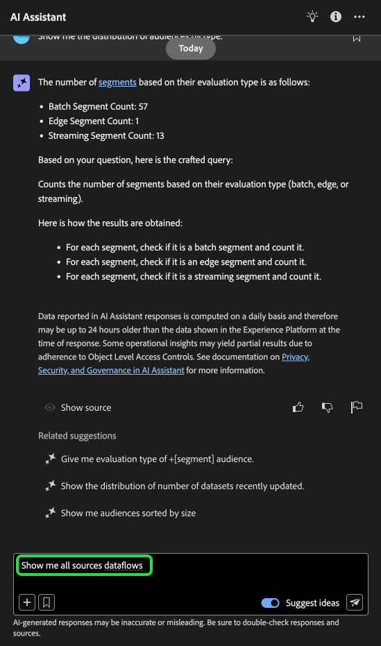
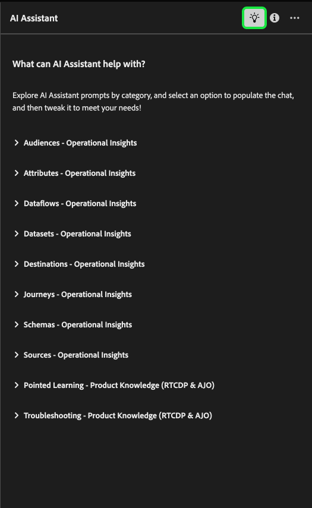

# Guida all’interfaccia utente di Assistente IA

Leggi questa guida per scoprire come utilizzare l’Assistente IA nell’interfaccia utente di Adobe Experience Platform.

## Accedere all’Assistente AI nell’interfaccia utente di Experienci Platform

Per avviare l&#39;Assistente IA, selezionare **[!UICONTROL Icona Assistente AI]** dall’intestazione superiore dell’interfaccia utente di Experienci Platform.

Viene visualizzata l’interfaccia di AI Assistant, che fornisce immediatamente le informazioni necessarie per iniziare. Puoi utilizzare le opzioni fornite in [!UICONTROL Idee per iniziare] per rispondere a domande e comandi quali:

* [!UICONTROL Quale dei miei tipi di pubblico viene attivato?]
* [!UICONTROL Che cos’è uno schema?]
* [!UICONTROL Alcuni casi d’uso comuni per Real-Time CDP]

## Guida all’interfaccia utente di Assistente IA

>[!NOTE]
>
>Il seguente flusso di lavoro è un esempio che utilizza il processo di creazione dello schema dell’evento esperienza per illustrare come utilizzare l’Assistente AI quando si utilizza l’interfaccia utente di Experienci Platform.

Considera un caso d’uso in cui stai creando una **Schema permuta dispositivo in evento**. Durante il processo di creazione dello schema dell’evento esperienza, ti imbatti nel `eventType` campo. &quot;A questo punto, puoi scegliere di uscire dal flusso di lavoro e fare riferimento a [nozioni di base su una composizione di schema](../xdm/schema/composition.md) oppure puoi utilizzare l’Assistente AI per recuperare le risposte alle tue domande e trovare risorse aggiuntive tramite i collegamenti alla documentazione consigliati dall’Assistente AI.&quot;

Per iniziare, immettere la domanda nella casella di testo fornita. Nell’esempio seguente, l’Assistente AI riceve la domanda: &quot;**Qual è il campo eventType in uno schema ExperienceEvent?**&quot;

L&#39;Assistente IA esegue quindi una query sulla knowledge base e calcola una risposta. Dopo alcuni istanti, l’Assistente IA restituisce una risposta e i suggerimenti correlati che puoi utilizzare come prompt di follow-up.

Dopo aver ricevuto una risposta dall’Assistente AI, puoi scegliere tra una serie di opzioni per decidere come procedere.

### Funzioni di AI Assistant {#features}

Questa sezione illustra le diverse funzioni di AI Assistant che è possibile utilizzare durante i flussi di lavoro in Experienci Platform.

### Visualizzare gli oggetti dati operativi {#view-operational-data-objects}

A seconda della query, l’Assistente AI fornisce informazioni aggiuntive relative ai dati nella sandbox. Per visualizzare in che modo la risposta alla query si applica alla sandbox specifica, seleziona **[!UICONTROL Nella sandbox].**

Quando visualizzi i dati relativi alla sandbox, l’Assistente AI può fornire collegamenti diretti a pagine dell’interfaccia utente specifiche che visualizzano i dati oggetto di query.

+++Seleziona per visualizzare l’esempio

In questo esempio, l’Assistente AI restituisce informazioni aggiuntive relative agli schemi XDM esistenti nella sandbox, compreso il conteggio totale e i cinque campi più comunemente utilizzati.

+++

### Visualizza citazioni {#view-citations}

Puoi verificare le risposte restituite dall’Assistente AI esaminando le citazioni disponibili con ogni risposta relativa alla conoscenza del prodotto.

+++Seleziona per visualizzare un esempio di come visualizzare le sorgenti

Per visualizzare le citazioni e convalidare la risposta dell’Assistente AI, seleziona **[!UICONTROL Mostra origini]**.

L’Assistente IA aggiorna l’interfaccia e fornisce i collegamenti alla documentazione che corroborano la risposta iniziale. Inoltre, quando le citazioni sono abilitate, l’Assistente IA aggiorna la risposta per includere le note a piè di pagina per indicare le parti specifiche della risposta che fanno riferimento alla documentazione fornita.

È inoltre possibile utilizzare i suggerimenti forniti dall&#39;Assistente IA in **[!UICONTROL Suggerimenti correlati]** per approfondire gli argomenti relativi alla domanda originale.

+++

### Informazioni operative {#operational-insights}

Devi trovarti in una sandbox attiva affinché AI Assistant risponda in modo sufficiente a una domanda sulle informazioni operative.

+++Seleziona per visualizzare un esempio di domanda di approfondimenti operativi

Nell’esempio seguente, a AI Assistant viene richiesta la seguente query: **&quot;Mostra i flussi di dati creati con il codice sorgente di Amazon S3&quot;**.

L’Assistente IA risponde quindi con una tabella in cui sono elencati i flussi di dati e gli ID corrispondenti. Per visualizzare l’intera tabella di dati, seleziona l’icona di espansione in alto a destra.

Viene visualizzata una vista espansa della tabella, che fornisce un elenco più completo dei flussi di dati basati sui parametri della query.

Quando viene richiesta una domanda di approfondimenti operativi, l’Assistente AI spiega in che modo ha calcolato la risposta. Nell’esempio seguente, l’Assistente AI illustra i passaggi eseguiti per identificare i flussi di dati creati utilizzando [!DNL Amazon S3] sorgente.

Puoi anche fornire filtri e modifiche alle domande, nonché istruire l’Assistente AI affinché esegua il rendering dei risultati in base ai filtri inclusi. Ad esempio, puoi chiedere all’Assistente AI di mostrare una tendenza del conteggio delle definizioni dei segmenti nell’ordine della data di creazione, rimuovere le definizioni dei segmenti con profili totali pari a zero e utilizzare i nomi dei mesi invece dei numeri interi durante la visualizzazione dei dati.

**Nota:** Le risposte alle informazioni operative sono attualmente in versione beta. Seleziona l’icona di descrizione comando nell’interfaccia utente dell’Assistente AI per visualizzare l’avviso Beta e un collegamento alla documentazione.

+++

### Usa completamento automatico {#use-auto-complete}

È possibile utilizzare la funzione di completamento automatico per ricevere un elenco di oggetti dati esistenti nella sandbox. I consigli di completamento automatico sono disponibili per i seguenti domini: pubblico, schemi, set di dati, origini e destinazioni.

+++Seleziona per visualizzare un esempio di completamento automatico

È possibile utilizzare il completamento automatico includendo il simbolo più (**`+`**) nella query. In alternativa, è possibile selezionare il segno più (**`+`**) che si trova nella parte inferiore della casella di immissione testo. Viene visualizzata una finestra con un elenco degli oggetti dati consigliati dalla sandbox.

+++

### Usa multi-giro {#use-multi-turn}

È possibile utilizzare le funzionalità multi-turn di AI Assistant per avere una conversazione più naturale durante la tua esperienza. L’Assistente AI è in grado di rispondere alle domande di follow-up, fornite. tale contesto può essere dedotto da un’interazione precedente.

+++Selezionare per visualizzare un esempio di tornitura multipla

Nell’esempio seguente, a AI Assistant viene richiesto prima il numero totale di flussi di dati e quindi di elencare i 10 flussi di dati più recenti.

Per ripristinare, seleziona i puntini di sospensione (**`...`**) sull&#39;interfaccia dell&#39;Assistente AI e quindi selezionare **[!UICONTROL Avvia nuova conversazione]**. Questo informa l’Assistente AI che intendi modificare gli argomenti e può essere particolarmente utile quando si risolvono problemi relativi a query che hanno esito negativo o che fanno riferimento a informazioni errate.

+++

### Utilizzare la funzionalità di individuazione {#use-discoverability}

È possibile utilizzare la funzione di individuazione dell&#39;Assistente AI per visualizzare un elenco dei soggetti generali, raggruppati in entità, supportati dall&#39;Assistente AI.

+++Selezionare questa opzione per visualizzare un esempio di individuazione

Per visualizzare il rilevamento, seleziona l’icona a forma di lampadina nell’intestazione superiore dell’interfaccia di AI Assistant.

Quindi, seleziona una categoria e seleziona un prompt dall’elenco fornito. Puoi utilizzare questa funzione per avere un’idea migliore dei tipi di domande a cui l’Assistente AI può rispondere. Puoi anche aggiornare i prompt preesistenti con dettagli specifici relativi alla sandbox utilizzando testo libero o [completamento automatico](#use-auto-complete).

+++

## Fornire feedback {#feedback}

Puoi fornire un feedback sulla tua esperienza con l’Assistente AI utilizzando le opzioni fornite con la risposta.

Per fornire un feedback, seleziona Miniature in alto, Miniature in basso o un flag dopo aver ricevuto una risposta dall’Assistente AI, quindi inserisci il feedback nella casella di testo fornita.

+++Seleziona per visualizzare altri esempi

>[!BEGINTABS]

>[!TAB Miniature in alto]

Seleziona l’icona miniature in alto per fornire un feedback su ciò che è andato bene con la tua esperienza con l’Assistente AI.

>[!TAB Miniature in basso]

Seleziona l’icona miniature verso il basso per fornire feedback su cosa potrebbe essere migliorato in base alla tua esperienza con l’Assistente AI. Durante questo passaggio, puoi anche fornire commenti specifici relativi alla tua esperienza. Il feedback fornito nei commenti viene rivisto ogni giorno.

>[!TAB Contrassegno]

Seleziona l’icona del flag per fornire ulteriori rapporti sulla tua esperienza utilizzando l’Assistente AI.

>[!ENDTABS]

+++
