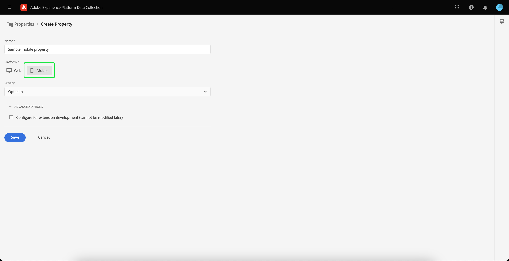

# Implementazione dell’estensione Adobe Experience Platform Assurance

Questo tutorial spiega come installare e implementare l’estensione Platform Assurance nell’SDK Mobile. Per istruzioni su come aggiungere l’estensione Assurance all’applicazione, consulta la [Panoramica sull’estensione Adobe Experience Platform Assurance](https://developer.adobe.com/client-sdks/documentation/platform-assurance-sdk/#add-the-aep-assurance-extension-to-your-app).

## Introduzione

Per installare e implementare l’estensione Assurance, è necessario accedere ai seguenti servizi:

- L’[interfaccia utente Raccolta dati di Adobe Experience Platform](https://experience.adobe.com/it#/data-collection/)
- [Adobe Experience Platform Assurance](https://experience.adobe.com/it/assurance)

## Creare una proprietà mobile

>[!NOTE]
>
>Se disponi già di una proprietà mobile, puoi passare al passaggio successivo.

Nell’interfaccia utente di Raccolta dati, seleziona **[!UICONTROL Tag]**. Viene visualizzato un elenco delle proprietà per dispositivi mobili e web, con informazioni sulle proprietà che appartengono alla tua organizzazione. Per creare una nuova proprietà, seleziona **[!UICONTROL Nuova proprietà]**.

Viene visualizzata la pagina **[!UICONTROL Crea proprietà]**. Inserisci il nome della nuova proprietà e seleziona **[!UICONTROL Mobile]** come piattaforma. Dopo aver inserito i dettagli, seleziona **[!UICONTROL Salva]** per creare la proprietà mobile.

>[!NOTE]
>
>L’impostazione **[!UICONTROL Privacy]** della proprietà mobile **non** influisce sulla raccolta dati di Assurance.

## Installare l’estensione Assurance

Seleziona la proprietà mobile in cui desideri installare l’estensione Assurance.

Viene visualizzata la pagina **dettagli proprietà mobile**. Seleziona **[!UICONTROL Estensioni]** per visualizzare un elenco delle estensioni attualmente associate alla proprietà mobile.

Seleziona **[!UICONTROL Catalogo]** per visualizzare un elenco di estensioni che è possibile aggiungere alla proprietà mobile. Utilizzando il filtro, individua l’estensione **[!UICONTROL AEP Assurance]** e seleziona **[!UICONTROL Installa]**.

## Passaggi successivi

Dopo aver installato l’estensione Assurance nella proprietà mobile, puoi iniziare a utilizzare Assurance nelle applicazioni. Per informazioni su come aggiungere l’estensione Assurance all’applicazione, consulta la [Panoramica sull’estensione Adobe Experience Platform Assurance](https://developer.adobe.com/client-sdks/documentation/platform-assurance-sdk/#add-the-aep-assurance-extension-to-your-app). Per informazioni su come utilizzare Assurance, consulta la [guida all’utilizzo di Assurance](./using-assurance.md).
