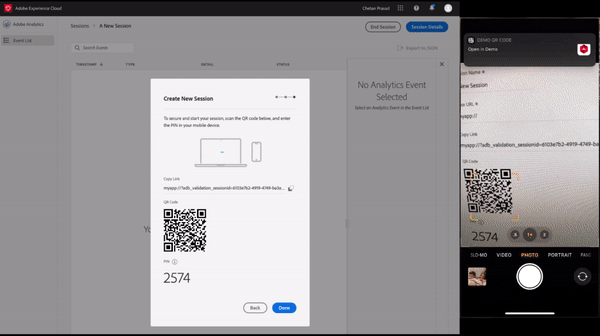

# Utilizzo di Adobe Experience Platform Assurance

Questo tutorial spiega come utilizzare Adobe Experience Platform Assurance. Per istruzioni su come installare e implementare l’estensione Adobe Experience Platform Assurance, leggi l’esercitazione su [implementazione dell’estensione Assurance](./implement-assurance.md).

## Creare le sessioni

Dopo aver effettuato l’accesso a [Interfaccia utente Assurance](https://experience.adobe.com/assurance), puoi selezionare **[!UICONTROL Crea sessione]** per iniziare a creare una sessione.

Il **[!UICONTROL Crea nuova sessione]** viene visualizzata. Controllare le istruzioni fornite e procedere selezionando **[!UICONTROL Inizio]**.

Ora puoi immettere un nome per identificare la sessione, quindi fornire un **[!UICONTROL URL di base]** (URL di collegamento profondo per l’app). Dopo aver fornito questi dettagli, seleziona **[!UICONTROL Successivo]**.

>[!INFO]
>
>L’URL di base è la definizione radice utilizzata per avviare l’app da un URL. Viene generato un URL di sessione da cui è possibile avviare la sessione Assurance. Un esempio di valore potrebbe essere: `myapp://default` In **[!UICONTROL URL di base]** , digita la definizione di collegamento profondo di base della tua app.

## Connettersi a una sessione

Dopo aver creato una sessione, assicurati di visualizzare **[!UICONTROL Crea nuova sessione]** visualizza un collegamento, un codice QR e un PIN.

Se viene visualizzata questa finestra di dialogo, puoi utilizzare l’app della fotocamera del dispositivo per scansionare il codice QR e aprire l’app oppure copiare il collegamento e aprirlo nell’app. All’avvio dell’app, dovrebbe essere visualizzata la schermata di immissione del PIN sovrapposta. Digitare il PIN del passaggio precedente e premere **[!UICONTROL Connetti]**.

Puoi verificare che l’app sia collegata ad Assurance quando sull’app viene visualizzata l’icona Adobe Experience Platform (Adobe rosso &quot;A&quot;).

## Esportare una sessione

Per esportare una sessione di Assurance, nella pagina dei dettagli delle sessioni dell’app, seleziona **[!UICONTROL Esporta in JSON]** in una sessione:

L’opzione di esportazione rispetta i risultati del filtro di ricerca ed esporta solo gli eventi visualizzati nella vista evento. Ad esempio, se hai cercato &quot;track&quot; events e poi hai selezionato **[!UICONTROL Esporta in JSON]**, vengono esportati solo i risultati dell’evento &quot;track&quot;.
