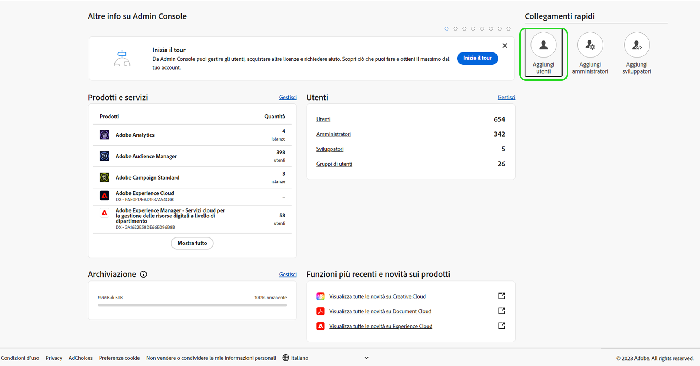
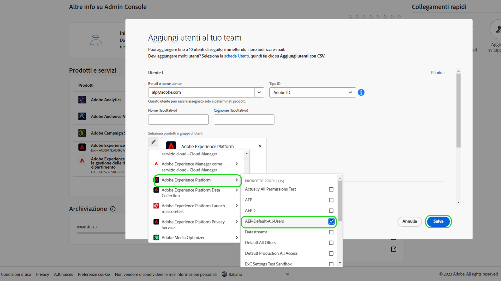

# Accesso utente

>[!WARNING]
>
>La procedura per accedere a Assurance sta cambiando. Poiché la fase beta (Project Griffon) si è conclusa e Assurance è ora disponibile per tutti i clienti di Adobe Experience Cloud, l’accesso ad Assurance sarà gestito tramite [Admin Console](https://helpx.adobe.com/it/enterprise/using/admin-console.html).
>
>Se hai bisogno di assistenza, contatta l’amministratore Adobe Experience Cloud della tua azienda.

Per ricevere o mantenere un accesso ininterrotto a Assurance, assicurati che in Admin Console siano completati i seguenti passaggi:

## Aggiunta di utenti a Experience Platform tramite un profilo di prodotto

Per aggiungere un utente a un profilo di prodotto, accedi a Admin Console e seleziona **Aggiungi utenti**.

Viene visualizzata la finestra di dialogo **Aggiungi utenti al team**. In questa finestra di dialogo è possibile immettere i dettagli dell’utente che desideri aggiungere. Inserisci l’indirizzo di posta elettronica, il nome (facoltativo) e il cognome (facoltativo) dell’utente.

Seleziona l’icona a forma di matita per scegliere i prodotti e i gruppi di utenti. Da qui, seleziona **Adobe Experience Platform**, quindi **AEP-Default-All-Users**, seguito da **Salva**.

