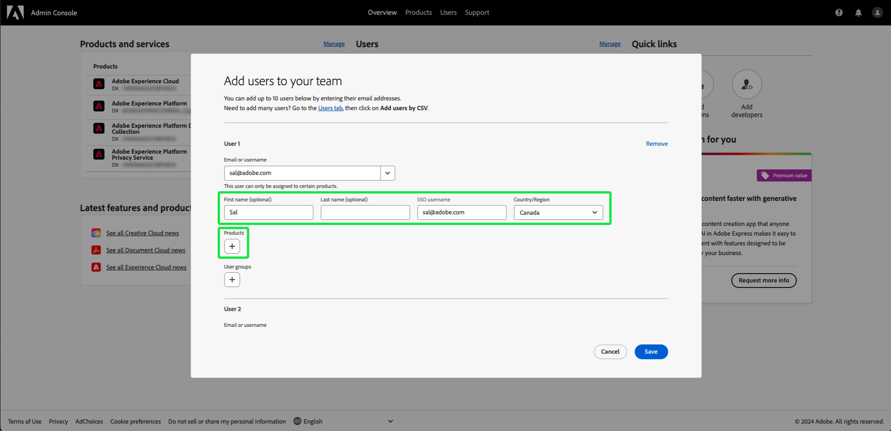

# Accesso utente

Concedi agli utenti l&#39;accesso a [!UICONTROL Assurance] aggiungendoli a qualsiasi profilo di prodotto in Adobe Experience Platform completando i seguenti passaggi in [Adobe Admin Console](https://adminconsole.adobe.com/):

## Aggiunta di utenti a Adobe Experience Platform tramite un profilo di prodotto {#adding-product-profile}

Per aggiungere un utente a un profilo di prodotto, accedere a [Adobe Admin Console](https://adminconsole.adobe.com/). Dalla scheda **[!UICONTROL Panoramica]** dell&#39;interfaccia utente di Admin Console, seleziona **[!UICONTROL Aggiungi utenti]**.

Viene visualizzata la finestra di dialogo **[!UICONTROL Aggiungi utenti al team]**. Immettere l&#39;indirizzo di posta elettronica o il nome utente della persona che si desidera aggiungere, quindi selezionare **[!UICONTROL Aggiungi come nuovo utente]**.

Due caselle di testo vengono visualizzate per immettere un **[!UICONTROL Nome]** facoltativo e un **[!UICONTROL Cognome]** facoltativo. Il nome utente **[!UICONTROL SSO]** è compilato automaticamente, insieme al **[!UICONTROL Paese]** nel menu a discesa. Assicurati che entrambe queste opzioni siano corrette e apporta le modifiche necessarie. Una volta che tutto è corretto, seleziona **[!UICONTROL Prodotti]**.

Viene visualizzata la finestra di dialogo **[!UICONTROL Seleziona prodotto]**. Seleziona il Adobe Experience Platform.

Viene visualizzata la finestra di dialogo **[!UICONTROL Seleziona profili di prodotto]** con un elenco di profili di prodotto. Seleziona un profilo di prodotto, quindi seleziona **[!UICONTROL Applica]**. Ripeti questi passaggi per aggiungere altri prodotti e profili di prodotto.

Verifica che tutto sia corretto per l’utente. Da qui puoi aggiungere altri utenti o salvare le modifiche selezionando **[!UICONTROL Salva]**.

