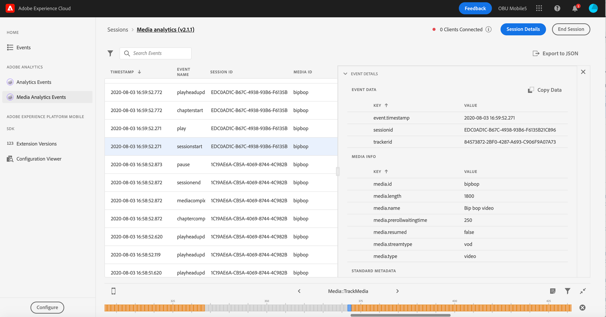

# Vista Adobe Analytics per contenuti in streaming in Assurance

Con l’integrazione tra Adobe Analytics per contenuti in streaming e Adobe Experience Platform Assurance, ora puoi convalidare l’implementazione di Media Analytics nella tua app mobile. Le visualizzazioni di Media Analytics visualizzano ciò che viene tracciato nella sessione multimediale, ad esempio:

- Evento di inizio sessione che contiene tutte le proprietà di base del contenuto, i metadati standard e i metadati personalizzati, nonché gli eventi di fine sessione e di completamento sessione.
- Eventi di inizio e inizio dell’interruzione pubblicitaria con tutte le proprietà dell’annuncio associate, nonché eventi Salta e Completa per entrambi.
- Inizio capitolo con tutte le proprietà allegate, nonché gli eventi Salta capitolo e Completa capitolo.
- Tutti gli eventi di modifica della riproduzione (riproduzione, pausa, buffer, errori, modifica del bitrate).
- Tutti gli eventi di tracciamento delle modifiche dello stato del lettore (inizio, fine).

Una volta elaborati i dati in Analytics, nella visualizzazione dei dettagli dell’evento sono disponibili anche i dati relativi allo stato e alla fase di post-elaborazione, ad esempio il tempo trascorso dal contenuto multimediale e la durata totale della pausa.

## Introduzione

Prima di continuare, assicurati di disporre dei seguenti servizi:

- Il [Interfaccia utente di Adobe Experience Platform Data Collection](https://experience.adobe.com/#/data-collection/)
- [Adobe Experience Platform Assurance](https://experience.adobe.com/assurance)

Per informazioni su come installare Assurance nell’applicazione, leggi [guida all’implementazione di Assurance](../tutorials/implement-assurance.md).

## Utilizzare Assurance con Adobe Analytics per contenuti in streaming

Dopo aver effettuato la connessione e configurato l’app per Adobe Analytics, puoi configurarla per Streaming Media Analytics. Nella parte inferiore del pannello sinistro, seleziona **[!UICONTROL Configura]** per aggiungere la visualizzazione Eventi di Media Analytics e **Salva** ...

Una volta aggiunto, seleziona il **[!UICONTROL Eventi di Media Analytics]** visualizzare in **[!UICONTROL Adobe Analytics]** per convalidare il tracciamento della sessione.

In **[!UICONTROL Eventi di Media Analytics]** , è possibile cercare e filtrare per ID sessione (VSID) per visualizzare una sessione multimediale specifica. Per visualizzare ulteriori dettagli sull’evento, seleziona un evento specifico.

Per una visualizzazione più sintetica delle chiamate API, puoi anche nascondere gli eventi di aggiornamento della testina di riproduzione selezionando **[!UICONTROL Nascondi eventi di aggiornamento della testina di riproduzione]** filtro.

>[!INFO]
>
>La visualizzazione dei dati di analisi dei contenuti multimediali post-elaborati richiede l’utilizzo delle versioni SDK: Android Media 2.1.2 e iOS AEPMedia 3.0.1 (o versioni successive)

Per visualizzare i dati post-elaborati, individua l’evento di inizio sessione e verifica nella colonna dello stato che la sessione è stata completata. Se l’evento è stato completato, fai clic su di esso per visualizzare il riepilogo di una sessione multimediale nella visualizzazione dei dettagli dell’evento. Per ulteriori dettagli, scorri verso il basso per trovare i dettagli post-elaborati.

