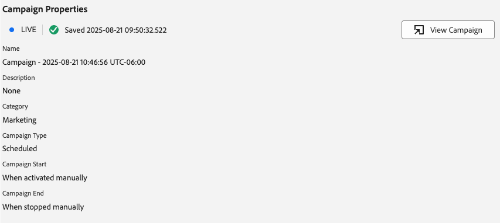

# Visualizzazione Schede di contenuto in Assurance

La vista Messaggistica in-app all’interno di Adobe Experience Platform Assurance consente di convalidare l’app, monitorare le schede di contenuto inviate al dispositivo e visualizzare le schede di anteprima.

## Schede contenuto

Nella parte superiore della scheda **[!UICONTROL Schede di contenuto]** è disponibile un elenco a discesa **[!UICONTROL Scheda di contenuto]**. Elenca tutte le schede di contenuto ricevute nella sessione Assurance. Se una scheda non è presente nell&#39;elenco, significa che l&#39;app non l&#39;ha mai ricevuta.

Selezionando una scheda di contenuto verranno visualizzate molte informazioni su tale scheda, come descritto nelle sezioni seguenti.

### Anteprima scheda

Nel pannello a destra è presente il riquadro **[!UICONTROL Anteprima scheda]** che mostra il rendering di una scheda tra i modelli più comuni: immagine piccola, immagine grande e solo immagine.

Utilizza l&#39;interruttore **[!UICONTROL Tema]** per visualizzare la scheda in modalità chiara o scura.

### Schede disponibili

Nella sezione a sinistra, le schede disponibili dipendono dalla scheda selezionata. Se la scheda include regole, verranno visualizzate tre schede: **[!UICONTROL Informazioni]**, **[!UICONTROL Interazioni]** e **[!UICONTROL Analisi regole]**.

Se la scheda non include regole, verranno visualizzate due schede: **[!UICONTROL Informazioni]** e **[!UICONTROL Interazioni]**.

### Scheda Info

La scheda **[!UICONTROL Info]** mostra la sezione **[!UICONTROL Proprietà scheda]** nella parte superiore, inclusi i badge per lo **[!UICONTROL Stato corrente]** (trigger, display, dismiss, squalificare) oltre a metadati come **[!UICONTROL Modello]** (immagine piccola, immagine grande o solo immagine), **[!UICONTROL Superficie]** ed eventuali coppie chiave-valore personalizzate.

La sezione **[!UICONTROL Proprietà campagna]** contiene le informazioni caricate da Adobe Journey Optimizer (AJO).

Puoi anche selezionare **[!UICONTROL Visualizza campagna]** per aprire la scheda in AJO per l&#39;ispezione o la modifica.

### Scheda Interazioni

La scheda **[!UICONTROL Interazioni]** riepiloga il ciclo di vita di ogni scheda come una sequenza di badge: inizia sempre con **[!UICONTROL trigger]**, seguito dal risultato ottenuto dalle regole:**[!UICONTROL visualizzazione]**, **[!UICONTROL ignora]** o **[!UICONTROL non idoneo]**.

### Scheda Regole di analisi

La scheda **[!UICONTROL Analizza]** mostra una tabella di eventi con un massimo di tre colonne di regole:**[!UICONTROL Visualizza]**, **[!UICONTROL Ignora]** e **[!UICONTROL Escludi]**, in base alle regole della scheda. Se la scheda definisce una sola regola, viene visualizzata solo quella colonna.

Ogni riga rappresenta un evento di sessione e ogni colonna indica se la regola della scheda corrisponde alle condizioni di quell’evento. Un punteggio pari a 0% indica che non vi sono condizioni corrispondenti; un punteggio pari a 100% indica una corrispondenza completa (la regola verrebbe attivata).

Se l’evento corrisponde a una condizione, verrà visualizzato un segno di spunta verde. Se l’evento non corrisponde, verrà visualizzata un’icona rossa.

Utilizza il cursore **[!UICONTROL Soglia corrispondenza]** per filtrare gli eventi in base alla percentuale minima di corrispondenza.

Quando selezioni un evento, a destra viene visualizzato un pannello dei dettagli con un pannello a soffietto che elenca le tre regole: **[!UICONTROL Visualizzazione]**, **[!UICONTROL Ignora]** e **[!UICONTROL Non idoneo]**.

Espandi qualsiasi sezione per visualizzare le condizioni della regola, quali condizioni corrispondono e la percentuale di corrispondenza calcolata per tale risultato.

## Scheda Richieste

Nella scheda **[!UICONTROL Richieste]** sono visualizzate le schede di contenuto richieste e la superficie.

Utilizza il pulsante **[!UICONTROL Visualizza scheda]** per tornare alla scheda informazioni di una scheda di contenuto specifica.

## Scheda Elenco eventi

La scheda **[!UICONTROL Elenco eventi]** mostra gli eventi di sessione relativi alle schede dei contenuti, incluse le richieste/risposte alla proposta di AJO, gli eventi del ciclo di vita delle schede e il tracciamento delle interazioni. Puoi cercare, filtrare, ordinare e personalizzare le colonne, nonché esportare i risultati.

Selezionando un evento si apre un pannello dei dettagli sul lato destro con il payload non elaborato e gli attributi chiave; è inoltre possibile contrassegnare gli eventi per il follow-up. Questa visualizzazione è utile per correlare richieste, risultati delle regole e interazioni in tutta la sessione.

## Scheda Convalida

La scheda **[!UICONTROL Convalida]** esegue le convalide per la sessione corrente, verificando se l&#39;app è stata configurata correttamente per la messaggistica:

