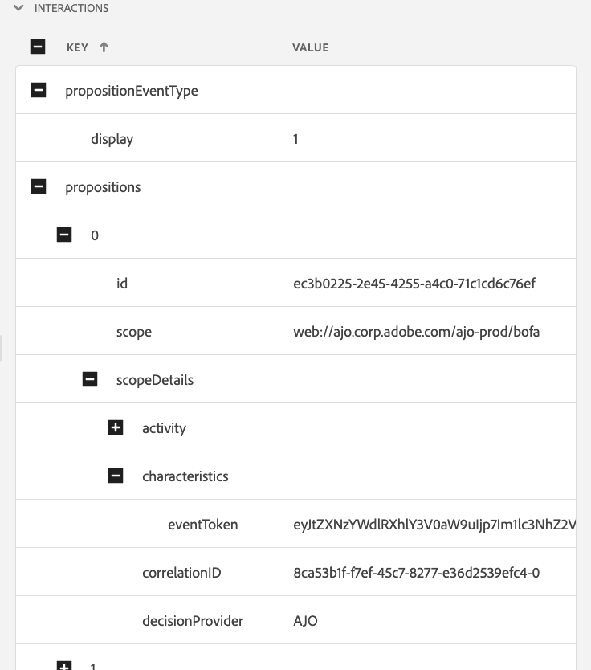

# Visualizzazione Edge Delivery in Assurance

La visualizzazione **[!UICONTROL Edge Delivery]** all&#39;interno di **[!UICONTROL Adobe Experience Platform Assurance]** consente di controllare e convalidare la consegna Edge [!UICONTROL AJO in entrata] dei messaggi alle app Web e mobili. Questa visualizzazione è particolarmente utile per la risoluzione dei problemi relativi alla consegna di [!UICONTROL campagne e percorsi Web e mobili AJO in entrata].

## Introduzione

Prima di continuare, assicurati di avere accesso ai seguenti servizi:

- L’[interfaccia utente Raccolta dati di Adobe Experience Platform](https://experience.adobe.com/it#/data-collection/)
- [Adobe Experience Platform Assurance](https://experience.adobe.com/it/assurance)

Per informazioni su come installare **[!UICONTROL Assurance]** nell&#39;applicazione, leggere la [guida all&#39;implementazione di Assurance](../tutorials/implement-assurance.md).

## Utilizzare Assurance con Edge Delivery

Una volta aperta una sessione di **[!UICONTROL Assurance]**, puoi aggiungere la visualizzazione **[!UICONTROL Edge Delivery]** a **[!UICONTROL Assurance]**. Nella parte inferiore del pannello sinistro, seleziona **[!UICONTROL Configura]** per aggiungere la visualizzazione **[!UICONTROL Edge Delivery]** e **Salva**.

Una volta aggiunta, seleziona la visualizzazione **[!UICONTROL Edge Delivery]** nella sezione **[!UICONTROL Adobe Journey Optimizer]** per convalidare la consegna Edge in entrata.

È possibile accedere a 

## Elenco richieste

Nel riquadro principale della visualizzazione viene visualizzato l’elenco delle richieste di consegna Edge. Questo elenco mostra tutte le [!UICONTROL richieste AJO] in entrata effettuate a Experience Edge ed elaborate dal **[!UICONTROL servizio di consegna in entrata]**, incluse le richieste di recupero di decisioni di personalizzazione e di tracciamento delle interazioni delle proposte di personalizzazione (ad esempio visualizzazione, clic, attivazione o esclusione).

Le richieste sono ordinate per marca temporale, con le richieste più recenti in alto. Oltre alla marca temporale, l’elenco include anche una colonna ID richiesta e un tipo di richiesta, che possono essere uno dei seguenti:

- **[!UICONTROL Consegna esperienze]**: una richiesta per recuperare le decisioni di personalizzazione
- **[!UICONTROL Interazioni esperienza]**: richiesta di tenere traccia delle interazioni delle proposte di personalizzazione
- **[!UICONTROL Consegna esperienze e interazioni]**: una richiesta per recuperare le decisioni di personalizzazione, comprese le interazioni delle proposte di personalizzazione
- **[!UICONTROL Anteprima consegna]**: richiesta per recuperare le decisioni di personalizzazione dell&#39;anteprima

Le richieste possono essere filtrate anche inserendo un termine di ricerca nella barra di ricerca nella parte superiore dell’elenco. Questo è utile quando si filtrano valori specifici, come gli ID.

## Visualizzazioni richieste dettagliate

Una volta selezionata una richiesta nella vista principale, a destra vengono visualizzate informazioni dettagliate sulla richiesta selezionata. Questa visualizzazione include le sezioni seguenti:

### Panoramica della richiesta

Questa sezione fornisce una panoramica di alto livello della richiesta selezionata, tra cui [!UICONTROL ID organizzazione], [!UICONTROL cluster Edge], [!UICONTROL ID richiesta] e [!UICONTROL Tipo richiesta], [!UICONTROL ID sandbox], [!UICONTROL Nome sandbox], [!UICONTROL ID Datastream], nonché l&#39;elenco delle superfici di richiesta in caso di [!UICONTROL richieste Consegna esperienza].

### Profilo

Questa sezione fornisce informazioni sui dati del profilo utilizzati durante l’elaborazione della richiesta, tra cui la mappa di identità, l’iscrizione al segmento e le impostazioni di consenso.\
La sezione [!UICONTROL Profilo] è molto utile per la risoluzione di problemi come il mancato funzionamento previsto della consegna a causa di appartenenza al segmento mancante o ritardata o di impostazioni di consenso per la rinuncia.

### Attività qualificate

Questa sezione fornisce un elenco delle attività qualificate per la richiesta selezionata, inclusi il tipo di attività, gli ID, lo spazio dei nomi delle identità, le superfici, la pianificazione e i tipi di pubblico. Informazioni più dettagliate sull&#39;attività sono disponibili nella [sezione traccia esecuzione raw](#execution).

### Attività non qualificate

Questa sezione fornisce un elenco delle attività che non sono state qualificate. Oltre al tipo di attività, agli ID, agli spazi dei nomi delle identità, alle superfici, alle pianificazioni e ai tipi di pubblico, questa sezione include anche un elenco dei motivi per cui l’attività non è stata qualificata.

### Dettagli messaggio

Questa sezione fornisce informazioni dettagliate sui messaggi consegnati per la richiesta selezionata. Include ID dei messaggi, frammenti, criteri di decisione, [!UICONTROL parametri di Offer decisioning], nonché il contesto di selezione dei messaggi.

### Interazioni

Questa sezione fornisce informazioni dettagliate sulle interazioni tracciate nella richiesta selezionata. Include il tipo di interazione (in `propositionEventType`), nonché i metadati di proposta associati, come i metadati di attività (in `scopeDetails.activity`) e il token di evento di proposta (in `scopeDetails.characteristics.eventToken`).

### Tracce non elaborate

Questa sezione fornisce le tracce non elaborate della richiesta selezionata. Include la traccia completa della richiesta, inclusa la richiesta effettiva ricevuta in **[!UICONTROL Inbound Delivery Service]**, traccia di esecuzione e traccia di risposta. Ciò è utile per la risoluzione avanzata di problemi come il mancato funzionamento della consegna come previsto a causa della non disponibilità del servizio di consegna, di dati mancanti o errati o per comprendere il flusso completo dell’elaborazione delle richieste.

#### Richiesta

La traccia della richiesta include la richiesta completa in quanto ricevuta dal **[!UICONTROL servizio di consegna in entrata]** **[!UICONTROL Konductor]** a monte. Include le intestazioni della richiesta, il corpo e altri metadati. Ad esempio, è possibile controllare il payload XDM della richiesta nel campo `event.body.xdm`.

#### Execution

La traccia di esecuzione include la traccia completa della richiesta elaborata dal **[!UICONTROL servizio di consegna in entrata]**. Mostra il contesto di esecuzione, la qualifica dell’attività, la selezione dei messaggi e altri passaggi di elaborazione. Eventuali errori o avvisi che si sono verificati durante l&#39;elaborazione della richiesta sono disponibili nei campi `context.messages` e `context.exceptions`. Informazioni dettagliate sulla qualifica dell&#39;attività sono disponibili nei campi `context.qualifiedActivitiesDetailed` e `context.unqualifiedActivitiesDetailed`.

#### Risposta

La traccia di risposta include la risposta completa restituita da **[!UICONTROL Inbound Delivery Service]** a valle di **[!UICONTROL Konductor]**. Include le intestazioni di risposta, il corpo e altri metadati. È possibile controllare il corpo completo della risposta copiando il messaggio con ID `1` negli Appunti utilizzando il pulsante **[!UICONTROL Copia valore]** e incollandolo in un visualizzatore JSON.

