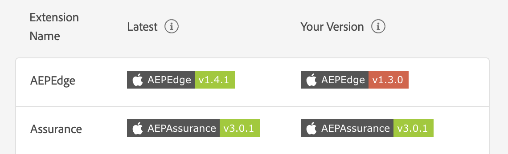

# Vista Versioni estensioni

La vista Versione estensioni consente di ordinare e visualizzare rapidamente quali estensioni di Adobe Experience Platform per dispositivi mobili sono state installate e se sono aggiornate in un client connesso a una sessione di Assurance.

## Introduzione alle viste Versioni estensioni

Dopo [aver impostato Assurance](../tutorials/implement-assurance.md), nella vista **Home**, seleziona **[!UICONTROL Versioni estensione]**

## Verifica se la tua versione è aggiornata

All’interno di questa vista, una tabella mostra sia la versione più recente di ogni SDK Mobile, sia l’eventuale versione corrente installata. Quando una versione è sincronizzata con la versione più recente, la versione installata presenterà un badge verde. In caso contrario, il badge verrà visualizzato in rosso.

## Esporta versioni

In alto a destra nella vista puoi selezionare **[!UICONTROL Esporta versioni]** che fornisce un payload JSON con tutte le informazioni sulle estensioni e sulla piattaforma utilizzata dal client. Puoi scegliere di esportare questi dati in un file JSON oppure copiarli negli Appunti.

