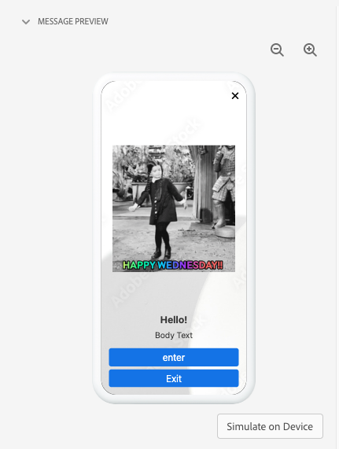
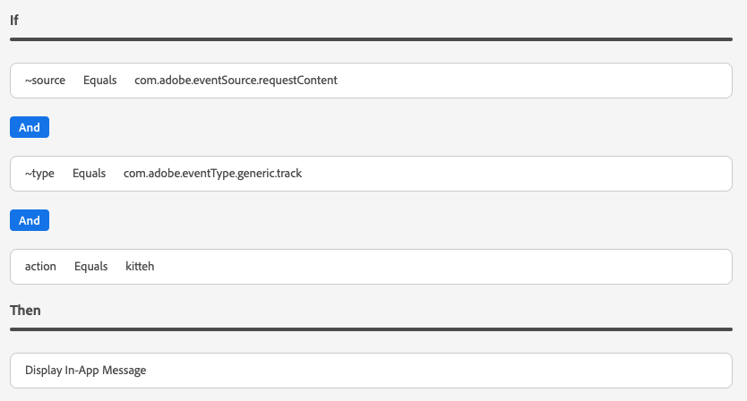

# Visualizzazione Messaggistica in-app in Assurance

La visualizzazione Messaggistica in-app in Adobe Experience Platform Assurance consente di convalidare l’app, monitorare i messaggi in-app inviati al dispositivo e simulare i messaggi inviati al dispositivo.

## Messaggi sul dispositivo

Nella parte superiore del **[!UICONTROL Messaggi sul dispositivo]** è una **[!UICONTROL Messaggio]** a discesa. Questo includerà tutti i messaggi ricevuti nella sessione di Assurance. Se un messaggio non è presente in questo elenco, significa che l’app non l’ha mai ricevuta.


Quando si seleziona un messaggio vengono visualizzate numerose informazioni su di esso, come descritto nelle sezioni seguenti.

### Anteprima messaggio

Nel pannello di destra è presente una **[!UICONTROL Anteprima messaggio]** , che mostra un’anteprima del messaggio. Selezione **[!UICONTROL Simulazione sul dispositivo]** invierà il messaggio a tutti i dispositivi attualmente connessi alla sessione.



### Comportamento dei messaggi

Sotto la **[!UICONTROL Anteprima messaggio]** il riquadro è **[!UICONTROL Comportamento dei messaggi]** scheda . Sono disponibili tutti i dettagli sulla visualizzazione del messaggio. Queste informazioni includono informazioni sul posizionamento, animazioni, gesti di scorrimento e impostazioni di aspetto.


### Scheda Informazioni

Nella sezione a sinistra sono presenti quattro schede che mostrano i dettagli del messaggio. La **[!UICONTROL Info]** La scheda mostra le informazioni caricate da Adobe Journey Optimizer (AJO) sulla campagna messaggi.

Puoi anche selezionare **[!UICONTROL Visualizza campagna]** per aprire il messaggio in AJO per l’ispezione o la modifica.


### Scheda Regole

La **[!UICONTROL Regole]** la scheda mostra cosa deve accadere per visualizzare questo messaggio. In questo modo è possibile comprendere esattamente cosa attiverà un messaggio da visualizzare. Osservando questo esempio:



L’esempio mostra tre diverse condizioni per la regola. Se selezioni un evento (da un elenco di eventi, dalla scheda Analizza o nella timeline), questo verrà valutato in base a queste regole. Se l’evento corrisponde a una condizione, viene visualizzato un segno di spunta verde:


Se l’evento non corrisponde, viene visualizzata un’icona rossa:


Se tutte e tre le condizioni corrispondono all’evento corrente, viene visualizzato il messaggio.

### Scheda Analizza

La **[!UICONTROL Analizza]** fornisce ulteriori informazioni sulle regole. In questo caso, filtriamo ogni evento nella sessione in base alla vicinanza della regola del messaggio con l’evento.


Nell’esempio in **[!UICONTROL Scheda Regole]** nella regola sono presenti tre condizioni. Questa scheda mostra la percentuale della regola corrispondente a ogni evento. La maggior parte degli eventi corrisponde al 33% (una delle tre condizioni) e il resto al 100%.

Di conseguenza, puoi trovare eventi vicini alla corrispondenza ma che non corrispondono completamente alla regola.


La **[!UICONTROL Soglia corrispondenza]** Il cursore consente di filtrare gli eventi da visualizzare. Ad esempio, questo valore può essere impostato su 50% - 90% per ottenere un elenco di eventi che corrispondono esattamente a due delle tre condizioni.

### Scheda Interazioni

La **[!UICONTROL Interazioni]** La scheda mostra un elenco degli eventi di interazione inviati a Edge a scopo di tracciamento.


In genere sono disponibili quattro eventi di interazione ogni volta che viene visualizzato un messaggio:

```
trigger > display > interact > dismiss
```

L’interazione &quot;interagisce&quot; presenta un valore &quot;action&quot; aggiuntivo associato a essa. I valori possibili includono &quot;clicked&quot; o &quot;cancel&quot;.

La colonna di convalida mostra se l’evento di interazione è stato correttamente ricevuto ed elaborato dal server Edge.

## Convalida

La **[!UICONTROL Convalida]** La scheda esegue le convalide rispetto alla sessione corrente, verificando se l’app è stata configurata correttamente per i messaggi in-app:


Se sono stati rilevati errori, verranno forniti dettagli su come correggere tali errori.

## Elenco eventi


La **[!UICONTROL Elenco eventi]** La scheda fornisce un&#39;occhiata rapida a tutti gli eventi della sessione di verifica relativi ai messaggi in-app. Alcuni degli eventi che potresti vedere qui sono:

* Richieste e risposte per il recupero dei messaggi
* Visualizzare gli eventi dei messaggi
* Eventi di tracciamento dell’interazione

In questa visualizzazione è possibile utilizzare molte delle funzioni standard dell’elenco di eventi, tra cui l’applicazione di ricerche, l’applicazione di filtri, l’aggiunta o la rimozione di colonne ed esportazione di dati.

Seleziona un evento per visualizzare i dettagli non elaborati dell’evento nel pannello di destra.

Dal pannello dei dettagli a destra, l’evento selezionato può essere contrassegnato, utile per contrassegnare un elemento che deve essere rivisto da un’altra persona.
