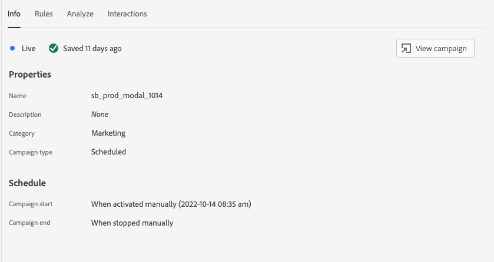

# Vista Messaggistica in-app in Assurance

La vista Messaggistica in-app all’interno di Adobe Experience Platform Assurance consente di convalidare l’app, monitorare i messaggi in-app consegnati al dispositivo e simulare i messaggi al dispositivo.

## Messaggi sul dispositivo

Nella parte superiore della scheda **[!UICONTROL Messaggi sul dispositivo]** è presente un menu a discesa **[!UICONTROL Messaggio]**. Questo includerà tutti i messaggi che sono stati ricevuti nella sessione di Assurance. Se un messaggio non è presente nell’elenco, significa che l’app non l’ha mai ricevuto.


Selezionando un messaggio verranno visualizzate molte informazioni su quel messaggio, come descritto nelle sezioni seguenti.

### Anteprima del messaggio

Nel pannello a destra è presente un riquadro di **[!UICONTROL Anteprima del messaggio]**, che mostra un’anteprima del messaggio. Selezionando **[!UICONTROL Simula sul dispositivo]** verrà inviato il messaggio a tutti i dispositivi attualmente connessi alla sessione.


### Comportamento del messaggio

Sotto il riquadro **[!UICONTROL Anteprima del messaggio]** è presente la scheda **[!UICONTROL Comportamento del messaggio]**. Contiene tutti i dettagli su come il messaggio viene visualizzato. Queste informazioni includono informazioni sul posizionamento, animazioni, movimenti di scorrimento e impostazioni di aspetto.


### Scheda Info

Nella sezione a sinistra sono disponibili quattro schede che mostrano i dettagli del messaggio. La scheda **[!UICONTROL Info]** mostra le informazioni caricate da Adobe Journey Optimizer (AJO) sulla campagna di messaggi.

Puoi anche selezionare **[!UICONTROL Visualizza campagna]** per aprire il messaggio in AJO per controllarlo o modificarlo.



### Scheda Regole

La scheda **[!UICONTROL Regole]** mostra cosa deve accadere affinché il messaggio venga visualizzato. Questa fornisce informazioni approfondite su esattamente cosa attiverà la visualizzazione di un messaggio. Osservando questo esempio:


L’esempio mostra tre condizioni diverse per la regola. Se selezioni un evento (da un elenco di eventi, dalla scheda Analizza o nella timeline), tale evento verrà valutato in base a queste regole. Se l’evento corrisponde a una condizione, verrà visualizzato un segno di spunta verde:


Se l’evento non corrisponde, verrà visualizzata un’icona rossa:


Se tutte e tre le condizioni corrispondono all’evento corrente, il messaggio sarà visualizzato.

### Scheda Analizza

La scheda **[!UICONTROL Analizza]** fornisce ulteriori informazioni sulle regole. In questo caso, viene filtrato ogni evento della sessione in base a quanto la regola del messaggio corrisponde all’evento.


Nell’esempio della sezione **[!UICONTROL Scheda Regole]**, nella regola sono presenti tre condizioni. Questa scheda mostra la percentuale della regola a cui corrisponde ogni evento. La maggior parte degli eventi corrisponde al 33% (una delle tre condizioni) e il resto corrisponde al 100%.

Di conseguenza, puoi trovare eventi che sono vicini alla corrispondenza ma non corrispondono completamente alla regola.


Il cursore **[!UICONTROL Soglia di corrispondenza]** consente di filtrare gli eventi da visualizzare. Ad esempio, potrebbe essere impostato su 50% - 90% per ottenere un elenco di eventi che corrispondono esattamente a due delle tre condizioni.

### Scheda Interazioni

La scheda **[!UICONTROL Interazioni]** mostra un elenco di eventi di interazione inviati a Edge a scopo di tracciamento.


Ogni volta che viene visualizzato un messaggio, in genere si verificano quattro eventi di interazione:

```
trigger > display > interact > dismiss
```

All’interazione “interagire” è associato un valore “azione” aggiuntivo. I valori possibili includono “cliccato” o “annulla”.

La colonna di convalida mostra se l’evento di interazione è stato ricevuto ed elaborato correttamente da Edge.

## Convalida

La scheda **[!UICONTROL Convalida]** esegue le convalide rispetto alla sessione corrente, verificando se l’app è stata configurata correttamente per la messaggistica in-app:


Se vengono rilevati errori, verranno fornite informazioni su come correggerli.

## Elenco eventi


La scheda **[!UICONTROL Elenco eventi]** fornisce una rapida panoramica di tutti gli eventi della sessione di Assurance correlati alla messaggistica in-app. Alcuni degli eventi che puoi visualizzare qui sono:

* Richieste e risposte per recuperare i messaggi
* Visualizzazione gli eventi dei messaggi
* Eventi di tracciamento delle interazioni

In questa vista è possibile utilizzare molte delle caratteristiche standard dell’elenco di eventi, tra cui l’applicazione di ricerche e di filtri, l’aggiunta o la rimozione di colonne e l’esportazione di dati.

Seleziona un evento per visualizzarne i dettagli non elaborati nel pannello di destra.

Dal pannello dei dettagli a destra, è possibile contrassegnare l’evento selezionato, utile per contrassegnare un elemento che deve essere rivisto da un’altra persona.
