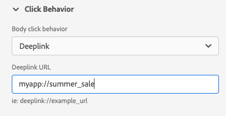

# Visualizzazione Debug push

La visualizzazione Debug push all’interno di Adobe Experience Platform Assurance consente di convalidare la configurazione push dell’app e inviare un messaggio di prova al dispositivo.

## Client

Il menu a discesa del client contiene un elenco di ogni client univoco connesso a questa sessione di controllo. Un client è un dispositivo univoco o un&#39;installazione di app univoca per un dispositivo. Ad esempio, se un dispositivo Android e un dispositivo iOS sono stati collegati alla sessione, tali client verranno visualizzati nel menu a discesa Client .

Dopo aver reinstallato e ricollegato l’app a un dispositivo, verrà visualizzato un altro client. Se esiste già un dispositivo con lo stesso nome, il nuovo menu a discesa aggiungerà un #2 al nome.

Questa visualizzazione è abilitata solo per un singolo client, pertanto la selezione di un client diverso modificherà i dettagli sullo schermo.

## Convalida installazione

La **[!UICONTROL Convalida installazione]** La scheda convalida e fornisce dettagli aggiuntivi sulla configurazione push dell’app. Sono disponibili tre pannelli che eseguono convalide. Se le convalide hanno esito positivo, viene visualizzato un segno di spunta verde. Se sono presenti tre segni di spunta verdi, l’app è stata configurata correttamente per i messaggi push, sta scrivendo token al profilo utente e dispone di una superficie dell’app associata configurata.

Se qualcosa non funziona come previsto, verrà visualizzato un avviso con dettagli su come risolvere il problema:

### Dettagli client

Questo pannello controlla se il dispositivo è configurato correttamente. Ciò include la configurazione dell’estensione nell’interfaccia utente di raccolta dati, l’inizializzazione dell’estensione e dei relativi prerequisiti nell’applicazione e l’acquisizione del token push dal dispositivo.

Se valido, nel pannello viene visualizzato l’ECID per il dispositivo, il token push e il nome e il tipo della Sandbox Edge.

### Dettagli profilo

Una volta configurato correttamente il client, questo pannello controlla se il dispositivo sta scrivendo al profilo. Inoltre, verifica che il token push nel profilo corrisponda a quello sul dispositivo.

Se valido, il pannello mostra l’ECID per il dispositivo, il token push, l’ID app dell’applicazione, la piattaforma di messaggistica e se il token push è stato inserito nell’elenco non consentiti. Il token può essere inserito nell’elenco non consentiti per vari motivi, ad esempio se l’utente ha disinstallato l’app o se ha disabilitato i messaggi push per l’app.

Infine, nella parte inferiore del pannello è presente un collegamento che aprirà questo profilo specifico in una nuova scheda.

### Credenziali e configurazione di AppStore

Questo pannello verifica che l’ID dell’app e la piattaforma di messaggistica salvata nel profilo abbiano una superficie dell’app corrispondente creata. Una superficie dell’app è la posizione in cui vengono caricate le credenziali push per l’applicazione.

Se valido, nel profilo vengono visualizzati il nome della superficie dell’app, l’ID dell’app e il nome del servizio di messaggistica.

Infine, nella parte inferiore del pannello è presente un collegamento che aprirà questa superficie dell’app specifica in una nuova scheda.

## Invia push di prova

La **[!UICONTROL Invia push di prova]** può essere utilizzata per inviare un messaggio di test al dispositivo.

Puoi configurare diversi riquadri per testare diverse funzioni push di iOS e Android. Una volta configurata, seleziona **[!UICONTROL Invia notifica push di prova]** per inviare il messaggio.

### Messaggio

In **[!UICONTROL Messaggio]** Puoi fornire un titolo e un corpo per il messaggio. La funzione di notifica silenziosa può essere attivata anche qui.

### Target push

La **[!UICONTROL Target push]** Il riquadro ti consente di personalizzare il token push e la superficie dell’app da utilizzare per l’invio del messaggio push.

Queste informazioni sono fornite per impostazione predefinita se **[!UICONTROL Convalida installazione]** vengono visualizzati tre segni di spunta verdi nella scheda . Tuttavia, puoi fornire il tuo token push e la tua superficie dell’app, anche se l’app non è completamente configurata.

### Comportamento del clic

Da **[!UICONTROL Comportamento del clic]** Puoi scegliere quale dovrebbe essere il comportamento quando fai clic sulla notifica push sul dispositivo. Per impostazione predefinita, apre l’app, ma può aprire un collegamento diretto o una pagina web.

Se scegli di utilizzare un collegamento diretto, lo sviluppatore dell’app deve crearne uno per te.

### Contenuti multimediali

La **[!UICONTROL Contenuti multimediali]** Il riquadro ti consente di aggiungere al messaggio elementi multimediali aggiuntivi, ad esempio immagini, video o GIF. Per abilitare questa funzione, lo sviluppatore dell’app deve aggiungere codice all’app.

### Pulsanti

La **[!UICONTROL Pulsanti]** Il riquadro ti consente di aggiungere pulsanti aggiuntivi alla notifica push. Ogni pulsante può aprire l’app, aprire un collegamento diretto nell’app o aprire una pagina web.

Per abilitare questa funzione, lo sviluppatore dell’app deve aggiungere codice all’app.

### Dati personalizzati

La **[!UICONTROL Dati personalizzati]** Il riquadro ti consente di aggiungere dati personalizzati alla notifica push. Ogni coppia chiave/valore viene inviata come metadati insieme al messaggio e può essere utilizzata dagli sviluppatori per creare esperienze potenti e aggiungere un tracciamento aggiuntivo.

## Risultati del test

Una volta inviato un messaggio, la **[!UICONTROL Risultati del test]** riceve i dati dai servizi push per il messaggio. Qui puoi vedere se il messaggio è stato inviato ai servizi di messaggistica Google/iOS:

Se si sono verificati dei problemi, questi vengono visualizzati qui:

## Avanzate

### Visualizza payload messaggio

Accanto al **[!UICONTROL Invia notifica push di prova]** pulsante è un set di puntini di sospensione con un menu a comparsa. Da qui puoi visualizzare il payload del messaggio. Questo ti consente di visualizzare il messaggio esatto che verrà inviato al servizio di messaggistica remota. Puoi rivedere questo payload o anche copiarlo e incollarlo in uno strumento di test push desktop.

