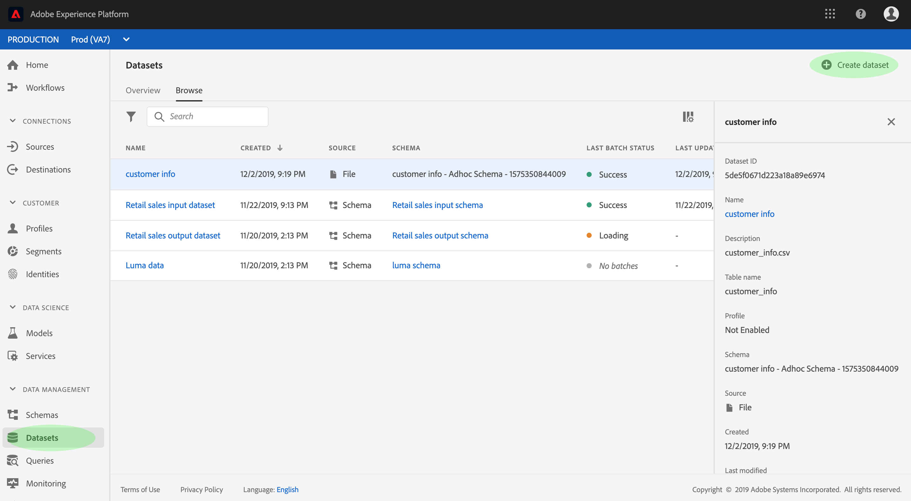

# Guida utente dei set di dati

Questa guida utente fornisce istruzioni sull&#39;esecuzione di azioni comuni quando si utilizzano i set di dati all&#39;interno &#39;interfaccia utente del Adobe Experience Platform.

## Introduzione

Questa guida utente richiede una buona conoscenza dei seguenti componenti del  Adobe Experience Platform:

* [Set](overview.md)di dati: Il concetto di storage e gestione per la persistenza dei dati in  Experience Platform.
* [Sistema](../../xdm/home.md)XDM (Experience Data Model): Framework standard con cui  Experience Platform organizza i dati sull&#39;esperienza dei clienti.
   * [Nozioni di base sulla composizione](../../xdm/schema/composition.md)dello schema: Scoprite i componenti di base degli schemi XDM, inclusi i principi chiave e le procedure ottimali nella composizione dello schema.
   * [Editor](../../xdm/tutorials/create-schema-ui.md)schema: Scoprite come creare schemi XDM personalizzati utilizzando l&#39;Editor di schema nell&#39;interfaccia utente di Platform.
* [Profilo](../../profile/home.md)cliente in tempo reale: Fornisce un profilo di consumo unificato e in tempo reale basato su dati aggregati provenienti da più origini.
* [Governance](../../data-governance/home.md)dei dati: Assicurati la conformità a normative, restrizioni e criteri relativi all&#39;utilizzo dei dati dei clienti.

## Visualizzare i set di dati

Nell&#39;interfaccia utente di  Experience Platform, fai clic su **Set** di dati nella barra di navigazione a sinistra per aprire il dashboard *Set* di dati. Il dashboard elenca tutti i set di dati disponibili per l&#39;organizzazione. I dettagli vengono visualizzati per ciascun dataset elencato, incluso il nome, lo schema a cui il dataset aderisce e lo stato dell&#39;assimilazione più recente.

Fare clic sul nome di un dataset per accedere alla schermata Attività ** DataSet corrispondente e visualizzare i dettagli del set di dati selezionato. La scheda dell&#39;attività include un grafico che visualizza il tasso di utilizzo dei messaggi e un elenco di batch con esito positivo o negativo.

## Anteprima di un dataset

Dalla schermata Attività ** DataSet, fate clic su **Anteprima set di dati** vicino all&#39;angolo superiore destro dello schermo per visualizzare in anteprima fino a 100 righe di dati. Se il set di dati è vuoto, il collegamento di anteprima verrà disattivato e verrà visualizzata la dicitura **Anteprima non disponibile**.

Nella finestra di anteprima, la visualizzazione gerarchica dello schema per il dataset viene visualizzata a destra.

Per metodi più affidabili per accedere ai dati,  Experience Platform fornisce servizi a valle come Query Service e JupyterLab per esplorare e analizzare i dati. Per ulteriori informazioni, consulta i documenti seguenti:

* [Panoramica di Servizio query](../../query-service/home.md)
* [Guida utente di JupyterLab](../../data-science-workspace/jupyterlab/overview.md)

## Creare un dataset {#create}

Per creare un nuovo set di dati, fai clic su **Crea set di dati** nel dashboard *Set* dati.

Nella schermata successiva vengono visualizzate le due opzioni seguenti per creare un nuovo set di dati:

* [Crea set di dati dallo schema](#create-a-dataset-with-an-existing-schema)
* [Crea set di dati da file CSV](#create-a-dataset-with-a-csv-file)

### Creare un dataset con uno schema esistente

Nella schermata *Crea set di dati* , fare clic su **Crea set di dati dallo schema** per creare un nuovo set di dati vuoto.

Viene visualizzato il passaggio *Seleziona schema* . Sfogliare l&#39;elenco dello schema e selezionare lo schema a cui il set di dati aderirà prima di fare clic su **Avanti**.

Viene visualizzato il passaggio *Configura set di dati* . Immettete un nome e una descrizione facoltative per il set di dati, quindi fate clic su **Fine** per creare il set di dati.

### Creare un set di dati con un file CSV

Quando un set di dati viene creato utilizzando un file CSV, viene creato uno schema ad hoc per fornire al set di dati una struttura che corrisponde al file CSV fornito. Nella schermata *Crea set di dati* , fate clic sulla casella con la dicitura **Crea set di dati dal file** CSV.

Viene visualizzato il passaggio *Configura* . Immettete il set di dati con un nome e una descrizione facoltativa, quindi fate clic su **Avanti**.

Viene visualizzato il passaggio *Aggiungi dati* . Caricate il file CSV trascinandolo e rilasciandolo al centro dello schermo, oppure fate clic su **Sfoglia** per esplorare la directory dei file. Il file può avere una dimensione massima di 10 gigabyte. Una volta caricato il file CSV, fate clic su **Salva** per creare il set di dati.

>[!NOTE]
>
>I nomi delle colonne CSV devono iniziare con caratteri alfanumerici e possono contenere solo lettere, numeri e caratteri di sottolineatura.

## Abilita un set di dati per il profilo cliente in tempo reale

Ogni dataset ha la capacità di arricchire i profili dei clienti con i dati acquisiti. A tal fine, lo schema a cui aderisce il dataset deve essere compatibile per l&#39;uso nel profilo cliente in tempo reale. Uno schema compatibile soddisfa i seguenti requisiti:

* Lo schema ha almeno un attributo specificato come proprietà identity.
* Lo schema presenta una proprietà identity definita come identità primaria.

Per ulteriori informazioni sull&#39;abilitazione di uno schema per il profilo, vedere la guida [utente dell&#39;Editor di](../../xdm/tutorials/create-schema-ui.md)schema.

Per abilitare un set di dati per il profilo, accedi alla schermata Attività ** DataSet corrispondente e fai clic sull’opzione **Profilo** nella colonna *Proprietà* . Una volta attivato, i dati acquisiti nel dataset verranno utilizzati anche per compilare i profili dei clienti.

Se un dataset contiene già dei dati e viene quindi abilitato per Profilo, i dati esistenti non vengono utilizzati da Profilo. Dopo che un set di dati è abilitato per il profilo, si consiglia di ripetere l&#39;acquisizione di tutti i dati esistenti per consentirne la compilazione nei profili cliente.

## Gestione e applicazione della governance dei dati su un dataset

L&#39;etichettatura e l&#39;applicazione dell&#39;uso dei dati (DULE) è il meccanismo di gestione dei dati di base per  Experience Platform. Le etichette DULE consentono di classificare set di dati e campi in base ai criteri di utilizzo applicabili ai dati. Per ulteriori informazioni sulle etichette, vedere la panoramica [sulla governance dei](../../data-governance/home.md) dati o consultare la guida [utente relativa alle etichette di utilizzo dei](../../data-governance/labels/overview.md) dati per istruzioni su come applicare le etichette ai set di dati.

## Eliminare un dataset

È possibile eliminare un dataset accedendo innanzitutto alla schermata delle attività ** DataSet. Quindi, fare clic su **Elimina set di dati** per eliminarlo.

>[!NOTE]
>
>Non è possibile eliminare i set di dati creati e utilizzati da applicazioni e servizi Adobe (ad esempio Adobe  Analytics,  Adobe Audience Manager o Servizio di disattivazione).

Viene visualizzata una casella di conferma. Fate clic su **Elimina** per confermare l&#39;eliminazione del set di dati.

## Eliminare un set di dati abilitato per il profilo

Se un set di dati è abilitato per il profilo, eliminandolo dall’interfaccia utente, il set di dati viene disattivato per l’inserimento, ma non elimina automaticamente il set di dati nel backend. Per eliminare completamente il dataset, inclusi i dati di profilo e identità forniti, è necessario effettuare un&#39;ulteriore richiesta di eliminazione. Per informazioni su come eliminare correttamente i dati dallo store Profilo, consultate la [guida secondaria API Profilo cliente in tempo reale sui processi del sistema dei profili, nota anche come &quot;richieste di eliminazione&quot;](../../profile/api/profile-system-jobs.md).

## Caricamento dei dati del monitor

Nell’interfaccia  di Experience Platform, fate clic su **Monitoraggio** nella navigazione a sinistra. Il dashboard di *monitoraggio* consente di visualizzare gli stati dei dati in entrata da un&#39;acquisizione batch o in streaming. Per visualizzare lo stato dei singoli batch, fare clic su *Batch end-to-end* o su *Streaming end-to-end*. Le dashboard elencano tutte le esecuzioni batch o in streaming dell&#39;assimilazione, incluse quelle che hanno esito positivo, non sono riuscite o sono ancora in corso. Ogni elenco fornisce dettagli del batch, inclusi l’ID batch, il nome del set di dati di destinazione e il numero di record acquisiti. Se il set di dati di destinazione è abilitato per il profilo, viene visualizzato anche il numero di record di identità e profilo acquisiti.

Puoi fare clic su un singolo ID **** batch per accedere al dashboard Panoramica ** batch e visualizzare i dettagli del batch, compresi i log di errore in caso di errore durante il caricamento del batch.

Per eliminare il batch, fate clic su **Elimina batch** nella parte superiore destra del dashboard. In questo modo i record verranno rimossi anche dal set di dati a cui è stato originariamente assimilato il batch.

## Passaggi successivi

Questa guida utente fornisce istruzioni per eseguire azioni comuni quando si utilizzano i set di dati nell&#39;interfaccia utente  Experience Platform. Per i passaggi relativi all&#39;esecuzione di flussi di lavoro Platform comuni con set di dati, fare riferimento alle seguenti esercitazioni:

* [Creazione di un set di dati tramite le API](create.md)
* [Query dei dati del set di dati tramite l&#39;API Data Access](../../data-access/home.md)
* [Configurare un set di dati per il profilo cliente e il servizio identità in tempo reale mediante le API](../../profile/tutorials/dataset-configuration.md)