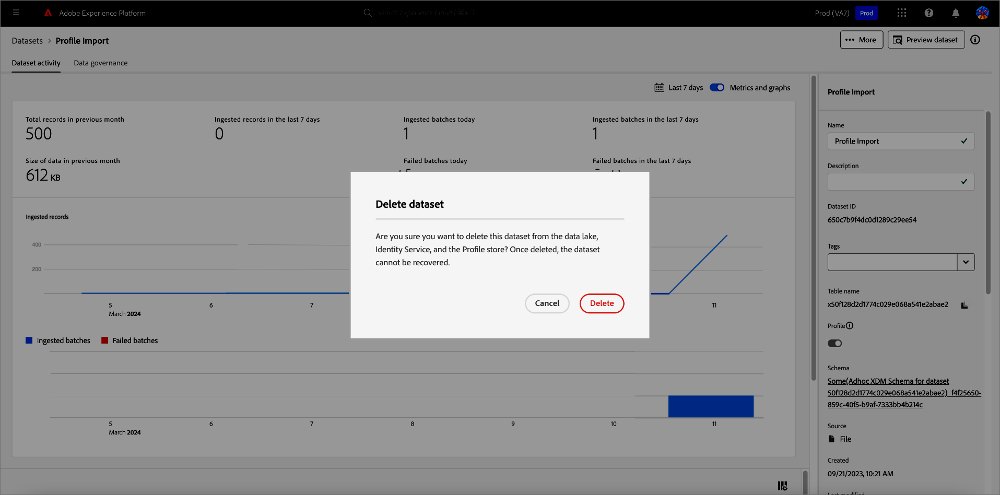
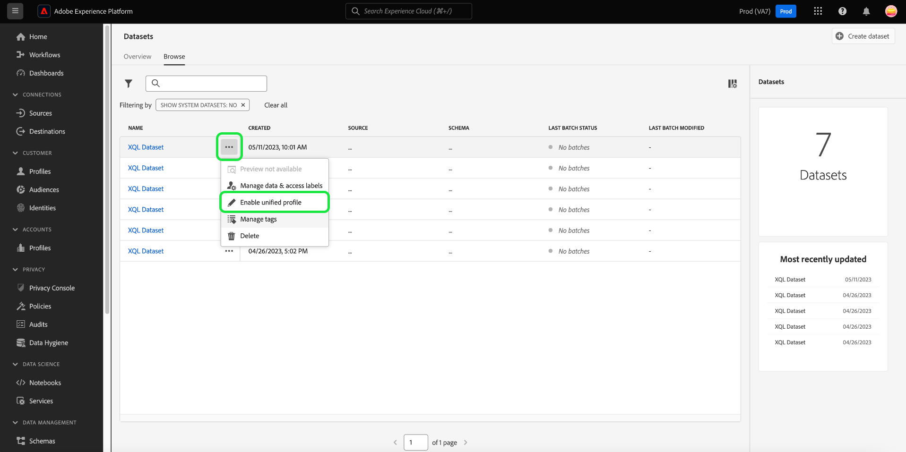
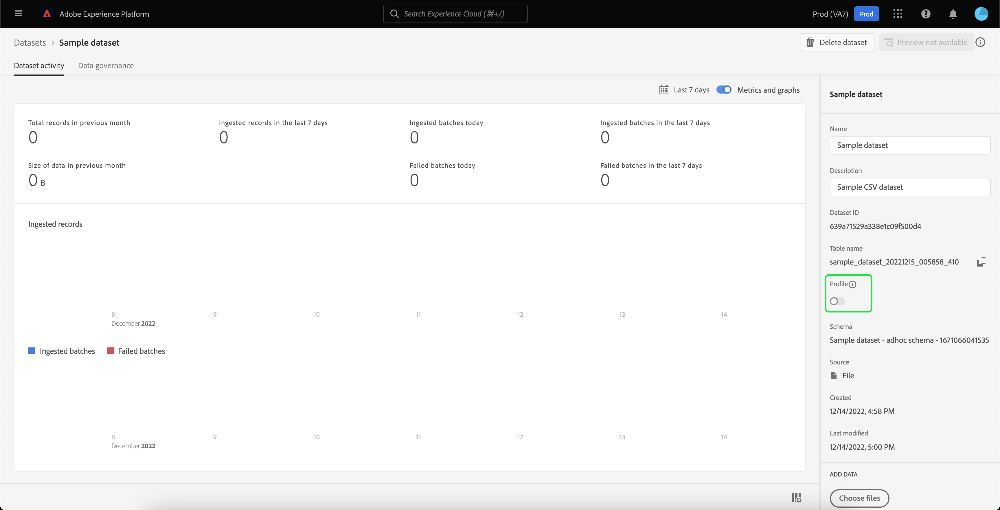
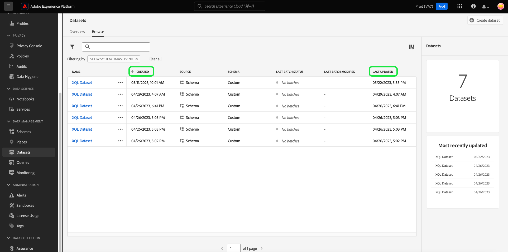
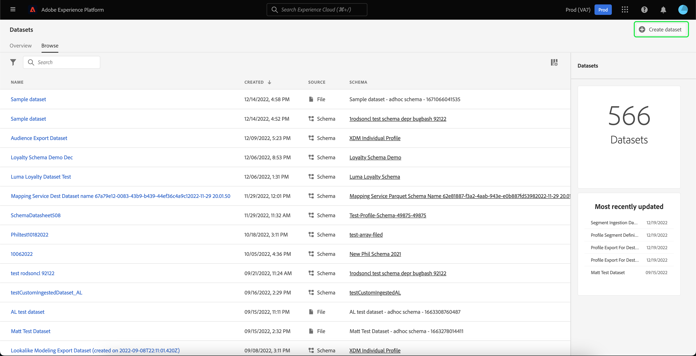
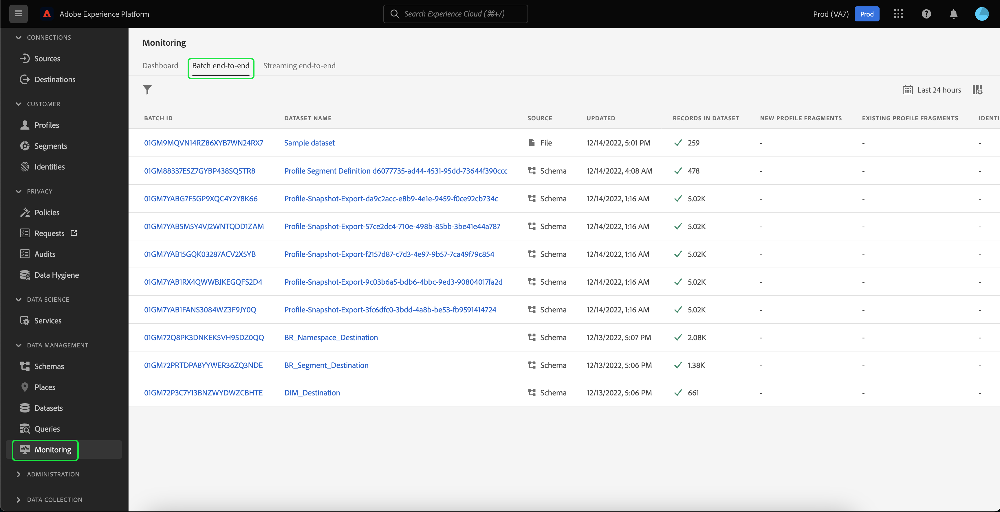

# Guida all’interfaccia utente dei set di dati

Questa guida utente fornisce istruzioni su come eseguire azioni comuni quando si lavora con set di dati nell’interfaccia utente di Adobe Experience Platform.

## Introduzione

La presente guida utente richiede una buona conoscenza dei seguenti componenti di Adobe Experience Platform:

* [Set di dati](overview.md): il costrutto di archiviazione e gestione per la persistenza dei dati in [!DNL Experience Platform].
* [[!DNL Experience Data Model (XDM) System]](../../xdm/home.md): framework standardizzato tramite il quale [!DNL Experience Platform] organizza i dati sull&#39;esperienza del cliente.
   * [Nozioni di base sulla composizione dello schema](../../xdm/schema/composition.md): scopri i blocchi predefiniti di base degli schemi XDM, inclusi i principi chiave e le best practice nella composizione dello schema.
   * [Editor schema](../../xdm/tutorials/create-schema-ui.md): scopri come creare schemi XDM personalizzati utilizzando [!DNL Schema Editor] nell&#39;interfaccia utente di [!DNL Platform].
* [[!DNL Real-Time Customer Profile]](../../profile/home.md): fornisce un profilo consumer unificato e in tempo reale basato su dati aggregati provenienti da più origini.
* [[!DNL Adobe Experience Platform Data Governance]](../../data-governance/home.md): garantire la conformità a normative, restrizioni e criteri relativi all&#39;utilizzo dei dati dei clienti.

## Visualizza set di dati {#view-datasets}

>[!CONTEXTUALHELP]
>id="platform_datasets_negative_numbers"
>title="Numeri negativi nelle attività sui set di dati"
>abstract="I numeri negativi nei record acquisiti indicano che un utente ha eliminato alcuni batch in un intervallo di tempo selezionato."
>text="Learn more in documentation"

>[!CONTEXTUALHELP]
>id="platform_datasets_browse_daysRemaining"
>title="Scadenza set di dati"
>abstract="Questa colonna indica il numero di giorni rimanenti al set di dati di destinazione prima della scadenza automatica."

Nell&#39;interfaccia utente [!DNL Experience Platform], seleziona **[!UICONTROL Set di dati]** nell&#39;area di navigazione a sinistra per aprire il dashboard **[!UICONTROL Set di dati]**. Il dashboard elenca tutti i set di dati disponibili per l’organizzazione. Vengono visualizzati i dettagli di ciascun set di dati elencato, compreso il nome, lo schema a cui il set di dati aderisce e lo stato dell’esecuzione di acquisizione più recente.

Seleziona il nome di un set di dati dalla scheda [!UICONTROL Sfoglia] per accedere alla relativa schermata **[!UICONTROL Attività set di dati]** e visualizzare i dettagli del set di dati selezionato. La scheda attività include un grafico che mostra il tasso di utilizzo dei messaggi e un elenco di batch con esito positivo o negativo.

## Altre azioni {#more-actions}

È possibile [!UICONTROL eliminare] o [!UICONTROL abilitare un set di dati per il profilo] dalla visualizzazione dei dettagli del [!UICONTROL set di dati]. Per visualizzare le azioni disponibili, selezionare **[!UICONTROL ... Altro]** in alto a destra nell&#39;interfaccia utente. Viene visualizzato il menu a discesa.

![Area di lavoro dei set di dati con [!UICONTROL ... Menu a discesa Altro] evidenziato.](../images/datasets/user-guide/more-actions.png)

Se si seleziona **[!UICONTROL Abilita un set di dati per il profilo]**, viene visualizzata una finestra di dialogo di conferma. Seleziona **[!UICONTROL Abilita]** per confermare la scelta.

>[!NOTE]
>
>Per abilitare un set di dati per il profilo, lo schema a cui il set di dati aderisce deve essere compatibile per l’utilizzo in Real-Time Customer Profile. Per ulteriori informazioni, vedere la sezione [Abilitare un set di dati per il profilo](#enable-profile).

Se si seleziona **[!UICONTROL Elimina]**, viene visualizzata la finestra di conferma [!UICONTROL Elimina set di dati]. Seleziona **[!UICONTROL Elimina]** per confermare la scelta.

>[!NOTE]
>
>Impossibile eliminare i set di dati di sistema.

Puoi anche eliminare un set di dati o aggiungere un set di dati da utilizzare con Real-Time Customer Profile dalle azioni in linea disponibili nella scheda [!UICONTROL Sfoglia]. Per ulteriori informazioni, vedere la [sezione azioni in linea](#inline-actions).

## Azioni del set di dati in linea {#inline-actions}

L’interfaccia utente dei set di dati ora offre una raccolta di azioni in linea per ogni set di dati disponibile. Seleziona i puntini di sospensione (...) di un set di dati da gestire per visualizzare le opzioni disponibili in un menu a comparsa. Le azioni disponibili comprendono:

* [[!UICONTROL Anteprima set di dati]](#preview),
* [[!UICONTROL Gestione dei dati ed etichette di accesso]](#manage-and-enforce-data-governance)
* [[!UICONTROL Abilita profilo unificato]](#enable-profile)
* [[!UICONTROL Gestione tag]](#manage-tags)
* [[!UICONTROL Sposta in cartelle]](#move-to-folders)
* [[!UICONTROL Elimina]](#delete).

Ulteriori informazioni su queste azioni disponibili sono disponibili nelle rispettive sezioni. Per informazioni su come gestire simultaneamente un numero elevato di set di dati, consulta la sezione [azioni in blocco](#bulk-actions).

### Visualizzare in anteprima un set di dati {#preview}

Puoi visualizzare in anteprima i dati di esempio del set di dati sia dalle opzioni in linea della scheda [!UICONTROL Sfoglia] che dalla visualizzazione [!UICONTROL Attività set di dati]. Dalla scheda [!UICONTROL Sfoglia], seleziona i puntini di sospensione (...) accanto al nome del set di dati da visualizzare in anteprima. Viene visualizzato un elenco di opzioni. Selezionare **[!UICONTROL Anteprima set di dati]** dall&#39;elenco delle opzioni disponibili. Se il set di dati è vuoto, il collegamento di anteprima viene disattivato e indica invece che l’anteprima non è disponibile.

Viene visualizzata la finestra di anteprima, in cui a destra è visualizzata la vista gerarchica dello schema per il set di dati.

In alternativa, dalla schermata **[!UICONTROL Attività set di dati]**, seleziona **[!UICONTROL Anteprima set di dati]** nell&#39;angolo superiore destro dello schermo per visualizzare in anteprima fino a 100 righe di dati.

Per metodi più affidabili per accedere ai dati, [!DNL Experience Platform] fornisce servizi downstream come [!DNL Query Service] e [!DNL JupyterLab] per esplorare e analizzare i dati. Per ulteriori informazioni, consulta i seguenti documenti:

* [Panoramica di Query Service](../../query-service/home.md)
* [Guida utente di JupyterLab](../../data-science-workspace/jupyterlab/overview.md)

### Gestire e applicare la governance dei dati su un set di dati {#manage-and-enforce-data-governance}

Puoi gestire le etichette di governance dei dati per un set di dati selezionando le opzioni in linea della scheda [!UICONTROL Sfoglia]. Seleziona i puntini di sospensione (...) accanto al nome del set di dati che desideri gestire, seguiti da **[!UICONTROL Gestisci dati ed etichette di accesso]** dal menu a discesa.

Le etichette di utilizzo dei dati, applicate a livello di schema, ti consentono di categorizzare set di dati e campi in base ai criteri di utilizzo applicabili a tali dati. Per ulteriori informazioni sulle etichette, consulta la [Panoramica sulla governance dei dati](../../data-governance/home.md) oppure fai riferimento alla [guida utente sulle etichette di utilizzo dei dati](../../data-governance/labels/overview.md) per istruzioni su come applicare le etichette agli schemi per la propagazione ai set di dati.

## Abilitare un set di dati per Real-Time Customer Profile {#enable-profile}

Ogni set di dati ha la capacità di arricchire i profili dei clienti con i dati acquisiti. A tale scopo, lo schema a cui aderisce il set di dati deve essere compatibile per l&#39;utilizzo in [!DNL Real-Time Customer Profile]. Uno schema compatibile soddisfa i seguenti requisiti:

* Lo schema ha almeno un attributo specificato come proprietà di identità.
* Lo schema ha una proprietà di identità definita come identità primaria.

Per ulteriori informazioni sull&#39;abilitazione di uno schema per [!DNL Profile], vedere la [Guida utente dell&#39;Editor di schema](../../xdm/tutorials/create-schema-ui.md).

È possibile abilitare un set di dati per il profilo sia dalle opzioni in linea della scheda [!UICONTROL Sfoglia] che dalla visualizzazione [!UICONTROL Attività set di dati]. Dalla scheda [!UICONTROL Sfoglia] dell&#39;area di lavoro [!UICONTROL Set di dati], seleziona i puntini di sospensione di un set di dati da abilitare per il profilo. Viene visualizzato un elenco di opzioni. Selezionare **[!UICONTROL Abilita profilo unificato]** dall&#39;elenco delle opzioni disponibili.

In alternativa, dalla schermata **[!UICONTROL Attività set di dati]** del set di dati, selezionare l&#39;opzione **[!UICONTROL Profilo]** nella colonna **[!UICONTROL Proprietà]**. Una volta abilitata, anche i dati acquisiti nel set di dati verranno utilizzati per popolare i profili dei clienti.

>[!NOTE]
>
>Se un set di dati contiene già dati ed è quindi abilitato per [!DNL Profile], i dati esistenti non vengono utilizzati automaticamente da [!DNL Profile]. Dopo aver abilitato un set di dati per [!DNL Profile], si consiglia di acquisire nuovamente tutti i dati esistenti affinché contribuiscano ai profili cliente.

Anche i set di dati abilitati per il profilo possono essere filtrati in base a questo criterio. Per ulteriori informazioni, consulta la sezione su come [filtrare i set di dati abilitati per il profilo](#filter-profile-enabled-datasets).

### Gestire i tag dei set di dati {#manage-tags}

Aggiungi tag personalizzati creati per organizzare i set di dati e migliorare le funzionalità di ricerca, filtro e ordinamento. Dalla scheda [!UICONTROL Sfoglia] dell&#39;area di lavoro [!UICONTROL Set di dati], seleziona i puntini di sospensione di un set di dati da gestire, quindi dal menu a discesa **[!UICONTROL Gestisci tag]**.

Viene visualizzata la finestra di dialogo [!UICONTROL Gestisci tag]. Inserisci una breve descrizione per creare un tag personalizzato oppure scegli un tag preesistente per etichettare il set di dati. Seleziona **[!UICONTROL Salva]** per confermare le impostazioni.

La finestra di dialogo [!UICONTROL Gestisci tag] può anche rimuovere i tag esistenti da un set di dati. Seleziona semplicemente la x accanto al tag da rimuovere e seleziona **[!UICONTROL Salva]**.

Una volta aggiunto un tag a un set di dati, i set di dati possono essere filtrati in base al tag corrispondente. Per ulteriori informazioni, consulta la sezione su come [filtrare i set di dati per tag](#enable-profile).

Per ulteriori informazioni su come classificare gli oggetti business per individuare e classificare più facilmente gli oggetti, vedere la guida alla [gestione delle tassonomie dei metadati](../../administrative-tags/ui/managing-tags.md). Questa guida descrive come un utente con le autorizzazioni appropriate può creare tag predefiniti, assegnare categorie ai tag ed eseguire tutte le operazioni CRUD correlate su tag e categorie di tag nell’interfaccia utente di Platform.

### Sposta in cartelle {#move-to-folders}

Per una migliore gestione dei set di dati, puoi inserire i set di dati all’interno di cartelle. Per spostare un set di dati in una cartella, seleziona i puntini di sospensione (...) accanto al nome del set di dati che desideri gestire, quindi **[!UICONTROL Sposta nella cartella]** dal menu a discesa.

![Dashboard [!UICONTROL Set di dati] con i puntini di sospensione e [!UICONTROL Sposta nella cartella] evidenziati.](../images/datasets/user-guide/move-to-folder.png)

Viene visualizzata la finestra di dialogo [!UICONTROL Sposta] set di dati nella cartella. Seleziona la cartella in cui vuoi spostare il pubblico, quindi seleziona **[!UICONTROL Sposta]**. Una notifica a comparsa informa che lo spostamento del set di dati è stato eseguito correttamente.

![La finestra di dialogo [!UICONTROL Sposta] del set di dati con [!UICONTROL Sposta] evidenziata.](../images/datasets/user-guide/move-dialog.png)

>[!TIP]
>
>Puoi anche creare cartelle direttamente dalla finestra di dialogo Sposta set di dati. Per creare una cartella, selezionare l&#39;icona Crea cartella () in alto a destra nella finestra di dialogo.
>
>![La finestra di dialogo del set di dati [!UICONTROL Sposta] con l&#39;icona Crea cartella evidenziata.](/help/catalog/images/datasets/user-guide/create-folder.png)

Una volta che il set di dati si trova in una cartella, puoi scegliere di visualizzare solo i set di dati che appartengono a una cartella specifica. Per aprire la struttura di cartelle, selezionare l&#39;icona Mostra cartelle (). Quindi, seleziona la cartella scelta per visualizzare tutti i set di dati associati.

![Dashboard [!UICONTROL Set di dati] con la struttura di cartelle dei set di dati visualizzata, l&#39;icona Mostra cartelle e una cartella selezionata evidenziata.](../images/datasets/user-guide/folder-structure.png)

### Eliminare un set di dati {#delete}

Puoi eliminare un set di dati dalle azioni in linea del set di dati nella scheda [!UICONTROL Sfoglia] o nella parte in alto a destra della visualizzazione [!UICONTROL Attività set di dati]. Nella visualizzazione [!UICONTROL Sfoglia], seleziona i puntini di sospensione (...) accanto al nome del set di dati da eliminare. Viene visualizzato un elenco di opzioni. Quindi, seleziona **[!UICONTROL Elimina]** dal menu a discesa.

Viene visualizzata una finestra di dialogo di conferma. Seleziona **[!UICONTROL Elimina]** per confermare.

In alternativa, selezionare **[!UICONTROL Elimina set di dati]** dalla schermata **[!UICONTROL Attività set di dati]**.

>[!NOTE]
>
>I set di dati creati e utilizzati dalle applicazioni e dai servizi Adobe (ad esempio Adobe Analytics, Adobe Audience Manager o [!DNL Offer Decisioning]) non possono essere eliminati.

Viene visualizzata una casella di conferma. Seleziona **[!UICONTROL Elimina]** per confermare l&#39;eliminazione del set di dati.

### Eliminare un set di dati abilitato per il profilo

Se un set di dati è abilitato per il profilo, eliminandolo tramite l’interfaccia utente verrà eliminato dal data lake, da Identity Service e anche da tutti i dati di profilo associati a tale set di dati nell’archivio Profili.

È possibile eliminare i dati profilo associati a un set di dati dall&#39;archivio [!DNL Profile] (lasciando i dati nel data lake) utilizzando l&#39;API Profilo cliente in tempo reale. Per ulteriori informazioni, consulta la [guida dell&#39;endpoint API dei processi di sistema ](../../profile/api/profile-system-jobs.md).

## Cercare e filtrare i set di dati {#search-and-filter}

Per cercare o filtrare l&#39;elenco dei set di dati disponibili, selezionare l&#39;icona del filtro () in alto a sinistra nell&#39;area di lavoro. Nella barra a sinistra viene visualizzato un set di opzioni filtro. Esistono diversi metodi per filtrare i set di dati disponibili. Questi includono: [[!UICONTROL Mostra set di dati di sistema]](#show-system-datasets), [[!UICONTROL Incluso nel profilo]](#filter-profile-enabled-datasets), [[!UICONTROL Tag]](#filter-by-tag), [[!UICONTROL Data creazione]](#filter-by-creation-date), [[!UICONTROL Data modifica], [!UICONTROL Creato da]](#filter-by-creation-date) e [[!UICONTROL Schema]](#filter-by-schema).

L’elenco dei filtri applicati viene visualizzato sopra i risultati filtrati.

### Mostra set di dati di sistema {#show-system-datasets}

Per impostazione predefinita, vengono visualizzati solo i set di dati in cui hai acquisito i dati. Se desideri visualizzare i set di dati generati dal sistema, seleziona la casella di controllo **[!UICONTROL Sì]** nella sezione [!UICONTROL Mostra set di dati di sistema]. I set di dati generati dal sistema vengono utilizzati solo per elaborare altri componenti. Ad esempio, il set di dati di esportazione del profilo generato dal sistema viene utilizzato per elaborare il dashboard del profilo.

![Opzioni filtro dell&#39;area di lavoro Set di dati con la sezione [!UICONTROL Mostra set di dati di sistema] evidenziata.](../images/datasets/user-guide/show-system-datasets.png)

### Filtra set di dati abilitati per il profilo {#filter-profile-enabled-datasets}

I set di dati abilitati per i dati del profilo vengono utilizzati per popolare i profili dei clienti dopo l’acquisizione dei dati. Per ulteriori informazioni, consulta la sezione su [abilitazione dei set di dati per il profilo](#enable-profile).

Per filtrare il set di dati in base al fatto che siano stati abilitati per il profilo, seleziona la casella di controllo [!UICONTROL Sì] dalle opzioni filtro.

![Opzioni filtro dell&#39;area di lavoro Set di dati con [!UICONTROL Incluso nel profilo] evidenziato.](../images/datasets/user-guide/included-in-profile.png)

### Filtrare i set di dati per tag {#filter-by-tag}

Inserisci il nome del tag personalizzato nell&#39;input [!UICONTROL Tag], quindi seleziona il tag dall&#39;elenco delle opzioni disponibili per cercare e filtrare i set di dati corrispondenti a tale tag.

![Opzioni filtro dell&#39;area di lavoro Set di dati con l&#39;input [!UICONTROL Tag] e l&#39;icona filtro evidenziati.](../images/datasets/user-guide/filter-tags.png)

### Filtrare i set di dati per data di creazione {#filter-by-creation-date}

I set di dati possono essere filtrati per data di creazione in un periodo di tempo personalizzato. Può essere utilizzato per escludere dati storici o per generare informazioni sui dati cronologici e rapporti specifici. Scegli una [!UICONTROL Data inizio] e una [!UICONTROL Data fine] selezionando l&#39;icona del calendario per ciascun campo. In seguito, nella scheda Sfoglia verranno visualizzati solo i set di dati conformi a tali criteri.

### Filtrare i set di dati per data di modifica {#filter-by-modified-date}

Simile al filtro per la data di creazione, puoi filtrare i set di dati in base alla data dell’ultima modifica. Nella sezione [!UICONTROL Data di modifica], scegli una [!UICONTROL Data di inizio] e una [!UICONTROL Data di fine] selezionando l&#39;icona del calendario per ciascun campo. In seguito, nella scheda Sfoglia verranno visualizzati solo i set di dati modificati durante tale periodo.

### Filtra per schema {#filter-by-schema}

Puoi filtrare i set di dati in base allo schema che ne definisce la struttura. Seleziona l’icona a discesa o inserisci il nome dello schema nel campo di testo. Viene visualizzato un elenco di potenziali corrispondenze. Seleziona lo schema appropriato dall’elenco.

## Azioni in blocco {#bulk-actions}

Utilizza azioni in blocco per migliorare l’efficienza operativa ed eseguire più azioni su numerosi set di dati contemporaneamente. È possibile risparmiare tempo e mantenere una struttura di dati organizzata con azioni in blocco come [Sposta nella cartella](#move-to-folders), [Modifica tag](#manage-tags) e [Elimina](#delete) set di dati.

Per agire su più set di dati alla volta, seleziona singoli set di dati con la casella di controllo su ogni riga oppure seleziona un’intera pagina con la casella di controllo dell’intestazione di colonna. Una volta selezionata, viene visualizzata la barra delle azioni di massa.

Quando applichi azioni in blocco ai set di dati, si applicano le seguenti condizioni:

* Puoi selezionare i set di dati da pagine diverse dell’interfaccia utente.
* Se selezioni un filtro, i set di dati selezionati verranno reimpostati.

## Ordinare i set di dati per data di creazione {#sort}

I set di dati nella scheda [!UICONTROL Sfoglia] possono essere ordinati in base a date ascendenti o discendenti. Seleziona le intestazioni di colonna [!UICONTROL Creato] o [!UICONTROL Ultimo aggiornamento] per alternare tra crescente e decrescente. Una volta selezionata, la colonna lo indica con una freccia su o giù a lato dell’intestazione della colonna.

## Creare un set di dati {#create}

Per creare un nuovo set di dati, inizia selezionando **[!UICONTROL Crea set di dati]** nel dashboard **[!UICONTROL Set di dati]**.

Nella schermata successiva vengono presentate le due opzioni seguenti per la creazione di un nuovo set di dati:

* [Crea un set di dati dallo schema](#schema)
* [Crea set di dati da file CSV](#csv)

### Creare un set di dati con uno schema esistente {#schema}

Nella schermata **[!UICONTROL Crea set di dati]**, seleziona **[!UICONTROL Crea set di dati dallo schema]** per creare un nuovo set di dati vuoto.

Viene visualizzato il passaggio **[!UICONTROL Seleziona schema]**. Sfoglia l&#39;elenco degli schemi e seleziona lo schema a cui il set di dati aderirà prima di selezionare **[!UICONTROL Avanti]**.

Viene visualizzato il passaggio **[!UICONTROL Configura set di dati]**. Fornisci al set di dati un nome e una descrizione facoltativa, quindi seleziona **[!UICONTROL Fine]** per creare il set di dati.

I set di dati possono essere filtrati dall’elenco dei set di dati disponibili nell’interfaccia utente con il filtro dello schema. Per ulteriori informazioni, consulta la sezione su come [filtrare i set di dati per schema](#filter-by-schema).

### Creare un set di dati con un file CSV {#csv}

Quando un set di dati viene creato utilizzando un file CSV, viene creato uno schema ad hoc per fornire al set di dati una struttura che corrisponda al file CSV fornito. Nella schermata **[!UICONTROL Crea set di dati]**, seleziona **[!UICONTROL Crea set di dati dal file CSV]**.

Viene visualizzato il passaggio **[!UICONTROL Configura]**. Fornisci al set di dati un nome e una descrizione facoltativa, quindi seleziona **[!UICONTROL Successivo]**.

Viene visualizzato il passaggio **[!UICONTROL Aggiungi dati]**. Carica il file CSV trascinandolo e rilasciandolo al centro dello schermo oppure seleziona **[!UICONTROL Sfoglia]** per esplorare la directory dei file. Le dimensioni del file non possono superare i dieci GB. Una volta caricato il file CSV, seleziona **[!UICONTROL Salva]** per creare il set di dati.

>[!NOTE]
>
>I nomi delle colonne CSV devono iniziare con caratteri alfanumerici e possono contenere solo lettere, numeri e trattini bassi.

## Monitorare l’acquisizione dei dati

Nell&#39;interfaccia utente di [!DNL Experience Platform], selezionare **[!UICONTROL Monitoraggio]** nel menu di navigazione a sinistra. Il dashboard **[!UICONTROL Monitoraggio]** consente di visualizzare gli stati dei dati in entrata dall&#39;acquisizione in batch o in streaming. Per visualizzare gli stati dei singoli batch, selezionare **[!UICONTROL Batch end-to-end]** o **[!UICONTROL Streaming end-to-end]**. Le dashboard elencano tutte le esecuzioni di acquisizione in batch o in streaming, incluse quelle che hanno avuto esito positivo, non sono riuscite o sono ancora in corso. Ogni elenco fornisce dettagli sul batch, tra cui l’ID del batch, il nome del set di dati di destinazione e il numero di record acquisiti. Se il set di dati di destinazione è abilitato per [!DNL Profile], viene visualizzato anche il numero di record di identità e di profilo acquisiti.

Puoi selezionare un singolo **[!UICONTROL ID batch]** per accedere al dashboard **[!UICONTROL Panoramica batch]** e visualizzare i dettagli del batch, inclusi i registri di errore nel caso in cui il batch non venga acquisito.

Se si desidera eliminare il batch, selezionare **[!UICONTROL Elimina batch]** in alto a destra nel dashboard. L’eliminazione di un batch rimuove anche i relativi record dal set di dati in cui è stato originariamente acquisito il batch.

>[!NOTE]
>
>Se i dati acquisiti sono stati abilitati per il profilo ed elaborati, l’eliminazione di un batch non comporta l’eliminazione di tali dati dall’archivio Profili.

## Passaggi successivi

Questa guida utente fornisce istruzioni per l&#39;esecuzione di azioni comuni durante l&#39;utilizzo dei set di dati nell&#39;interfaccia utente [!DNL Experience Platform]. Per i passaggi relativi all&#39;esecuzione di flussi di lavoro [!DNL Platform] comuni che coinvolgono set di dati, fare riferimento alle seguenti esercitazioni:

* [Creare un set di dati utilizzando le API](create.md)
* [Eseguire query sui dati del set di dati utilizzando l’API di accesso ai dati](../../data-access/home.md)
* [Configurare un set di dati per Real-Time Customer Profile e Identity Service tramite API](../../profile/tutorials/dataset-configuration.md)
