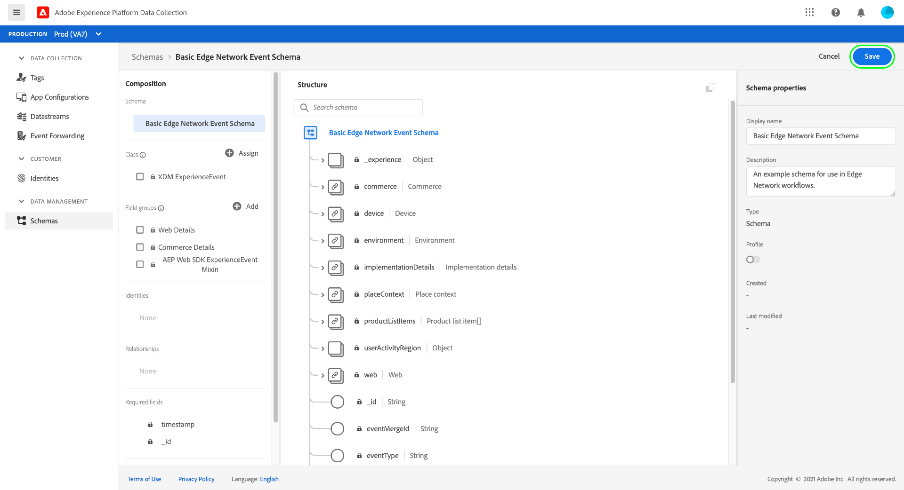

# Panoramica end-to-end sulla raccolta dati

Adobe Experience Platform raccoglie e trasferisce i dati ad altri prodotti Adobe e destinazioni di terze parti. Per inviare i dati dell’evento dall’applicazione alla rete Edge di Experience Platform, è importante comprendere queste tecnologie di base e configurarle in modo da fornire i dati alle destinazioni necessarie, quando necessario.

Questa guida fornisce un tutorial di alto livello su come inviare un evento tramite la rete Edge utilizzando le funzionalità di raccolta dati di Platform. In particolare, il tutorial illustra i passaggi necessari per installare e configurare l’estensione tag Adobe Experience Platform Web SDK nell’interfaccia utente di Data Collection (precedentemente Adobe Experience Platform Launch).

>[!NOTE]
>
>Se non desideri utilizzare i tag, puoi anche scegliere di installare e configurare manualmente l’SDK, ma i passaggi successivi devono ancora essere completati come descritto di seguito.
>
>Tutti i passaggi che riguardano l’interfaccia utente di Data Collection possono essere eseguiti anche nell’interfaccia utente di Experience Platform.

## Prerequisiti

Questa esercitazione utilizza l’interfaccia utente di Data Collection per creare uno schema, configurare uno stream di dati e installare l’SDK per web. Per eseguire queste azioni nell’interfaccia utente, devi disporre dell’accesso ad almeno una proprietà web insieme ai seguenti elementi [diritti di proprietà](../tags/ui/administration/user-permissions.md#property-rights):

* Sviluppa
* Gestire le estensioni

Consulta la guida su [gestione delle autorizzazioni per la raccolta dati](./permissions.md) per scoprire come concedere l’accesso a proprietà e diritti di proprietà.

Per utilizzare i vari prodotti di raccolta dati menzionati in questa guida, devi anche avere accesso agli stream di dati e la possibilità di creare e gestire gli schemi. Se hai bisogno di accedere a una di queste funzioni, contatta il tuo CSM per aiutarti a ottenere l’accesso necessario. Se non hai acquistato Adobe Experience Platform, Adobe ti fornirà l’accesso necessario per utilizzare l’SDK senza costi aggiuntivi.

Se disponi già dell’accesso a Platform, devi assicurarti di disporre di tutte le [autorizzazioni](../access-control/home.md#permissions) nelle seguenti categorie abilitate:

* Modellazione dati
* Identità

Consulta la [panoramica dell’interfaccia utente di controllo degli accessi](../access-control/ui/overview.md) per scoprire come concedere agli utenti le autorizzazioni per le funzionalità di Platform.

## Riepilogo del processo

Il processo di configurazione della raccolta dati per il sito web può essere riassunto come segue:

1. [Creare uno schema](#schema) per determinare la struttura dei dati quando vengono inviati alla rete Edge.
1. [Creare un flusso di dati](#datastream) per configurare le destinazioni a cui inviare i dati.
1. [Installare e configurare Web SDK](#sdk) per inviare dati allo stream di dati quando si verificano determinati eventi sul sito web.

Una volta che sei in grado di inviare dati alla rete Edge, puoi anche, facoltativamente [configurare l’inoltro degli eventi](#event-forwarding) se la tua organizzazione dispone di una licenza per questo prodotto.

## Creare uno schema {#schema}

[Experience Data Model (XDM)](../xdm/home.md) è una specifica open-source che fornisce strutture e definizioni comuni per i dati sotto forma di schemi. In altre parole, XDM è un modo per strutturare e formattare i dati in modo utilizzabile dalla rete Edge e da altre applicazioni Adobe Experience Cloud.

Il primo passaggio nella configurazione delle operazioni di raccolta dei dati consiste nel creare uno schema XDM per rappresentare i dati. In un passaggio successivo di questa esercitazione, mapperai i dati che desideri inviare alla struttura di questo schema.

>[!NOTE]
>
>Gli schemi XDM sono molto personalizzabili. Invece di essere eccessivamente prescrittivi, i passaggi descritti di seguito si concentrano specificamente sui requisiti dello schema per l’SDK per web. Al di fuori di questi parametri, puoi definire la struttura rimanente dei dati come preferisci.

Nell’interfaccia utente, seleziona **[!UICONTROL Schemi]** nel menu di navigazione a sinistra. Da qui puoi visualizzare un elenco degli schemi creati in precedenza e appartenenti alla tua organizzazione. Per continuare, seleziona **[!UICONTROL Crea schema]**, quindi seleziona **[!UICONTROL XDM ExperienceEvent]** dal menu a discesa.


Viene visualizzata una finestra di dialogo che richiede di iniziare ad aggiungere gruppi di campi allo schema. Per inviare eventi tramite Web SDK, è necessario aggiungere il gruppo di campi **[!UICONTROL Mixin ExperienceEvent AEP Web SDK]**. Questo gruppo di campi contiene le definizioni per gli attributi dei dati raccolti automaticamente dalla libreria SDK Web.

Utilizzare la barra di ricerca per limitare l&#39;elenco e semplificare la ricerca di questo gruppo di campi. Dopo averlo trovato, selezionalo dall’elenco prima di selezionare **[!UICONTROL Aggiungi gruppi di campi]**.


Viene visualizzata l’area di lavoro dello schema, con una struttura ad albero dello schema XDM che include i campi forniti dal gruppo di campi dell’SDK per web.


Selezionare il campo radice nella struttura da aprire **[!UICONTROL Proprietà dello schema]** nella barra a destra, dove puoi fornire un nome e una descrizione facoltativa per lo schema.


Per aggiungere altri campi allo schema, seleziona **[!UICONTROL Aggiungi]** sotto **[!UICONTROL Gruppi di campi]** nella barra a sinistra.


>[!NOTE]
>
>Consulta la guida su [aggiunta di gruppi di campi](../xdm/ui/resources/schemas.md#add-field-groups) nella documentazione di XDM per i passaggi dettagliati su come cercare diversi gruppi di campi in base ai casi d’uso.
>
>Si consiglia di aggiungere solo campi per i dati che si prevede di inviare tramite la rete Edge. Dopo aver aggiunto i campi a uno schema e averlo salvato, è possibile apportare allo schema solo modifiche aggiuntive. Consulta la sezione sulla [regole di evoluzione dello schema](../xdm/schema/composition.md#evolution) per ulteriori informazioni.

Dopo aver aggiunto i campi necessari, seleziona **[!UICONTROL Salva]** per salvare lo schema.



## Creare un flusso di dati {#datastream}

Un flusso di dati è una configurazione che indica alla rete Edge dove desideri che vengano inviati i dati. In particolare, un datastream specifica a quali prodotti Experience Cloud desideri inviare i dati e come desideri che i dati vengano gestiti e memorizzati in ciascun prodotto.

>[!NOTE]
>
>Se si desidera utilizzare [inoltro eventi](../tags/ui/event-forwarding/overview.md) (supponendo che la tua organizzazione disponga della licenza per questa funzionalità), devi abilitarla per uno stream di dati nello stesso modo in cui abiliti i prodotti Adobe. I dettagli su questo processo sono trattati in una [sezione successiva](#event-forwarding).

Seleziona **[!UICONTROL Flussi di dati]** nel menu di navigazione a sinistra. Da qui puoi selezionare uno stream di dati esistente dall’elenco da modificare, oppure puoi creare una nuova configurazione selezionando **[!UICONTROL Nuovo flusso di dati]**.


I requisiti di configurazione per un datastream dipendono dai prodotti e dalle funzionalità a cui invii i dati. Per informazioni dettagliate sulle opzioni di configurazione di ciascun prodotto, consulta [panoramica sugli stream di dati](../edge/datastreams/overview.md).

## Installare e configurare Web SDK {#install}

Dopo aver creato uno schema e un flusso di dati, il passaggio successivo consiste nell’installare e configurare Platform Web SDK per iniziare a inviare dati alla rete Edge.

>[!NOTE]
>
>Questa sezione utilizza l’interfaccia utente di Data Collection per configurare l’estensione tag Web SDK, ma puoi anche installarla e configurarla utilizzando codice non elaborato. Per ulteriori informazioni, consulta le seguenti guide:
>
>* [Installare l’SDK](../edge/fundamentals/installing-the-sdk.md)
>* [Configurare l’SDK](../edge/fundamentals/configuring-the-sdk.md)
>
>Inoltre, anche se desideri utilizzare solo l’inoltro degli eventi, devi comunque installare e configurare l’SDK come descritto prima di configurare l’inoltro degli eventi a [passaggio successivo](#event-forwarding).

Il processo può essere riassunto come segue:

1. [Installare Adobe Experience Platform Web SDK su una proprietà tag](#install-sdk) per accedere alle sue funzionalità.
1. [Creare un elemento dati di oggetti XDM](#data-element) per mappare le variabili sul sito web alla struttura dello schema XDM creato in precedenza.
1. [Creare una regola](#rule) per indicare all’SDK quando deve inviare i dati alla rete Edge.
1. [Creare e installare una libreria](#library) per implementare la regola sul sito web.

### Installare l’SDK su una proprietà tag {#install-sdk}

Seleziona **[!UICONTROL Tag]** nel menu di navigazione a sinistra per visualizzare un elenco di proprietà dei tag. Puoi scegliere una proprietà esistente da modificare, se lo desideri, oppure selezionare **[!UICONTROL Nuova proprietà]** invece.


Se crei una nuova proprietà, fornisci un nome descrittivo e imposta [!UICONTROL Piattaforma] a **[!UICONTROL Web]**. Fornisci il dominio completo per la proprietà web, quindi seleziona **[!UICONTROL Salva]**.


Viene visualizzata la pagina della panoramica della proprietà. Da qui, seleziona **[!UICONTROL Estensioni]** nel menu di navigazione a sinistra, seleziona quindi **[!UICONTROL Catalogo]**. Trova l’elenco per Platform Web SDK (facoltativamente utilizzando la barra di ricerca per limitare i risultati) e seleziona **[!UICONTROL Installa]**.


Viene visualizzata la pagina di configurazione per l’SDK. La maggior parte dei valori richiesti viene compilata automaticamente con i valori predefiniti che puoi scegliere di modificare se lo desideri.


Prima di installare l’SDK, tuttavia, devi selezionare uno stream di dati in modo che sappia a dove inviare i dati. Sotto **[!UICONTROL Flussi di dati]**, utilizza il menu a discesa per selezionare lo stream di dati configurato in un [passaggio precedente](#datastream). Dopo aver impostato lo stream di dati, seleziona **[!UICONTROL Salva]** per completare l&#39;installazione dell&#39;SDK nella proprietà.


### Creare un elemento dati XDM {#data-element}

Affinché l’SDK possa inviare dati alla rete Edge, questi devono essere mappati sullo schema XDM creato in un [passaggio precedente](#schema). Questa mappatura viene eseguita tramite l’utilizzo di un elemento dati.

Nell’interfaccia utente, seleziona **[!UICONTROL Elementi dati]**, quindi seleziona **[!UICONTROL Creare un nuovo elemento dati]**.


Nella schermata successiva, seleziona **[!UICONTROL Adobe Experience Platform Web SDK]** sotto [!UICONTROL Estensione] a discesa, quindi seleziona **[!UICONTROL Oggetto XDM]** per il tipo di elemento dati.


Viene visualizzata la finestra di dialogo di configurazione per il tipo di oggetto XDM. La finestra di dialogo seleziona automaticamente la sandbox Platform e da qui puoi visualizzare tutti gli schemi creati in tale sandbox. Seleziona dall’elenco lo schema XDM creato in precedenza.


Viene visualizzata la struttura dello schema. Tutti i campi con un asterisco (**\***) indicano i campi che si compilano automaticamente quando si attivano gli eventi. Per tutti gli altri campi, puoi esplorare la struttura dello schema e compilare il resto dei dati.


>[!NOTE]
>
>La schermata precedente illustra come mappare una variabile accessibile a livello globale dal lato client del sito web (`cartAbandonsTotal`) a un campo XDM facendo riferimento al relativo nome nella sezione [!UICONTROL Valore] campo, circondato dai segni di percentuale (`%`).
>
>Per compilare questi campi, puoi anche utilizzare altri elementi dati creati in precedenza. Vedi il riferimento a [elementi dati](../tags/ui/managing-resources/data-elements.md) per ulteriori informazioni, consulta la documentazione sui tag.

Dopo aver completato la mappatura dei dati sullo schema, fornisci un nome per l’elemento dati prima di selezionare **[!UICONTROL Salva]**.


### Creare una regola

Dopo aver salvato l’elemento dati, il passaggio successivo consiste nel creare una regola che lo invierà alla rete Edge ogni volta che si verifica un determinato evento sul sito web (ad esempio quando un cliente aggiunge un prodotto a un carrello).

Puoi impostare regole per praticamente qualsiasi evento che possa verificarsi sul sito web. Ad esempio, in questa sezione viene illustrato come creare una regola che verrà attivata quando un cliente invia un modulo. Il seguente HTML rappresenta una semplice pagina web con un modulo &quot;Aggiungi al carrello&quot;, che sarà l’oggetto della regola:

```html
<!DOCTYPE html>
<html>
<body>

  <form id="add-to-cart-form">
    <label for="item">Product:</label><br>
    <input type="text" id="item" name="item"><br>
    <label for="amount">Amount:</label><br>
    <input type="number" id="amount" name="amount" value="1"><br><br>
    <input type="submit" value="Add to Cart">
  </form> 

</body>
</html>
```

Nell’interfaccia utente di Data Collection, seleziona **[!UICONTROL Regole]** nel menu di navigazione a sinistra, seleziona quindi **[!UICONTROL Crea nuova regola]**.


Nella schermata successiva, specifica un nome per la regola. Da qui, il passaggio successivo è quello di determinare l’evento per la regola (in altre parole, quando la regola verrà attivata). Seleziona **[!UICONTROL Aggiungi]** in [!UICONTROL Eventi].


Viene visualizzata la pagina di configurazione dell’evento. Per configurare un evento, devi innanzitutto selezionare il tipo di evento. I tipi di evento sono forniti dalle estensioni. Per impostare un evento di &quot;invio modulo&quot;, ad esempio, seleziona la **[!UICONTROL Core]** , quindi seleziona la **[!UICONTROL Invia]** tipo di evento sotto **[!UICONTROL Modulo]** categoria.

>[!NOTE]
>
>Per ulteriori informazioni sui diversi tipi di eventi forniti dalle estensioni Web Adobe, tra cui la modalità di configurazione, vedi [Riferimento per le estensioni Adobe](../tags/extensions/client/overview.md) nella documentazione sui tag.

L’evento di invio modulo consente di utilizzare un [Selettore CSS](https://www.w3schools.com/css/css_selectors.asp) per fare riferimento a un elemento specifico per la regola su cui attivare. Nell’esempio seguente, l’ID `add-to-cart-form` viene utilizzato in modo che questa regola venga attivata solo per il modulo &quot;Aggiungi al carrello&quot;. Seleziona **[!UICONTROL Mantieni modifiche]** per aggiungere l’evento alla regola.


Viene visualizzata di nuovo la pagina di configurazione della regola dove si vede che l&#39;evento è stato aggiunto. Puoi restringere il &quot;[!UICONTROL Se]&quot; aggiungendo ulteriori condizioni alla regola.

In caso contrario, il passaggio successivo consiste nell’aggiungere un’azione da eseguire per la regola quando viene attivata. Seleziona **[!UICONTROL Aggiungi]** in **[!UICONTROL Azioni]** per continuare.


Viene visualizzata la pagina di configurazione dell’azione. Per ottenere la regola per inviare i dati alla rete Edge, seleziona **[!UICONTROL Adobe Experience Platform Web SDK]** per l&#39;estensione, e **[!UICONTROL Invia evento]** per il tipo di azione.


La schermata si aggiorna per mostrare opzioni aggiuntive per configurare l’azione invia evento. Sotto **[!UICONTROL Tipo]**, puoi fornire un valore di tipo personalizzato per compilare il `eventType` Campo XDM. Sotto **[!UICONTROL Dati XDM]**, fornire il nome del tipo di dati XDM creato in precedenza (racchiuso tra simboli di percentuale) oppure selezionare l&#39;icona del database () per selezionarlo da un elenco. Questi sono i dati che verranno infine inviati alla rete Edge.

Seleziona **[!UICONTROL Mantieni modifiche]** al termine.


Al termine della configurazione della regola, seleziona **[!UICONTROL Salva]** per completare il processo.


### Creare e installare una libreria {#library}

Una volta configurata la regola, puoi aggiungerla a una libreria di tag, generarla in un ambiente e installarla sul sito web.

>[!NOTE]
>
>Se non hai ancora configurato un ambiente nell’interfaccia utente di Data Collection, devi farlo prima di poter creare una build. Consulta la sezione su [configurazione di un ambiente per una proprietà web](../tags/ui/publishing/environments.md#web-configuration) per ulteriori informazioni, consulta la documentazione sui tag.

Per informazioni su come creare una libreria, aggiungere estensioni e regole alla libreria e generarla in un ambiente, consulta la guida su [gestione delle librerie](../tags/ui/publishing/libraries.md) nella documentazione sui tag. Quando crei la libreria, accertati di includere l’estensione Platform Web SDK e le regole di raccolta dati create in precedenza.

Dopo aver creato la libreria e aver assegnato la relativa build a un ambiente, puoi installare tale ambiente sul lato client del sito web. Consulta la sezione su [installazione di ambienti](../tags/ui/publishing/environments.md#installation) per ulteriori informazioni.

Dopo aver installato l’ambiente sul sito web, puoi [testare l’implementazione](../tags/ui/publishing/embed-code-testing.md) utilizzando Adobe Experience Platform Debugger.

## Configurare l’inoltro degli eventi (facoltativo) {#event-forwarding}

>[!NOTE]
>
>L’inoltro degli eventi è disponibile solo per le organizzazioni per le quali è stata concessa la licenza.

Dopo aver configurato l’SDK per l’invio dei dati alla rete Edge, puoi impostare l’inoltro degli eventi per indicare alla rete Edge dove desideri che vengano consegnati i dati.

Per utilizzare l’inoltro degli eventi, devi innanzitutto creare una proprietà di inoltro degli eventi. Seleziona **[!UICONTROL Inoltro eventi]** nella barra di navigazione a sinistra, seleziona quindi **[!UICONTROL Nuova proprietà]**. Immetti un nome per la proprietà prima di selezionare **[!UICONTROL Salva]**.

Dopo aver creato una proprietà di inoltro degli eventi, il passaggio successivo consiste nel creare una regola che determini dove devono essere inviati i dati. Le regole per le proprietà di inoltro degli eventi sono costruite in modo molto simile alle proprietà dei tag, con l’eccezione che non è possibile specificare alcun evento (poiché l’inoltro degli eventi riguarda solo gli eventi che riceve direttamente dallo stream di dati). Per l’azione della regola, puoi utilizzare una delle estensioni di inoltro degli eventi disponibili oppure il codice personalizzato per distribuire l’evento.


Come prima, una volta configurata la regola, devi aggiungerla a una libreria e generarla in un ambiente.

Una volta completata la build, il passaggio finale consiste nell’aggiornare lo stream di dati [configurato in precedenza](#datastream) e abilita l’inoltro degli eventi. Per iniziare, passa a **[!UICONTROL Flussi di dati]** e seleziona lo stream di dati in questione dall’elenco. Da qui, abilita l’interruttore per l’inoltro degli eventi e fornisci i nomi della proprietà e dell’ambiente appena configurati.


## Passaggi successivi

Questa guida fornisce una panoramica end-to-end di alto livello su come inviare dati a Edge Network utilizzando Platform Web SDK. Per ulteriori informazioni sui vari componenti e servizi coinvolti, consulta la documentazione accessibile dai collegamenti presenti in questa guida.
