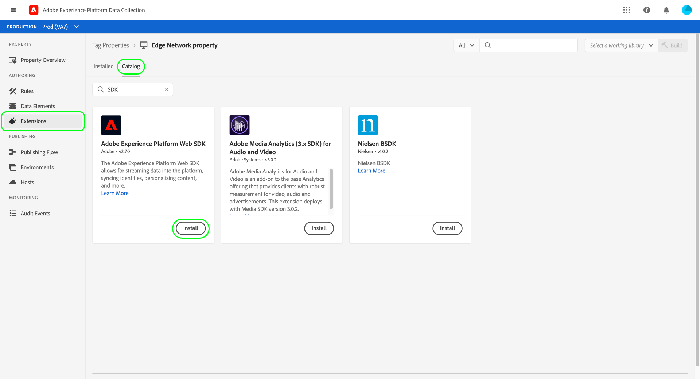

# Panoramica sulla raccolta dati end-to-end

Adobe Experience Platform raccoglie e trasferisce i tuoi dati in altri prodotti Adobe e destinazioni di terze parti. Per inviare i dati dell’evento dall’applicazione ad Experience Platform Edge Network, è importante comprendere queste tecnologie di base e come configurarle in modo da inviare i dati alle destinazioni richieste, quando necessario.

Questa guida fornisce un’esercitazione di alto livello su come inviare un evento tramite la rete Edge utilizzando le funzionalità di raccolta dati di Platform. In particolare, l&#39;esercitazione descrive i passaggi necessari per installare e configurare l&#39;estensione tag Adobe Experience Platform Web SDK all&#39;interno dell&#39;interfaccia utente di raccolta dati (precedentemente Adobe Experience Platform Launch).

>[!NOTE]
>
>Puoi anche scegliere di installare e configurare manualmente l’SDK se non desideri utilizzare i tag, ma i passaggi circostanti devono comunque essere completati come descritto di seguito.

## Prerequisiti

Questa esercitazione utilizza l’interfaccia utente di raccolta dati per creare uno schema, configurare un datastream e installare l’SDK per web. Per eseguire queste azioni nell’interfaccia utente, è necessario disporre dell’accesso ad almeno una proprietà Web insieme alle seguenti [diritti di proprietà](../tags/ui/administration/user-permissions.md#property-rights):

* Sviluppa
* Gestire le estensioni

Consulta la guida su [gestione delle autorizzazioni per la raccolta dati](./permissions.md) per scoprire come concedere l’accesso a proprietà e diritti di proprietà.

Per utilizzare i vari prodotti di raccolta dati menzionati in questa guida, devi anche avere accesso ai datastreams e la possibilità di creare e gestire gli schemi. Se hai bisogno di accedere a una di queste funzioni, contatta il tuo CSM per ottenere l&#39;accesso necessario. Se non hai acquistato Adobe Experience Platform, Adobe ti fornirà l’accesso necessario per utilizzare l’SDK senza costi aggiuntivi.

Se disponi già dell’accesso a Platform, assicurati di disporre del [permissions](../access-control/home.md#permissions) nelle seguenti categorie abilitate:

* Modellazione dati
* Identità

Consulta la sezione [panoramica dell’interfaccia utente di controllo accessi](../access-control/ui/overview.md) per scoprire come concedere agli utenti le autorizzazioni per le funzionalità di Platform.

## Riepilogo del processo

Il processo di configurazione della raccolta dati per il sito web può essere riassunto come segue:

1. [Creare uno schema](#schema) per determinare la struttura dei dati quando vengono inviati a Edge Network.
1. [Creare un datastream](#datastream) per configurare le destinazioni a cui inviare i dati.
1. [Installare e configurare l’SDK per web](#sdk) per inviare dati al datastream quando si verificano determinati eventi sul sito web.

Una volta inviati i dati alla rete Edge, è possibile [configurare l&#39;inoltro eventi](#event-forwarding) se la tua organizzazione dispone di una licenza per tale licenza.

## Creare uno schema {#schema}

[Experience Data Model (XDM)](../xdm/home.md) è una specifica open-source che fornisce strutture e definizioni comuni per i dati sotto forma di schemi. In altre parole, XDM è un modo per strutturare e formattare i dati in modo che sia fruibile da Edge Network e da altre applicazioni Adobe Experience Cloud.

Il primo passo per configurare le operazioni di raccolta dati è creare uno schema XDM per rappresentare i dati. In un passaggio successivo di questa esercitazione, mapperai i dati che desideri inviare alla struttura di questo schema.

>[!NOTE]
>
>Gli schemi XDM sono molto personalizzabili. Invece di essere eccessivamente prescrittivi, i passaggi descritti di seguito si concentrano specificamente sui requisiti di schema per l&#39;SDK per web. Al di fuori di questi parametri, puoi definire liberamente la struttura rimanente dei tuoi dati in base alle tue preferenze.

Nell’interfaccia utente Raccolta dati, seleziona **[!UICONTROL Schemi]** nella navigazione a sinistra. Da qui puoi visualizzare un elenco degli schemi creati in precedenza appartenenti all’organizzazione. Per continuare, seleziona **[!UICONTROL Creare uno schema]**, quindi seleziona **[!UICONTROL ExperienceEvent XDM]** dal menu a discesa .


Viene visualizzata una finestra di dialogo in cui viene richiesto di iniziare ad aggiungere gruppi di campi allo schema. Per inviare eventi utilizzando l’SDK per web, è necessario aggiungere il gruppo di campi **[!UICONTROL Mixin ExperienceEvent SDK per web AEP]**. Questo gruppo di campi contiene le definizioni degli attributi di dati raccolti automaticamente dalla libreria SDK per web.

Utilizza la barra di ricerca per restringere l’elenco in modo da facilitare la ricerca di questo gruppo di campi. Una volta trovata, selezionala dall’elenco prima di selezionare **[!UICONTROL Aggiungi gruppi di campi]**.


Viene visualizzata l’area di lavoro dello schema, che mostra una struttura ad albero dello schema XDM, inclusi i campi forniti dal gruppo di campi SDK per web.


Selezionare il campo principale nella struttura ad albero da aprire **[!UICONTROL Proprietà dello schema]** nella barra a destra, dove puoi fornire un nome e una descrizione facoltativa per lo schema.


Per aggiungere altri campi allo schema, seleziona **[!UICONTROL Aggiungi]** in **[!UICONTROL Gruppi di campi]** nella barra a sinistra.


>[!NOTE]
>
>Consulta la guida su [aggiunta di gruppi di campi](../xdm/ui/resources/schemas.md#add-field-groups) nella documentazione XDM per informazioni dettagliate su come cercare diversi gruppi di campi in base ai casi d’uso.
>
>Si consiglia di aggiungere solo campi per i dati che si prevede di inviare tramite la rete Edge. Dopo aver aggiunto i campi a uno schema e averlo salvato, è possibile apportare solo modifiche aggiuntive allo schema in seguito. Vedi la sezione sul [regole di evoluzione dello schema](../xdm/schema/composition.md#evolution) per ulteriori informazioni.

Dopo aver aggiunto i campi necessari, seleziona **[!UICONTROL Salva]** per salvare lo schema.


## Creare un flusso di dati {#datastream}

Un datastream è una configurazione che indica alla rete Edge in cui desideri inviare i dati. In particolare, un datastream specifica a quali prodotti di Experience Cloud si desidera inviare i dati e come si desidera che i dati vengano gestiti e memorizzati in ciascun prodotto.

>[!NOTE]
>
>Se desideri utilizzare [inoltro eventi](../tags/ui/event-forwarding/overview.md) (supponendo che l’organizzazione disponga della licenza per la funzionalità), è necessario abilitarla per un datastream nello stesso modo in cui si abilitano i prodotti Adobe. I dettagli di questo processo sono trattati in un [sezione successiva](#event-forwarding).

Nell’interfaccia utente Raccolta dati, seleziona **[!UICONTROL Datastreams]**. Da qui, puoi selezionare un datastream esistente dall&#39;elenco da modificare, oppure puoi creare una nuova configurazione selezionando **[!UICONTROL Nuovo Datastream]**.


I requisiti di configurazione per un datastream dipendono dai prodotti e dalle funzionalità a cui invii i dati. Per informazioni dettagliate sulle opzioni di configurazione per ciascun prodotto, consulta la [panoramica dei datastreams](../edge/datastreams/overview.md).

## Installare e configurare l’SDK per web {#install}

Dopo aver creato uno schema e un datastream, il passaggio successivo consiste nell’installare e configurare l’SDK per web di Platform per iniziare a inviare dati alla rete Edge.

>[!NOTE]
>
>Questa sezione utilizza l’interfaccia utente di raccolta dati per configurare l’estensione tag SDK per web, ma puoi anche installarla e configurarla utilizzando il codice non elaborato. Per ulteriori informazioni, consulta le seguenti guide:
>
>* [Installare l’SDK](../edge/fundamentals/installing-the-sdk.md)
>* [Configurare l&#39;SDK](../edge/fundamentals/configuring-the-sdk.md)
>
>Inoltre, anche se desideri utilizzare solo l&#39;inoltro eventi, devi comunque installare e configurare l&#39;SDK come descritto prima di configurare l&#39;inoltro eventi in un [passaggio successivo](#event-forwarding).

Il processo può essere riassunto come segue:

1. [Installare Adobe Experience Platform Web SDK su una proprietà tag](#install-sdk) per accedere alle sue funzionalità.
1. [Creare un elemento dati oggetto XDM](#data-element) per mappare le variabili sul sito web alla struttura dello schema XDM creato in precedenza.
1. [Creare una regola](#rule) per comunicare all’SDK quando deve inviare dati alla rete Edge.
1. [Creare e installare una libreria](#library) per implementare la regola sul tuo sito web.

### Installare l’SDK su una proprietà tag {#install-sdk}

Seleziona **[!UICONTROL Tag]** nel menu di navigazione a sinistra per visualizzare un elenco delle proprietà dei tag. Puoi scegliere una proprietà esistente da modificare, se lo desideri, oppure puoi selezionare **[!UICONTROL Nuova proprietà]** invece.


Se crei una nuova proprietà, fornisci un nome descrittivo e imposta il [!UICONTROL Piattaforma] a **[!UICONTROL Web]**. Fornisci il dominio completo per la proprietà web, quindi seleziona **[!UICONTROL Salva]**.


Viene visualizzata la pagina della panoramica della proprietà. Da qui, seleziona **[!UICONTROL Estensioni]** nel menu di navigazione a sinistra, seleziona **[!UICONTROL Catalogo]**. Trova l’elenco per l’SDK per web di Platform (utilizzando facoltativamente la barra di ricerca per limitare i risultati) e seleziona **[!UICONTROL Installa]**.



Viene visualizzata la pagina di configurazione per l&#39;SDK. La maggior parte dei valori richiesti viene compilata automaticamente con valori predefiniti che è possibile scegliere di modificare se lo si desidera.


Prima di installare l’SDK, tuttavia, devi selezionare un datastream in modo che sappia dove inviare i dati. Sotto **[!UICONTROL Datastreams]**, utilizza il menu a discesa per selezionare il datastream configurato in un [passaggio precedente](#datastream). Una volta impostato il datastream, seleziona **[!UICONTROL Salva]** per completare l’installazione dell’SDK nella proprietà.


### Creare un elemento dati XDM {#data-element}

Affinché l’SDK invii dati alla rete Edge, questi devono essere mappati sullo schema XDM creato in un [passaggio precedente](#schema). Questa mappatura viene eseguita utilizzando un elemento dati.

Nell’interfaccia utente, seleziona **[!UICONTROL Elementi dati]**, quindi seleziona **[!UICONTROL Crea nuovo elemento dati]**.


Nella schermata successiva, seleziona **[!UICONTROL Adobe Experience Platform Web SDK]** in [!UICONTROL Estensione] a discesa, quindi seleziona **[!UICONTROL Oggetto XDM]** per il tipo di elemento dati.


Viene visualizzata la finestra di dialogo di configurazione per il tipo di oggetto XDM. La finestra di dialogo seleziona automaticamente la sandbox di Platform e da qui puoi visualizzare tutti gli schemi creati in quella sandbox. Seleziona dall’elenco lo schema XDM creato in precedenza.


Viene visualizzata la struttura dello schema. Tutti i campi con un asterisco (**\***) indica i campi che verranno compilati automaticamente all’attivazione degli eventi. Per tutti gli altri campi, è possibile esplorare la struttura dello schema e compilare il resto dei dati.


>[!NOTE]
>
>La schermata precedente mostra come mappare una variabile accessibile a livello globale dal lato client del sito web (`cartAbandonsTotal`) a un campo XDM facendo riferimento al suo nome nel [!UICONTROL Valore] campo, circondato da segni di percentuale (`%`).
>
>Per compilare questi campi è inoltre possibile utilizzare altri elementi dati creati in precedenza. Vedi il riferimento su [elementi dati](../tags/ui/managing-resources/data-elements.md) per ulteriori informazioni, consulta la documentazione sui tag .

Una volta completata la mappatura dei dati sullo schema, fornisci un nome per l’elemento dati prima di selezionare **[!UICONTROL Salva]**.


### Creare una regola

Dopo aver salvato l’elemento dati, il passaggio successivo consiste nel creare una regola che lo invierà alla rete Edge ogni volta che si verifica un determinato evento sul sito web (ad esempio quando un cliente aggiunge un prodotto a un carrello).

Puoi impostare regole per praticamente qualsiasi evento che può verificarsi sul tuo sito web. Ad esempio, in questa sezione viene illustrato come creare una regola che si attivi quando un cliente invia un modulo. Il seguente HTML rappresenta una semplice pagina web con un modulo &quot;Aggiungi al carrello&quot;, che sarà oggetto della regola:

```html
<!DOCTYPE html>
<html>
<body>

  <form id="add-to-cart-form">
    <label for="item">Product:</label><br>
    <input type="text" id="item" name="item"><br>
    <label for="amount">Amount:</label><br>
    <input type="number" id="amount" name="amount" value="1"><br><br>
    <input type="submit" value="Add to Cart">
  </form> 

</body>
</html>
```

Nell’interfaccia utente Raccolta dati, seleziona **[!UICONTROL Regole]** nel menu di navigazione a sinistra, seleziona **[!UICONTROL Crea nuova regola]**.


Nella schermata successiva, specifica un nome per la regola. Da qui, il passaggio successivo consiste nel determinare l&#39;evento per la regola (in altre parole, quando la regola verrà attivata). Seleziona **[!UICONTROL Aggiungi]** sotto [!UICONTROL Eventi].


Viene visualizzata la pagina di configurazione dell’evento. Per configurare un evento, devi innanzitutto selezionare il tipo di evento. I tipi di evento vengono forniti dalle estensioni. Per impostare un evento &quot;invio modulo&quot;, ad esempio, selezionare la **[!UICONTROL Core]** , quindi seleziona la **[!UICONTROL Invia]** tipo di evento sotto **[!UICONTROL Modulo]** categoria.

>[!NOTE]
>
>Per ulteriori informazioni sui diversi tipi di eventi forniti da estensioni Web di Adobe, tra cui come configurarli, consulta la sezione [Riferimento per le estensioni di Adobe](../tags/extensions/web/overview.md) nella documentazione sui tag.

L’evento di invio del modulo consente di utilizzare un [Selettore CSS](https://www.w3schools.com/css/css_selectors.asp) per fare riferimento a un elemento specifico su cui attivare la regola. Nell’esempio seguente, l’ID `add-to-cart-form` viene utilizzato in modo che questa regola venga attivata solo per il modulo &quot;Aggiungi al carrello&quot;. Seleziona **[!UICONTROL Mantieni modifiche]** per aggiungere l’evento alla regola.


Viene visualizzata nuovamente la pagina di configurazione della regola, che mostra che l’evento è stato aggiunto. Puoi restringere il campo &quot;[!UICONTROL Se]&quot; aggiungendo ulteriori condizioni alla regola.

In caso contrario, il passaggio successivo consiste nell’aggiungere un’azione da eseguire nella regola quando viene attivata. Seleziona **[!UICONTROL Aggiungi]** sotto **[!UICONTROL Azioni]** per continuare.


Viene visualizzata la pagina di configurazione dell’azione. Per ottenere la regola per l’invio di dati alla rete Edge, selezionare **[!UICONTROL Adobe Experience Platform Web SDK]** per l&#39;estensione e **[!UICONTROL Invia evento]** per il tipo di azione.


La schermata si aggiorna e mostra opzioni aggiuntive per configurare l’azione Invia evento. Sotto **[!UICONTROL Tipo]**, puoi fornire un valore di tipo personalizzato per compilare il `eventType` Campo XDM. Sotto **[!UICONTROL Dati XDM]**, indica il nome del tipo di dati XDM creato in precedenza (circondato da segni di percentuale) oppure seleziona l’icona del database () per selezionarla da un elenco. Si tratta dei dati che verranno infine inviati alla rete Edge.

Seleziona **[!UICONTROL Mantieni modifiche]** una volta finito.


Al termine della configurazione della regola, seleziona **[!UICONTROL Salva]** per completare il processo.


### Creare e installare una libreria {#library}

Una volta configurata la regola, puoi aggiungerla a una libreria di tag, generarla in un ambiente e installarla sul tuo sito web.

>[!NOTE]
>
>Se non hai ancora configurato un ambiente nell’interfaccia utente di raccolta dati, devi farlo prima di poter creare una build. Vedi la sezione su [configurazione di un ambiente per una proprietà web](../tags/ui/publishing/environments.md#web-configuration) per ulteriori informazioni, consulta la documentazione sui tag .

Per informazioni su come creare una libreria, aggiungere estensioni e regole alla libreria e creare tale libreria in un ambiente, consulta la guida in [gestione delle librerie](../tags/ui/publishing/libraries.md) nella documentazione sui tag. Quando crei la libreria, accertati di includere l’estensione Platform Web SDK e le regole di raccolta dati create in precedenza.

Dopo aver creato la libreria e aver assegnato la relativa build a un ambiente, puoi installarlo sul lato client del sito web. Vedi la sezione su [installazione di ambienti](../tags/ui/publishing/environments.md#installation) per ulteriori informazioni.

Dopo aver installato l&#39;ambiente sul sito web, puoi [verifica l’implementazione](../tags/ui/publishing/embed-code-testing.md) utilizzo di Adobe Experience Platform Debugger.

## Configurare l’inoltro eventi (facoltativo) {#event-forwarding}

>[!NOTE]
>
>L’inoltro degli eventi è disponibile solo per le organizzazioni autorizzate.

Dopo aver configurato l’SDK per l’invio di dati alla rete Edge, puoi impostare l’inoltro eventi per indicare alla rete Edge in cui desideri che tali dati vengano inviati.

Per utilizzare l&#39;inoltro eventi, è innanzitutto necessario creare una proprietà di inoltro eventi. Seleziona **[!UICONTROL Inoltro eventi]** nel menu di navigazione a sinistra, seleziona **[!UICONTROL Nuova proprietà]**. Immetti un nome per la proprietà prima di selezionare **[!UICONTROL Salva]**.

Una volta creata la proprietà di inoltro di un evento, il passaggio successivo consiste nel creare una regola che determini dove devono essere inviati i dati. Le regole per le proprietà di inoltro eventi sono costruite in modo simile alle proprietà dei tag, con l&#39;eccezione che non è possibile specificare alcun evento (poiché l&#39;inoltro eventi riguarda solo gli eventi che riceve direttamente dal datastream). Per l&#39;azione della regola, puoi utilizzare una delle estensioni di inoltro eventi disponibili oppure utilizzare codice personalizzato per distribuire l&#39;evento.


Come in precedenza, dopo aver configurato la regola, devi aggiungerla a una libreria e generarla in un ambiente.

Al termine della compilazione, il passaggio finale è quello di aggiornare il datastream che [configurato in precedenza](#datastream) e abilitare l&#39;inoltro eventi. Per iniziare, passa a **[!UICONTROL Datastreams]** e selezionare il datastream in questione dall&#39;elenco. Da qui, abilita l’opzione per l’inoltro eventi e fornisci i nomi della proprietà e dell’ambiente appena configurati.


## Passaggi successivi

Questa guida fornisce una panoramica completa e dettagliata su come inviare dati alla rete Edge tramite l’SDK per web di Platform. Per ulteriori informazioni sui vari componenti e servizi interessati, consulta la documentazione collegata a in questa guida.
