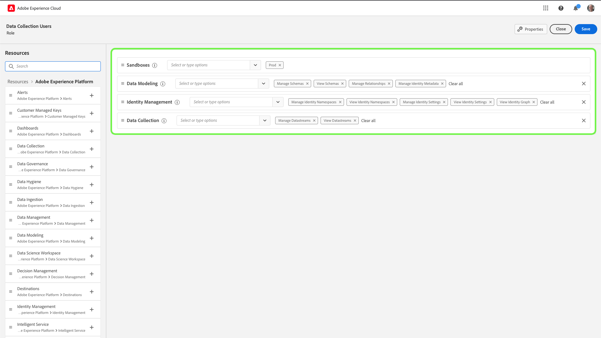
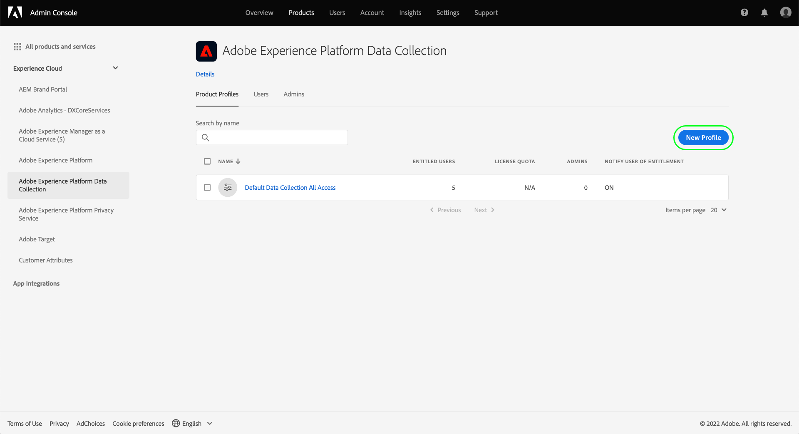

# Gestione delle autorizzazioni per la raccolta dati in Experienci Platform

[Raccolta dati in Adobe Experience Platform](./home.md) è costituito da diverse tecnologie che collaborano per raccogliere e trasferire i tuoi dati. L’accesso a queste tecnologie è controllato tramite autorizzazioni granulari basate sui ruoli in Adobe Admin Console.

Questa guida illustra come gestire le autorizzazioni per le funzionalità di raccolta dati.

## Introduzione

Per configurare il controllo degli accessi per la raccolta dati, è necessario disporre dei privilegi di amministratore per un&#39;organizzazione con un&#39;integrazione di prodotto con Raccolta dati di Adobe Experience Platform. Il ruolo minimo che può concedere o revocare le autorizzazioni è un **amministratore profilo di prodotto**. Altri ruoli di amministratore che possono gestire le autorizzazioni sono **amministratori di prodotto** (possono gestire tutti i profili all’interno di un prodotto) e **amministratori di sistema** (nessuna restrizione). Per ulteriori informazioni, consulta l’articolo sui [ruoli amministrativi](https://helpx.adobe.com/it/enterprise/using/admin-roles.html) nella guida all’amministrazione di Adobe Enterprise.

Questa guida presuppone che tu abbia familiarità con i concetti di base di Admin Console, come i profili di prodotto e il modo in cui concedono le autorizzazioni di prodotto a singoli utenti e gruppi. Per ulteriori informazioni, consulta la [Guida utente di Admin Console](https://helpx.adobe.com/it/enterprise/using/admin-console.html).

## Autorizzazioni disponibili

Le autorizzazioni pertinenti per la raccolta dei dati vengono fornite attraverso due designazioni di prodotto nell’Admin Console: **Adobe Experience Platform** e **Raccolta dati di Adobe Experience Platform**. Le sezioni seguenti descrivono le autorizzazioni fornite per ciascun prodotto insieme alle descrizioni delle funzionalità specifiche a cui concedono l’accesso.

### Autorizzazioni Adobe Experience Platform

Le autorizzazioni in Adobe Experience Platform includono l’accesso a flussi di dati, identità, schemi e sandbox. Per informazioni su come configurare le autorizzazioni di Adobe Experience Platform, consulta [guida utente al controllo degli accessi](../access-control/ui/overview.md).

| Categoria | Autorizzazione | Descrizione |
| --- | --- | --- |
| Sandbox | (N/D) | A seconda della [sandbox](../sandboxes/home.md) che sono state create nell’organizzazione, puoi controllare l’accesso a ciascuna di esse tramite questa categoria di autorizzazioni in Admin Console. |
| Modellazione dati | Gestire gli schemi | Consente di visualizzare, creare e modificare [Schemi Experience Data Model (XDM)](../xdm/home.md). |
| Modellazione dati | Visualizzare gli schemi | Consente l’accesso in sola lettura agli schemi. |
| Identity Management | Gestire gli spazi dei nomi delle identità | Consente di visualizzare, creare e modificare [spazi dei nomi di identità](../identity-service/features/namespaces.md). |
| Identity Management | Visualizzare gli spazi dei nomi delle identità | Consente l’accesso in sola lettura agli spazi dei nomi delle identità. |
| Raccolta dati | Gestire gli stream di dati | Consente di visualizzare, creare e modificare [flussi di dati](../datastreams/overview.md). |
| Raccolta dati | Visualizzare gli stream di dati | Consente l’accesso in sola lettura agli stream di dati. |

{style="table-layout:auto"}

### Autorizzazioni di Adobe Experience Platform Data Collection

Le autorizzazioni in Raccolta dati di Adobe Experience Platform controllano l’accesso ai tag e le funzionalità di inoltro degli eventi, tra cui proprietà, estensioni e ambienti. Per informazioni su come configurare le autorizzazioni di Adobe Experience Platform Data Collection, consulta [sezione successiva](#manage).

| Categoria | Autorizzazione | Descrizione |
| --- | --- | --- |
| Piattaforme | Web | Consente l’accesso a [proprietà web](../tags/ui/administration/companies-and-properties.md) quando combinato con altri diritti di proprietà. |
| Piattaforme | Dispositivi mobili | Consente l’accesso a [proprietà mobili](../tags/ui/administration/companies-and-properties.md) quando combinato con altri diritti di proprietà. |
| Piattaforme | Edge | Consente l’accesso a [Proprietà di Event Forwarding Edge](../tags/ui/event-forwarding/getting-started.md) quando combinato con altri diritti di proprietà. |
| Proprietà | (N/D) | A seconda delle proprietà create nell’organizzazione, puoi controllare l’accesso a ciascuna di esse tramite questa categoria di autorizzazioni in Admin Console.  I diritti di proprietà assegnati a un utente si applicano solo alle proprietà a cui è stato concesso l’accesso tramite questa categoria di autorizzazioni. |
| Diritti di proprietà | Approva | Consente di approvare una build della libreria come parte della [flusso di pubblicazione](../tags/ui/publishing/publishing-flow.md). |
| Diritti di proprietà | Sviluppa | Consente di sviluppare una build della libreria come parte del [flusso di pubblicazione](../tags/ui/publishing/publishing-flow.md). |
| Diritti di proprietà | Modifica proprietà | Consente di modificare la configurazione di base per le proprietà a cui un utente ha accesso. |
| Diritti di proprietà | Gestisci ambienti | Consente di gestire [ambienti](../tags/ui/publishing/environments.md) per le proprietà a cui un utente ha accesso. |
| Diritti di proprietà | Gestire le estensioni | Consente di gestire [estensioni](../tags/ui/managing-resources/extensions/overview.md) per le proprietà a cui un utente ha accesso. |
| Diritti di proprietà | Pubblica | Consente di pubblicare una build della libreria come parte del [flusso di pubblicazione](../tags/ui/publishing/publishing-flow.md). |
| Diritti aziendali | Sviluppare estensioni | Consente di creare e modificare pacchetti di estensione di proprietà dell’organizzazione, incluse versioni private e richieste di versioni pubbliche. |
| Diritti aziendali | Gestione configurazioni app | Questa autorizzazione è applicabile solo se disponi di una licenza per Adobe Journey Optimizer o di un’altra soluzione che consente l’accesso a messaggi mobili in-app e push. Questo consente di gestire le app conosciute da Adobe Experience Cloud insieme alle credenziali push necessarie per comunicare con il servizio Firebase Cloud Messaging e il servizio Apple Push Notification. |
| Diritti aziendali | Gestisci proprietà | Consente di creare e gestire tag (proprietà web), inoltro eventi (proprietà edge) e proprietà mobili. |

{style="table-layout:auto"}

>[!NOTE]
>
>Per ulteriori informazioni su come queste autorizzazioni influiscono sulle funzionalità dei tag, incluse le strategie di amministrazione per gli scenari comuni, consulta la documentazione sui tag in [autorizzazioni utente](../tags/ui/administration/user-permissions.md).

## Gestire le autorizzazioni {#manage}

Le autorizzazioni per la raccolta dei dati vengono gestite tramite due designazioni di prodotto: **Adobe Experience Platform** e **Raccolta dati di Adobe Experience Platform**.

Consulta le sottosezioni seguenti per i passaggi su come gestire le autorizzazioni pertinenti per ciascun prodotto in Admin Console:

* [Autorizzazioni Adobe Experience Platform](#manage-platform)
* [Autorizzazioni di Adobe Experience Platform Data Collection](#manage-collection)

### Gestire le autorizzazioni in Adobe Experience Platform {#manage-platform}

>[!NOTE]
>
>Per gestire le autorizzazioni per un ruolo, sono necessari i diritti di amministratore. Se non disponi dei privilegi di amministratore, contatta l’amministratore di sistema.

Experience Cloud **[!UICONTROL Autorizzazioni]** consente di definire ruoli utente e criteri per gestire l’accesso a funzioni e oggetti all’interno di un’applicazione di prodotto.

Da a [!UICONTROL Autorizzazioni], puoi creare e gestire i ruoli e assegnare le autorizzazioni per le risorse desiderate per tali ruoli.

Per accedere alle funzionalità di raccolta dati, devi abilitare tutte le autorizzazioni in **[!UICONTROL Sandbox]**, **[!UICONTROL Modellazione dati]**, **[!UICONTROL Identity Management]**, e **[!UICONTROL Raccolta dati]** categorie.

Consulta la [guida all’interfaccia utente per il controllo degli accessi](../access-control/ui/overview.md) per istruzioni dettagliate sulla gestione delle autorizzazioni di Platform.

>[!NOTE]
>
>A seconda degli SKU dei prodotti a cui la tua organizzazione ha accesso, potresti non disporre di tutte le autorizzazioni della piattaforma.

### Gestire le autorizzazioni in Raccolta dati di Adobe Experience Platform {#manage-collection}

Per gestire queste autorizzazioni, accedi a Admin Console e seleziona **[!UICONTROL Prodotti]** dalla navigazione in alto, quindi seleziona **[!UICONTROL Raccolta dati di Adobe Experience Platform]**.

#### Selezionare o creare un profilo di prodotto

La schermata successiva mostra un elenco dei profili di prodotto disponibili per la raccolta dati nell’organizzazione; il profilo predefinito è **[!DNL Default Data Collection All Access]**. Se lo desideri, puoi scegliere di modificare il profilo di prodotto predefinito oppure selezionare **[!UICONTROL Nuovo profilo]** per crearne uno. Se nell’organizzazione sono presenti più ruoli o gruppi di utenti che richiedono livelli di accesso diversi, è necessario creare un profilo di prodotto separato per ciascuno di essi.

Dopo aver selezionato o creato un profilo di prodotto, puoi utilizzare **[!UICONTROL Modifica]** icone per iniziare [autorizzazioni di modifica](#edit-permissions) per il profilo, oppure seleziona il **[!UICONTROL Utenti]** scheda per iniziare [assegnazione di utenti](#assign-users) al profilo.

#### Modificare le autorizzazioni per il profilo di prodotto {#edit-permissions}

Quando si modificano le autorizzazioni per un profilo, le autorizzazioni disponibili sono elencate nella colonna a sinistra, mentre quelle incluse nel profilo sono elencate nella colonna a destra. Seleziona le autorizzazioni elencate per spostarle tra una colonna e l’altra.

Le autorizzazioni sono organizzate in categorie. Per passare da una categoria all’altra, seleziona la categoria desiderata dal menu di navigazione a sinistra.

Al termine della configurazione delle autorizzazioni, seleziona **[!UICONTROL Salva]**.

La vista del profilo di prodotto viene nuovamente visualizzata con le autorizzazioni aggiunte riportate.

#### Assegnare utenti al profilo prodotto {#assign-users}

Per assegnare gli utenti al profilo di prodotto (e concedere loro le autorizzazioni configurate per il profilo), seleziona la scheda **[!UICONTROL Utenti]**, seguita da **[!UICONTROL Aggiungi utente]**.

Per ulteriori informazioni sulla gestione degli utenti per un profilo di prodotto, consulta la [documentazione di Admin Console](https://helpx.adobe.com/it/enterprise/using/manage-product-profiles.html).

## Passaggi successivi

Questa guida descrive le autorizzazioni disponibili per la raccolta dati e come gestirle con Admin Console. Per ulteriori informazioni sulla gestione delle autorizzazioni per altre funzionalità di Adobe Experience Platform, consulta la [documentazione sul controllo degli accessi](../access-control/home.md).
