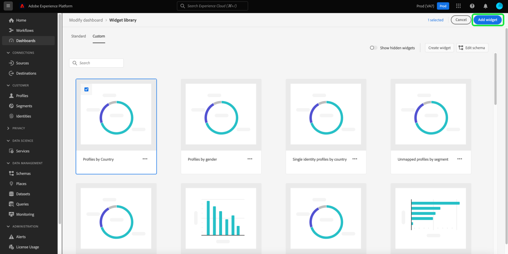
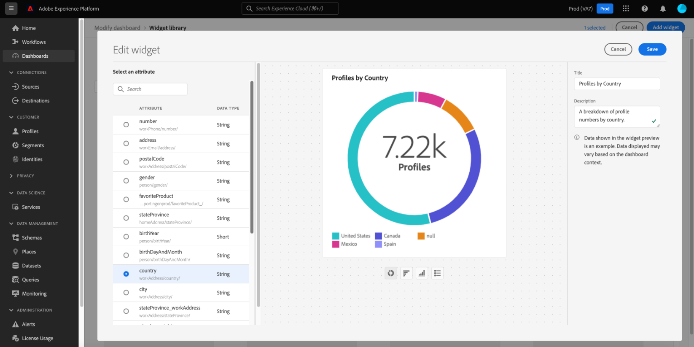

# Creazione di widget personalizzati per dashboard

In Adobe Experience Platform, puoi visualizzare e interagire con i dati della tua organizzazione utilizzando più dashboard. È inoltre possibile aggiornare alcune dashboard aggiungendo nuovi widget alla vista dashboard. Oltre ai widget standard forniti da Adobe, puoi anche creare widget personalizzati e condividerli all’interno dell’organizzazione.

Questa guida fornisce istruzioni dettagliate per creare e aggiungere widget personalizzati alle dashboard [!UICONTROL Profili], [!UICONTROL Segmenti] e [!UICONTROL Destinazioni] nell&#39;interfaccia utente di Platform.

>[!NOTE]
>
>Tutti gli aggiornamenti apportati alle dashboard sono per organizzazione e per sandbox.

Per ulteriori informazioni sui widget standard, consulta la guida per [aggiungere widget standard alle dashboard](standard-widgets.md).

## Libreria widget {#widget-library}

Questa guida richiede l&#39;accesso alla [!UICONTROL libreria Widget] in Experience Platform. Per ulteriori informazioni sulla libreria widget e su come accedervi nell&#39;interfaccia utente, leggere la [panoramica sulla libreria widget](widget-library.md).

## Guida introduttiva ai widget personalizzati

All&#39;interno della libreria di widget, la scheda **[!UICONTROL Personalizzato]** consente di creare widget e condividerli con altri utenti dell&#39;organizzazione per personalizzare l&#39;aspetto delle dashboard.

>[!IMPORTANT]
>
>La tua organizzazione può creare un massimo di 20 widget personalizzati nella libreria di widget.

Seleziona la scheda **[!UICONTROL Personalizzato]** per iniziare a creare widget personalizzati o per visualizzare widget personalizzati già creati dalla tua organizzazione.

## Creare un widget personalizzato

Per creare un widget personalizzato, seleziona **[!UICONTROL Crea widget]** dall&#39;angolo superiore destro della libreria di widget oppure, se si tratta del primo widget personalizzato dell&#39;organizzazione, seleziona **[!UICONTROL Crea]** dal centro della libreria di widget.

Nella finestra di dialogo **[!UICONTROL Crea widget]**, fornisci un titolo e una descrizione per il nuovo widget e scegli l&#39;attributo da visualizzare.

>[!NOTE]
>
>L’elenco degli attributi disponibili dipende dallo schema configurato per la tua organizzazione. Per ulteriori informazioni sulla selezione degli attributi e sulla configurazione dello schema, consulta la guida in [modifica dello schema per creare widget personalizzati](edit-schema.md).

Per scegliere un attributo, selezionare il pulsante di opzione accanto all&#39;attributo che si desidera aggiungere.

>[!NOTE]
>
>È possibile selezionare un solo attributo per widget e creare un solo widget per attributo. Se per un attributo è già stato creato un widget, l&#39;attributo viene visualizzato in grigio.

## Seleziona una visualizzazione

Dopo aver selezionato un attributo, nella finestra di dialogo viene visualizzata un’anteprima del nuovo widget. L’intelligenza artificiale viene utilizzata per selezionare automaticamente una visualizzazione che si adatta meglio ai dati dell’attributo e per fornire opzioni di visualizzazione aggiuntive che puoi selezionare manualmente.

A seconda dell’attributo, l’IA consiglia diverse opzioni di visualizzazione. L’elenco completo delle visualizzazioni include:

* Grafico a barre orizzontale: le linee orizzontali vengono utilizzate per rappresentare i valori.
* Grafico a barre verticale: le linee verticali vengono utilizzate per rappresentare i valori.
* Grafico ad anello: simile a un grafico a torta, i valori sono mostrati come parti o pezzi di un intero.
* Grafico a dispersione: usa un asse orizzontale e verticale per indicare i valori.
* Grafico a linee: i valori vengono visualizzati utilizzando una singola linea per mostrare le modifiche apportate in un periodo di tempo.
* Scheda numero: visualizza un numero di riepilogo per rappresentare un singolo valore chiave.
* Tabella dati: i valori vengono visualizzati come righe in una tabella.

>[!NOTE]
>
>L’unica metrica attualmente supportata per tutti gli attributi è il conteggio dei profili.
>
>I dati mostrati nel widget di esempio sono solo a scopo illustrativo. Nell’anteprima non vengono visualizzati i dati effettivi dell’organizzazione.

Per salvare il nuovo widget e tornare alla scheda [!UICONTROL Personalizzato], seleziona **[!UICONTROL Crea]**.

Il nuovo widget è ora disponibile per essere aggiunto a un dashboard scegliendo il widget dalla libreria e selezionando **[!UICONTROL Aggiungi widget]**.

## Nascondere un widget personalizzato

Dopo aver aggiunto un widget alla libreria, è possibile nasconderlo selezionando i puntini di sospensione (`...`) nella scheda del widget e quindi selezionando **[!UICONTROL Nascondi widget]**. Puoi anche visualizzare in anteprima e modificare il widget dallo stesso menu a discesa.

Per visualizzare i widget nascosti, selezionare **[!UICONTROL Mostra widget nascosti]** dall&#39;angolo superiore destro della libreria di widget.

>[!WARNING]
>
>Se si nasconde un widget nella libreria, questo non viene rimosso dalle dashboard dei singoli utenti. Se un widget non deve più essere utilizzato nella tua organizzazione, assicurati di comunicarlo direttamente a tutti gli utenti di Platform in quanto dovranno rimuovere il widget dalle loro dashboard.

## Modificare un widget personalizzato

Puoi modificare i widget personalizzati nella libreria di widget selezionando i puntini di sospensione (`...`) nella scheda del widget e quindi selezionando **[!UICONTROL Modifica]** dal menu a discesa.

Nella finestra di dialogo **[!UICONTROL Modifica widget]**, puoi modificare il titolo e la descrizione del widget, nonché visualizzare in anteprima e selezionare diverse visualizzazioni. Dopo aver apportato le modifiche, seleziona **[!UICONTROL Salva]** per salvarle e tornare alla scheda dei widget personalizzati.

>[!WARNING]
>
>La modifica di un widget nella libreria non aggiorna il widget per i singoli utenti. Se un widget è stato aggiornato, assicurati di comunicarlo direttamente a tutti gli utenti di Platform in quanto dovranno rimuovere il widget obsoleto dalle loro dashboard, quindi seleziona e aggiungi il widget aggiornato dalla libreria di widget.

## Passaggi successivi

Dopo aver letto questo documento, potrai accedere alla libreria dei widget e utilizzarla per creare e aggiungere widget personalizzati per la tua organizzazione. Per modificare le dimensioni e la posizione dei widget visualizzati nel dashboard, fare riferimento alla [guida modifica dashboard](modify.md).
