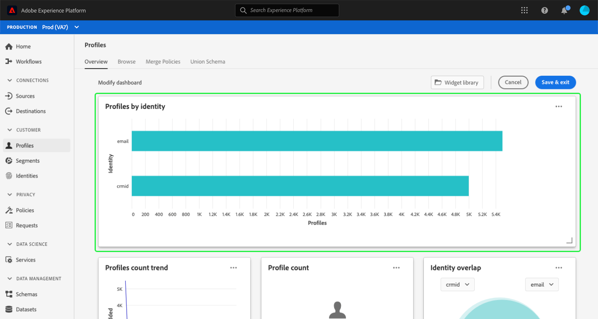

# Modificare le dashboard {#modify-dashboards}

Nell’interfaccia utente di Adobe Experience Platform puoi visualizzare e interagire con i dati dell’organizzazione utilizzando più dashboard. I widget e le metriche predefiniti visualizzati nelle dashboard possono essere regolati a livello di singolo utente per visualizzare i dati preferiti; i widget possono essere creati e condivisi tra gli utenti della stessa organizzazione.

>[!NOTE]
>
>Tutti gli aggiornamenti apportati alle dashboard sono per organizzazione e per sandbox.

Questa guida fornisce istruzioni dettagliate per personalizzare la modalità di visualizzazione dei dati del dashboard nelle dashboard [!UICONTROL Profili], [!UICONTROL Segmenti] e [!UICONTROL Destinazioni] nell&#39;interfaccia utente di Platform.

## Introduzione

Da qualsiasi dashboard, ad esempio [!UICONTROL Profili], è possibile selezionare **[!UICONTROL Modifica dashboard]** per ridimensionare e riordinare i widget esistenti.

## Riordinare i widget

Dopo aver scelto di modificare il dashboard, puoi riordinare i widget selezionando il titolo del widget e trascinandoli nell’ordine desiderato. In questo esempio, il widget **[!UICONTROL Tendenza conteggio profili]** viene spostato nella riga superiore e il widget **[!UICONTROL Conteggio profili]** viene ora visualizzato nella seconda riga.

## Ridimensionare i widget

È inoltre possibile ridimensionare un widget selezionando il simbolo dell&#39;angolo nell&#39;angolo inferiore destro del widget (`⌟`) e trascinando il widget alle dimensioni desiderate. In questo esempio, il widget **[!UICONTROL Profili per identità]** viene ridimensionato per riempire l&#39;intera riga superiore, spostando automaticamente gli altri widget alla seconda riga. Notate come l&#39;asse orizzontale si regola per fornire incrementi più dettagliati man mano che il widget diventa più grande.

>[!NOTE]
>
>Quando i widget vengono regolati in dimensione, i widget circostanti vengono riposizionati in modo dinamico. Questo potrebbe causare lo spostamento di alcuni widget in righe aggiuntive, che richiederebbero lo scorrimento per visualizzare tutti i widget.

## Salvare gli aggiornamenti del dashboard

Dopo aver spostato e ridimensionato i widget, seleziona **[!UICONTROL Salva ed esci]** per salvare le modifiche e tornare alla visualizzazione dashboard principale. Se non desideri mantenere le modifiche, seleziona **[!UICONTROL Annulla]** per reimpostare la dashboard e tornare alla visualizzazione della dashboard principale.

## Libreria widget

Oltre a ridimensionare e riordinare i widget, la selezione di **[!UICONTROL Modifica dashboard]** nei dashboard [!UICONTROL Profili], [!UICONTROL Segmenti] e [!UICONTROL Destinazioni] consente di accedere alla **[!UICONTROL Libreria widget]**, in cui è possibile trovare altri widget da visualizzare o creare widget personalizzati per l&#39;organizzazione.

Per istruzioni dettagliate su come accedere e utilizzare la [!UICONTROL libreria Widget], fare riferimento alla [guida della libreria widget](widget-library.md).

## Passaggi successivi

Dopo aver letto questo documento, hai imparato a utilizzare la funzionalità di modifica del dashboard per riordinare e ridimensionare i widget e personalizzare la visualizzazione del dashboard. Per informazioni su come creare e aggiungere widget alle dashboard, leggere la [guida alla libreria dei widget](widget-library.md).
