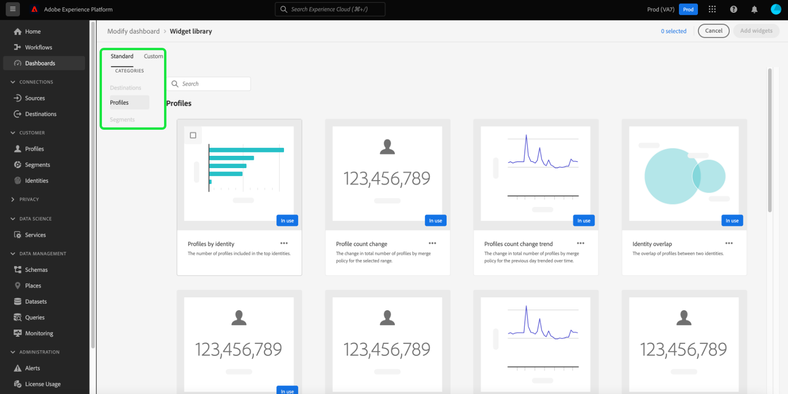

# Aggiungere widget standard alle dashboard

In Adobe Experience Platform puoi visualizzare e interagire con i dati della tua organizzazione utilizzando più dashboard. È inoltre possibile aggiornare alcune dashboard aggiungendo nuovi widget alla vista dashboard. In questo Adobe viene fornita una selezione di widget standard che è possibile scegliere di aggiungere alle dashboard.

I dashboard [[!UICONTROL Profili]](../guides/profiles.md#default-widgets), [[!UICONTROL Tipi di pubblico]](../guides/audiences.md#default-widgets) e [[!UICONTROL Destinazioni]](../guides/destinations.md#default-widgets) hanno ciascuno un widget predefinito al momento della creazione di una nuova istanza Platform. Questa guida fornisce istruzioni dettagliate per aggiungere widget standard per personalizzare le dashboard [!UICONTROL Profili], [!UICONTROL Tipi di pubblico] e [!UICONTROL Destinazioni] nell&#39;interfaccia utente di Platform.

>[!NOTE]
>
>Tutti gli aggiornamenti apportati alle dashboard sono per organizzazione e per sandbox.

Per ulteriori informazioni sui widget personalizzati, consulta la guida per [creare widget personalizzati](custom-widgets.md).

## Libreria widget {#widget-library}

Questa guida richiede l&#39;accesso alla [!UICONTROL libreria Widget] in Experience Platform. Per ulteriori informazioni sulla libreria widget e su come accedervi nell&#39;interfaccia utente, leggere la [panoramica sulla libreria widget](widget-library.md).

## Guida introduttiva ai widget standard {#standard-widgets}

All&#39;interno della libreria di widget, la scheda **[!UICONTROL Standard]** contiene widget creati per Adobe, suddivisi in categorie in base ai dashboard disponibili.

La categoria selezionata corrisponde al dashboard da cui è stata immessa la libreria di widget. In altre parole, se hai selezionato la libreria dei widget dal dashboard [!UICONTROL Profili], viene selezionata la categoria [!UICONTROL Profili] e le altre categorie sono disattivate.

Vengono visualizzati i widget standard per la categoria selezionata. Ogni widget viene visualizzato come una scheda che fornisce il titolo, la descrizione e una visualizzazione di esempio della metrica.

>[!NOTE]
>
>I widget possono essere aggiunti solo al dashboard che corrisponde alla categoria selezionata. Ad esempio, solo i widget della categoria [!UICONTROL Profili] possono essere aggiunti alla dashboard [!UICONTROL Profili].

## Aggiungi widget standard al dashboard

Per scegliere un widget standard da aggiungere al dashboard, evidenziarlo e selezionare la casella di controllo. Se è selezionato almeno un widget, il pulsante **[!UICONTROL Aggiungi widget]** diventa disponibile.

>[!NOTE]
>
>Il contatore nell&#39;angolo in alto a destra della libreria di widget mostra il numero totale di widget selezionati.

Seleziona **[!UICONTROL Aggiungi widget]** per aggiungere i widget selezionati al dashboard.

## Passaggi successivi

Dopo aver letto questo documento, potrai accedere alla libreria dei widget e utilizzarla per aggiungere widget standard a una dashboard. Per modificare le dimensioni e la posizione dei widget visualizzati nel dashboard, fare riferimento alla [guida modifica dashboard](modify.md).
