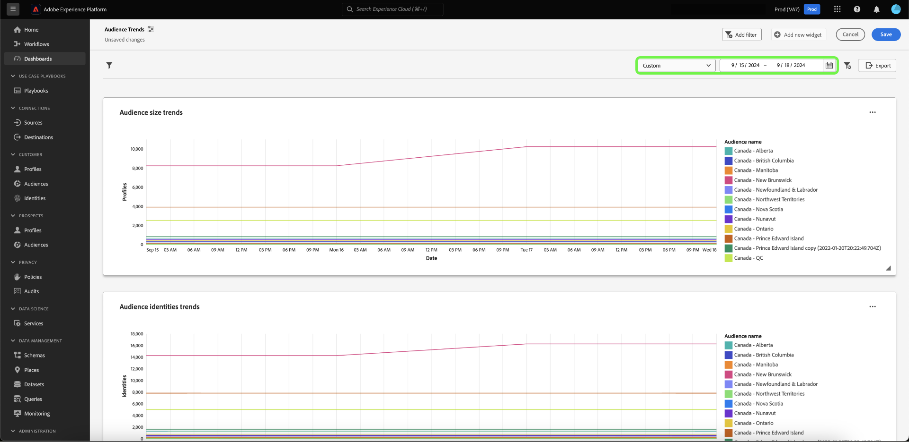
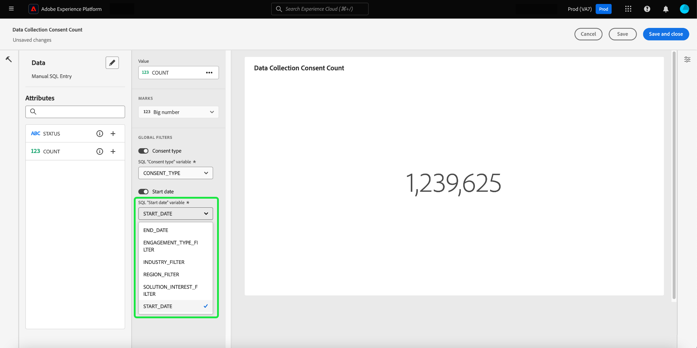

# Creare un filtro data {#create-date-filter}

Per filtrare le informazioni in base alla data, è necessario aggiungere parametri alle query SQL che possono accettare vincoli di data. Questa operazione viene eseguita come parte del flusso di lavoro per la creazione di insight in modalità query pro. Consulta la [documentazione sulla modalità query pro](#query-pro-mode) per scoprire come immettere SQL per ottenere informazioni approfondite.

I parametri di query consentono di lavorare con i dati dinamici in quanto fungono da segnaposto per i valori aggiunti in fase di esecuzione. Questi valori dei segnaposto possono essere aggiornati tramite l’interfaccia utente e consentono agli utenti meno tecnici di aggiornare le informazioni in base a intervalli di date.

Se non conosci i parametri di query, consulta la documentazione di [istruzioni su come implementare query con parametri](../../../../query-service/ui/parameterized-queries.md).

## Applicare un filtro data al dashboard {#apply-date-filter}

Per applicare un filtro data, seleziona **[!UICONTROL Aggiungi filtro]**, quindi **[!UICONTROL Filtro data]** dal menu a discesa della visualizzazione del dashboard.


Vengono visualizzate le seguenti opzioni di filtro delle date.

| Filtro | Descrizione |
| --- | --- |
| Nessuna data personalizzata | Seleziona una o più date personalizzate da più valori predefiniti. |
| Intervallo di date personalizzato | Seleziona una o più date personalizzate da più valori predefiniti oppure specifica un intervallo di date personalizzato. |
| Data personalizzata | Seleziona dai valori predefiniti o specifica la data di inizio per il dashboard. |


### Creare un filtro data non personalizzato

Per applicare un filtro di data predefinito, selezionare **[!UICONTROL Nessuna data personalizzata]**, quindi selezionare le opzioni di data predefinite che si desidera includere. Infine, utilizza il menu a discesa per selezionare l&#39;intervallo di date predefinito, quindi seleziona **[!UICONTROL Salva]**.


Viene visualizzata di nuovo la dashboard contenente l’intervallo date predefinito selezionato in precedenza. Utilizza il menu a discesa per selezionare un altro intervallo di date predefinito.


### Creare un filtro per intervalli di date personalizzato

Per applicare un filtro per intervalli di date personalizzato, seleziona **[!UICONTROL Intervallo di date personalizzato]**, quindi seleziona le opzioni di data predefinite che desideri includere. Infine, seleziona **[!UICONTROL Personalizzato]** per impostare l&#39;intervallo di date predefinito. Utilizza il calendario per specificare un intervallo di date, quindi seleziona **[!UICONTROL Salva]**.

>[!NOTE]
>
>Non è necessario selezionare opzioni di data predefinite.


Viene visualizzata di nuovo la dashboard, che mostra l’intervallo di dati personalizzato precedentemente specificato. Utilizza il menu a discesa per selezionare un altro intervallo di date predefinito.



### Creare un filtro data personalizzato

Per applicare un filtro data personalizzato, selezionare **[!UICONTROL Data personalizzata]** e selezionare le opzioni date predefinite da includere. Infine, seleziona **[!UICONTROL Personalizzato]**, quindi utilizza il calendario per selezionare una data di inizio. Infine, selezionare **[!UICONTROL Salva]**.

>[!NOTE]
>
>Non è necessario selezionare opzioni di data predefinite.


Viene visualizzata di nuovo la dashboard contenente i dati personalizzati precedentemente specificati. Utilizza il menu a discesa per selezionare un’altra data.


## Eliminare un filtro data {#delete-date-filter}

Per rimuovere il filtro di data, selezionare l&#39;icona Elimina filtro ().


## Modifica il codice SQL per includere i parametri di query della data {#include-date-parameters}

Quindi, assicurati che il codice SQL includa i parametri di query per consentire un intervallo di date. Se non hai ancora incorporato i parametri di query nell’istruzione SQL, modifica le informazioni per includere questi parametri. Per istruzioni su come [modificare un approfondimento](../overview.md#edit), consulta la documentazione.

>[!TIP]
>
>Si consiglia di aggiungere `$START_DATE` e `$END_DATE` parametri all&#39;istruzione SQL in ciascuno dei grafici per i quali si desidera abilitare i filtri di data.

>[!NOTE]
>
>I filtri di data non supportano vincoli di tempo. Il filtro si applica solo agli intervalli di date. Ciò significa che se hai più rapporti in un periodo di 24 ore, non puoi distinguere tra diverse ore all’interno dello stesso giorno. Per questo motivo, si consiglia di assegnare al componente tempo la forma di data.

Se il modello dati o le tabelle che si sta analizzando hanno un componente tempo, è possibile raggruppare i dati per data e quindi applicare questi filtri data.

L&#39;istruzione SQL di esempio seguente illustra come incorporare i parametri `$START_DATE` e `$END_DATE` e utilizza `cast` per inquadrare il componente tempo come una data.

```sql
SELECT Sum(personalization_consent_count) AS Personalization,
       Sum(datacollection_consent_count)  AS Datacollection,
       Sum(datasharing_consent_count)     AS Datasharing
FROM   fact_daily_consent_aggregates f
       INNER JOIN dim_consent_valued
               ON f.consent_value_id = d.consent_value_id
WHERE  f.date BETWEEN Upper(Coalesce(Cast('$START_DATE' AS date), '')) AND Upper
                      (
                             Coalesce(Cast('$END_DATE' AS date), ''))
       AND ( ( Upper(Coalesce($consent_value_filter, '')) IN ( '', 'NULL' ) )
              OR ( f.consent_value_id IN ( $consent_value_filter ) ) )
LIMIT  0; 
```

La schermata seguente evidenzia i vincoli di data incorporati nell’istruzione SQL e le coppie di valori chiave dei parametri della query.

>[!NOTE]
>
>Durante la composizione dell’istruzione in modalità query pro, è necessario fornire valori di esempio per ciascun parametro al fine di eseguire l’istruzione SQL e generare il grafico. I valori di esempio forniti durante la composizione dell’istruzione vengono sostituiti dai valori effettivi selezionati per il filtro data (o globale) in fase di esecuzione.

![Finestra di dialogo [!UICONTROL Inserisci SQL] con i parametri di data evidenziati nell&#39;istruzione SQL.](../../../images/sql-insights/sql-date-parameters.png)

## Abilita i parametri di data in ogni informazione approfondita {#enable-date-parameters}

Dopo aver incorporato i parametri appropriati nell&#39;istruzione SQL delle informazioni, le variabili `Start_date` e `End_date` sono ora disponibili come opzioni nel compositore widget. Per informazioni su come modificare un approfondimento, consulta la sezione [popolazione widget modalità query pro](#populate-widget).

Dal compositore widget, selezionare Attiva/Disattiva per abilitare i parametri `Start_date` e `End_date`.


Quindi, seleziona i parametri di query appropriati dai menu a discesa.



Infine, seleziona **[!UICONTROL Salva e chiudi]** per tornare al dashboard. I filtri di data sono ora abilitati per tutte le informazioni che hanno parametri di data di inizio e di fine.
