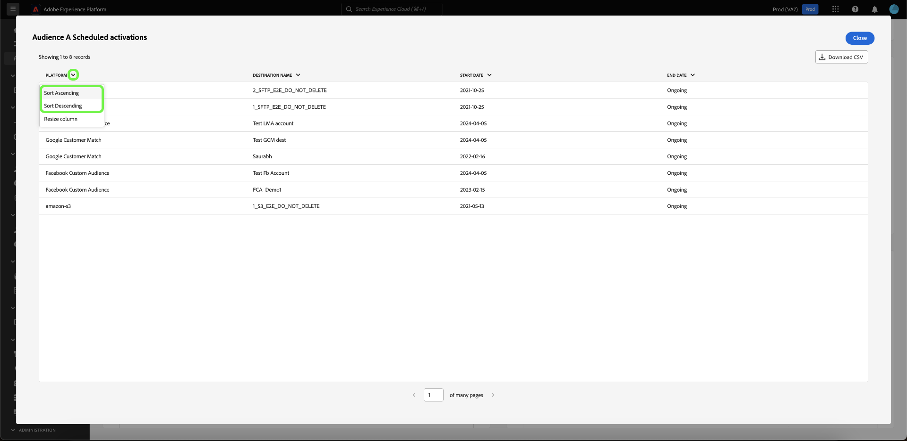

# Visualizza altro {#view-more}

Dopo aver creato un [approfondimento personalizzato](../sql-insights/overview.md) con [modalità query pro](./overview.md), puoi visualizzare i dati del grafico in diversi formati. Puoi visualizzare i risultati sotto forma di tabella oppure scaricare i dati come file CSV da visualizzare in un foglio di calcolo.

## Risultati tabulati {#tabulated-results}

Per ogni grafico creato utilizzando la modalità query pro tramite SQL, puoi visualizzare i risultati tabulati dell’analisi nell’interfaccia utente di Experience Platform.

Dal dashboard personalizzato, selezionare i puntini di sospensione (`...`) in qualsiasi widget per accedere alle opzioni [!UICONTROL Visualizza altro] e [!UICONTROL Visualizza SQL].

## Scarica CSV {#download-csv}

La funzionalità [!UICONTROL Visualizza altro] visualizza le coordinate specifiche del grafico sotto forma di tabella. Per semplificare il processo di condivisione e manipolazione dei dati, puoi scaricare i dati elaborati in formato CSV da questa finestra di dialogo. Seleziona **[!UICONTROL Scarica CSV]** per scaricare i dati.

>[!NOTE]
>
>Il download del file CSV è limitato ai primi 500 record.

## Ordina per colonna {#sort-column}

Quando si visualizzano i risultati tabulati, è possibile utilizzare la funzionalità di ordinamento per colonna in ordine crescente o decrescente. Dal dashboard personalizzato, selezionare i puntini di sospensione (`...`) in qualsiasi tabella per accedere all&#39;opzione [!UICONTROL Visualizza altro].

Puoi ordinare le colonne selezionando il menu a discesa accanto al nome della colonna, quindi selezionando **[!UICONTROL Ordine crescente]** o **[!UICONTROL Ordine decrescente]**.

>[!NOTE]
>
>Le opzioni [!UICONTROL Ordinamento crescente] e [!UICONTROL Ordinamento decrescente] verranno visualizzate solo per le colonne configurate con [funzionalità di ordinamento](./overview.md#advanced-attributes).

## Ridimensionare una colonna {#resize-column}

Puoi ridimensionare le colonne nei risultati tabulati per migliorare la leggibilità dei dati. Dal dashboard personalizzato, selezionare i puntini di sospensione (`...`) per consentire alla tabella di accedere all&#39;opzione [!UICONTROL Visualizza altro]. Utilizza il menu a discesa accanto al nome della colonna per ridimensionarla, quindi seleziona **[!UICONTROL Ridimensiona colonna]**.

Selezionare il dispositivo di scorrimento e trascinarlo a sinistra o a destra per regolare la dimensione della colonna in base alle esigenze.

## Paginazione tabella {#table-pagination}

La paginazione viene applicata automaticamente alle tabelle nella funzionalità [!UICONTROL Visualizza altro], eliminando la necessità di modificare manualmente le query SQL. Questa funzione garantisce che i dati vengano presentati in un formato più gestibile, facilitando il processo di navigazione tra set di dati di grandi dimensioni.

È possibile visualizzare fino a 500 record per pagina. Per spostarsi tra i record, utilizzare **[!UICONTROL >]** situato nella parte inferiore della pagina.

## Passaggi successivi

Dopo aver letto questo documento, ora sai come visualizzare i risultati tabulati dell’analisi SQL del grafico personalizzato e scaricare i dati come file CSV. Per informazioni su come [visualizzare le istruzioni SQL alla base delle tue informazioni personalizzate](./view-more.md), consulta il documento Visualizza SQL.

Puoi anche imparare a generare grafici dai modelli di dati esistenti nell&#39;interfaccia utente di Adobe Experience Platform con la [guida guidata alla modalità di progettazione](../../user-defined-dashboards.md).
