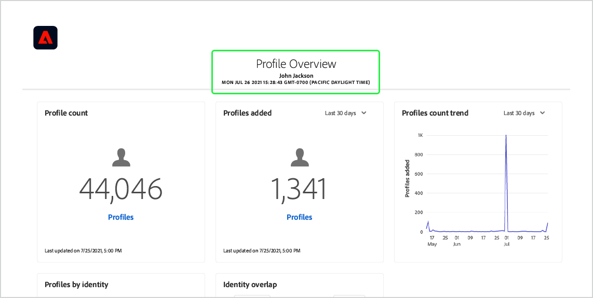
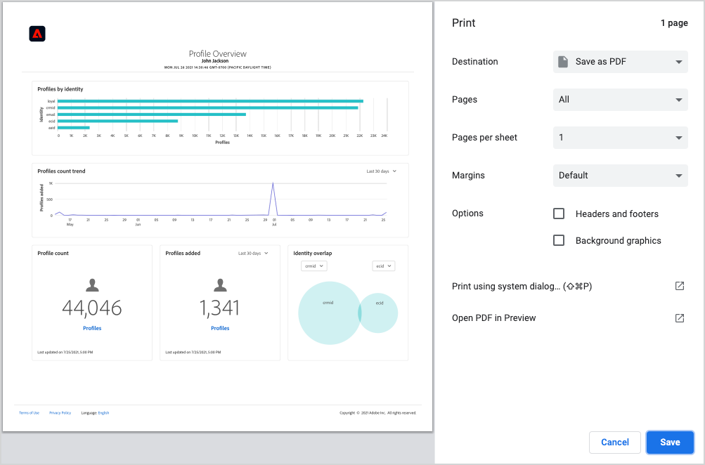

# Scarica dashboard in PDF

Le dashboard all’interno di Adobe Experience Platform possono essere scaricate in PDF dall’interfaccia utente di Platform per facilitare la condivisione di informazioni con i membri della tua organizzazione.

Questo documento fornisce un riepilogo su come scaricare i dashboard utilizzando l’interfaccia utente di Platform e salvarli in PDF utilizzando il menu di stampa predefinito del browser.

>[!WARNING]
>
>I dati contenuti nelle dashboard possono includere informazioni personali (PII, personally identifiable information) sui clienti o dati sensibili relativi all’organizzazione. Tutti i dati del dashboard salvati in PDF devono essere gestiti in modo appropriato in base alle linee guida sulla privacy dei dati della tua organizzazione.

## Scarica dashboard

Per iniziare a scaricare un dashboard, passare al dashboard che si desidera scaricare, ad esempio il dashboard [!UICONTROL Profili], quindi selezionare il menu altre opzioni (**`...`**) dall&#39;angolo superiore destro del dashboard. Selezionare **[!UICONTROL Scarica]**.

## Anteprima PDF

Dopo aver selezionato **[!UICONTROL Scarica]**, viene aperto il menu di stampa predefinito del browser. In questo esempio viene visualizzato il menu di stampa di Google Chrome.

Il menu di stampa consente di visualizzare in anteprima il PDF che verrà salvato. Il PDF è una rappresentazione fedele dei widget del dashboard visualizzati nell’interfaccia utente di Platform e le dimensioni del PDF vengono regolate automaticamente in modo da visualizzare tutti i widget del dashboard attualmente visibili in una singola pagina.

Il PDF include un’intestazione generata automaticamente contenente il logo dell’Experience Platform, il nome della dashboard, il nome dell’utente e la data e l’ora in cui la dashboard è stata scaricata. Queste informazioni sono di sola lettura e non possono essere modificate in PDF.

## Salva come PDF

Dopo aver visualizzato l&#39;anteprima del PDF, seleziona **Salva** per scegliere il percorso in cui salvare il PDF.

>[!NOTE]
>
>Se necessario, puoi utilizzare il menu a discesa **Destinazione** per selezionare **Salva come PDF** se tale opzione non è selezionata automaticamente.

## Personalizzare i PDF del dashboard

Il PDF generato corrisponde al dashboard che è possibile visualizzare nell’interfaccia utente e include solo i widget attualmente visibili nel dashboard. Alcuni dashboard possono essere personalizzati per modificare le dimensioni e la posizione dei widget o per aggiungere e rimuovere widget dalla visualizzazione. La personalizzazione dell’aspetto del dashboard nell’interfaccia utente di Platform cambia anche l’aspetto del PDF generato.

Ad esempio, puoi modificare l’aspetto del dashboard dei profili in modo da includere diversi widget a larghezza intera sovrapposti a tre widget standard.

Selezionando per scaricare il dashboard aggiornato si ottiene una nuova anteprima PDF che corrisponde all’aspetto del dashboard dei profili personalizzati. Inoltre, regola automaticamente le dimensioni del PDF per garantire che tutti i widget visibili siano inclusi in un PDF di una pagina.

Per ulteriori informazioni sulla personalizzazione delle dashboard, leggere la [panoramica sulla personalizzazione delle dashboard](customize/overview.md).

## Passaggi successivi

Dopo aver scaricato il dashboard e averlo salvato come PDF PDF, puoi ripetere questi passaggi per scaricare dashboard aggiuntivi o condividerlo con i membri della tua organizzazione.
