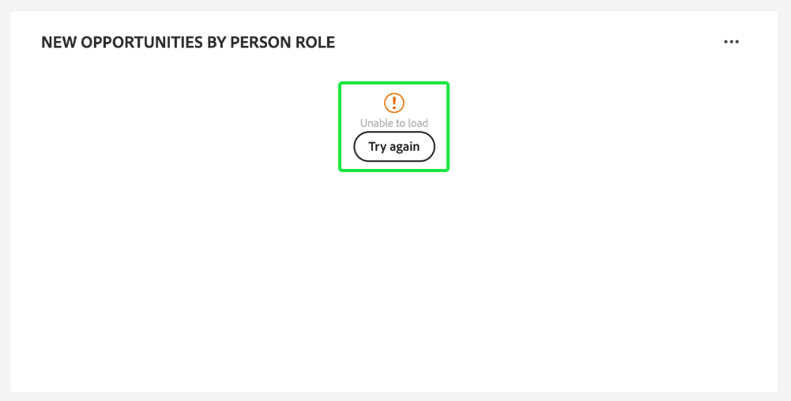

# Dashboard dei profili account

L’interfaccia utente di Adobe Experience Platform fornisce una dashboard attraverso la quale puoi visualizzare informazioni importanti sui profili dell’account, acquisite durante un’istantanea giornaliera. Questa guida illustra come accedere e utilizzare il dashboard [!UICONTROL Account Profiles] nell&#39;interfaccia utente e fornisce ulteriori informazioni sulle visualizzazioni visualizzate nel dashboard.

Questo documento fornisce una panoramica delle funzioni del dashboard [!UICONTROL Account Profiles] e descrive le informazioni standard disponibili. Per informazioni complete sulle funzioni disponibili, consultare la [[!UICONTROL Account Profiles] Guida dell&#39;interfaccia utente](../../rtcdp/accounts/account-profile-ui-guide.md).

## Introduzione

Devi avere diritto a [Adobe Real-Time Customer Data Platform B2B edition](../../rtcdp/b2b-overview.md) per accedere al dashboard [!UICONTROL Account Profiles] B2B.

## Dati dei profili account {#data}

Nel dashboard di [!UICONTROL Account Profiles] viene visualizzata un&#39;istantanea delle informazioni dell&#39;account unificato. Queste informazioni sull’account provengono dalle diverse origini nei vari canali di marketing e dai diversi sistemi attualmente utilizzati dalla tua organizzazione per archiviare le informazioni sull’account del cliente.

I dati di profilo nello snapshot mostrano i dati esattamente come vengono visualizzati nel momento specifico in cui lo snapshot è stato creato. In altre parole, lo snapshot non è un&#39;approssimazione o un campione dei dati e il dashboard [!UICONTROL Account Profiles] non viene aggiornato in tempo reale.

>[!NOTE]
>
>Eventuali modifiche o aggiornamenti apportati ai dati dal momento in cui è stata acquisita l’istantanea non verranno riflessi nel dashboard fino all’acquisizione dell’istantanea successiva.

## Esplora il dashboard [!UICONTROL Account Profiles] {#explore}

Per passare al dashboard [!UICONTROL Account Profiles] nell&#39;interfaccia utente di Experience Platform, seleziona **[!UICONTROL Profiles]** in [!UICONTROL Accounts] nel pannello di navigazione a sinistra.

Dal dashboard [!UICONTROL Account Profiles], puoi [sfogliare i profili dell&#39;account acquisiti nell&#39;organizzazione](#browse-account-profiles) oppure [visualizzare tutti i dati del profilo dell&#39;account utilizzando i widget](#standard-widgets).

### Filtro data {#date-filter}

La scheda [!UICONTROL Overview] è composta da widget che forniscono metriche di sola lettura per trasmettere informazioni importanti sui profili dell&#39;account. Seleziona l&#39;icona o le date del calendario per modificare il filtro data globale per i widget.

>[!IMPORTANT]
>
>L&#39;intervallo di date selezionato nel calendario a discesa influisce su tutte le informazioni tranne i due widget di punteggio predittivo ([distribuzione](#predictive-scoring-distribution) e [fattori influenti principali](#predictive-scoring-top-influential-factors)).

### Configurare il lead per il servizio di corrispondenza account {#lead-to-account-matching-service}

Selezionare **[!UICONTROL Settings]** per configurare il lead per il servizio di corrispondenza account dalla finestra di dialogo [!UICONTROL Account settings]. Per informazioni dettagliate su come configurare la corrispondenza tra lead e account, consulta la [guida dell&#39;interfaccia utente](../../rtcdp/accounts/account-profile-ui-guide.md#configure-lead-to-account-matching). Per ulteriori informazioni sulla corrispondenza lead-account, consulta [lead-account matching nella documentazione di Real-Time CDP B2B](../../rtcdp/b2b-ai-ml-services/lead-to-account-matching.md).

## Sfogliare i profili account {#browse-account-profiles}

Dalla scheda [!UICONTROL Browse], puoi cercare e visualizzare i profili dell&#39;account di sola lettura acquisiti nell&#39;organizzazione. Utilizzare un ID account da un&#39;origine aziendale connessa oppure immettere direttamente i dettagli dell&#39;origine. Da questa area di lavoro puoi visualizzare informazioni importanti appartenenti al profilo dell’account, tra cui nome, settore, ricavi e pubblico.

Selezionare [!UICONTROL Profile ID] dai risultati visualizzati nella scheda [!UICONTROL Browse] per aprire la scheda [!UICONTROL Details] per il profilo account.

Le informazioni sul profilo account visualizzate nella scheda [!UICONTROL Details] sono state unite da più frammenti di profilo per formare un&#39;unica visualizzazione del singolo account. Per ulteriori informazioni sulle funzionalità di visualizzazione dei profili dell&#39;account nell&#39;interfaccia utente di Experience Platform, consulta la documentazione su [esplorazione dei profili dell&#39;account in Adobe Real-Time Customer Data Platform](../../rtcdp/accounts/account-profile-ui-guide.md#browse-account-profiles).

## Widget standard {#standard-widgets}

>[!CONTEXTUALHELP]
>id="platform_dashboards_accountprofiles_customersperaccountoverview"
>title="Panoramica sui clienti per account"
>abstract="Questo widget drill-through fornisce informazioni sulla struttura dei dati B2B. Consente di identificare quanti profili account non hanno profili cliente collegati o hanno uno o più profili cliente associati.<ul><li>Clienti diretti: sono profili cliente collegati direttamente a un account tramite il percorso `personComponents`.</li><li>Clienti indiretti: sono profili cliente collegati a un account tramite il percorso `Account-Person`.</li></ul>"

Adobe fornisce widget standard che puoi utilizzare per visualizzare diverse metriche relative ai profili del tuo account.

>[!IMPORTANT]
>
>Se non fornisci un filtro per date, il comportamento predefinito di Insights analizza i dati aggiunti dall’anno precedente fino a oggi.

Per ulteriori informazioni su ciascuno dei widget standard disponibili, selezionare il nome di un widget dall&#39;elenco seguente:

* [Profili account aggiunti](#account-profiles-added)
* [Panoramica sui clienti per account](#customers-per-account-overview)
   * [Panoramica sulle opportunità per account](#opportunities-per-account-overview)
   * [Dettagli opportunità per account](#opportunities-per-account-detail)
   * [Dettagli clienti per account](#customers-per-account-detail)
* [Nuovi account per settore](#accounts-by-industry)
* [Nuovi account per tipo](#accounts-by-type)
* [Nuove opportunità per ruolo persona](#opportunities-by-person-role)
* [Nuove opportunità in base ai ricavi](#opportunities-by-revenue)
* [Nuove opportunità per stato e fase](#opportunities-by-status-&-stage)
* [Nuove opportunità realizzate](#opportunities-won)
* [Opportunità aggiunte](#opportunities-added)
* [Distribuzione del punteggio predittivo](#predictive-scoring-distribution)
* [Fattori influenti principali con punteggio predittivo](#predictive-scoring-top-influential-factors)

### Profili account aggiunti {#account-profiles-added}

Il widget [!UICONTROL Account profiles added] utilizza un grafico a linee per visualizzare il numero di profili di account aggiunti ogni giorno in un periodo di tempo. Utilizza il filtro data globale che si trova nella parte superiore del dashboard per determinare il periodo di analisi. Se non viene fornito alcun filtro di data, il comportamento predefinito elenca i profili di account aggiunti per l’anno precedente a oggi. I risultati possono essere utilizzati per dedurre una tendenza nel numero di profili di account aggiunti.

### Panoramica sui clienti per account {#customers-per-account-overview}

>[!NOTE]
>
>L&#39;insight [!UICONTROL Customers per account overview] e i relativi grafici drill-through ([!UICONTROL Customers per account detail], [!UICONTROL Opportunities per account overview], [!UICONTROL Opportunities per account detail]) non sono interessati da filtri di data globali eventualmente impostati.

Il grafico [!UICONTROL Customers per account overview] fornisce un riepilogo dei conti in base ai tipi di clienti. Visualizza una tabella a quattro righe che classifica i conti come clienti diretti o indiretti o senza. Fornisce il numero totale di conti per ogni categoria. Il grafico consente di identificare la distribuzione dei conti con clienti diretti e indiretti.

I clienti diretti sono profili cliente collegati direttamente a un account tramite il percorso `personComponents`. Questa relazione è più semplice e implica un collegamento diretto ed esplicito tra il cliente e l’account.

I clienti indiretti sono profili cliente collegati a un account tramite il percorso `Account-Person`. Questa relazione è meno semplice e coinvolge un’entità intermedia o una connessione più complessa tra il cliente e il conto, in genere attraverso altri conti o relazioni.

Per accedere a informazioni più dettagliate, selezionare l&#39;ellisse (**...**) nel grafico [!UICONTROL Customers per account overview] e scegliere **[!UICONTROL Drill through]** dal menu a discesa.

Viene visualizzata la vista drill-through. Quindi, esplora i grafici drill-through disponibili per comprendere meglio la struttura dei dati B2B. Puoi utilizzare questi grafici drill-through per identificare quanti profili account non hanno profili cliente collegati o a cui sono associati uno o più profili cliente. Puoi anche utilizzarli per identificare quanti clienti diretti o indiretti sono associati ai tuoi account.

* [[!UICONTROL Customers per account detail]](#customers-per-account-detail)
* [[!UICONTROL Accounts per opportunity overview]](#accounts-per-opportunity-overview)
* [[!UICONTROL Opportunities per account detail]](#accounts-per-opportunity-detail)

### [!UICONTROL Navigate between dashboard views] {#dashboard-view-navigation}

Per passare dal drill-through al dashboard Profili account e viceversa, selezionare l&#39;icona della cartella () seguita dalla visualizzazione corretta dal menu a discesa.

Per ulteriori informazioni sui drill-through nell&#39;interfaccia utente di Experience Platform, consulta la [guida drill-through](../sql-insights-query-pro-mode/drill-through.md).

#### [!UICONTROL Customers per account detail] {#customers-per-account-detail}

Il grafico [!UICONTROL Customers per account detail] fornisce dettagli più granulari sul numero di account associati a diversi tipi di clienti. Viene visualizzata una tabella a tre colonne che descrive il numero di conti per tipo di cliente (diretto o indiretto) e l’intervallo di clienti associati. Questo grafico consente di comprendere il modo in cui i clienti sono distribuiti tra diverse categorie di clienti e il numero totale di account associati a ciascuno di essi.

#### [!UICONTROL Opportunities per account overview] {#opportunities-per-account-overview}

Il grafico [!UICONTROL Opportunities per account overview] presenta un riepilogo dei conti che hanno o non hanno opportunità. Questa tabella a due righe consente di determinare rapidamente il numero di account associati alle opportunità, fornendo un’istantanea del coinvolgimento delle opportunità tra gli account.

#### [!UICONTROL Opportunities per account detail] {#opportunities-per-account-detail}

Il grafico [!UICONTROL Opportunities per account detail] offre una suddivisione più dettagliata degli account in base al numero di opportunità di cui dispongono. Nella tabella viene visualizzato il numero di account raggruppati per intervalli di conteggio delle opportunità, ad esempio 1-10 opportunità o oltre 100 opportunità. Questo grafico consente di identificare la modalità di distribuzione degli account in base al numero di opportunità gestite.

### Nuovi account per settore {#accounts-by-industry}

Il widget [!UICONTROL New accounts by industry] visualizza il numero totale di account in una singola metrica all&#39;interno di un grafico ad anello. Il grafico ad anello illustra la composizione relativa dei diversi settori che compongono questo totale. Un codice colore fornisce una suddivisione di tutti i settori inclusi. I conteggi individuali per ciascun settore vengono visualizzati in una finestra di dialogo quando il cursore passa sopra la rispettiva sezione del grafico ad anello.

### Nuovi account per tipo {#accounts-by-type}

Il widget [!UICONTROL New accounts by type] visualizza il numero totale di account in una singola metrica all&#39;interno di un grafico ad anello. Il grafico ad anello illustra la composizione relativa dei diversi tipi di conto che compongono questo totale. Una chiave con codice colore fornisce un raggruppamento di tutti i tipi di conto inclusi. I conteggi individuali per ciascun tipo di account vengono visualizzati in una finestra di dialogo quando il cursore passa sopra la rispettiva sezione del grafico ad anello.

### Nuove opportunità per ruolo persona {#opportunities-by-person-role}

Il widget [!UICONTROL New opportunities by person role] visualizza il numero totale delle opportunità in una singola metrica all&#39;interno di un grafico ad anello. Il grafico ad anello illustra la composizione relativa dei ruoli che compongono questo numero totale di opportunità. Una chiave con codice colore fornisce un raggruppamento di tutti i ruoli inclusi. I conteggi individuali per ciascun ruolo vengono visualizzati in una finestra di dialogo quando il cursore passa sopra la rispettiva sezione del grafico ad anello.

>[!NOTE]
>
>L&#39;errore [!UICONTROL No data found] o [!UICONTROL Unable to load] si verifica quando la tabella bridge &#39;Opportunity-Person&#39; non viene utilizzata nello schema. Se il tuo insight presenta uno di questi errori, controlla lo schema di unione e assicurati che il gruppo di campi &quot;Opportunità-Persona&quot; acquisisca i dati.

### Nuove opportunità in base ai ricavi {#opportunities-by-revenue}

Il widget [!UICONTROL New opportunities by revenue] utilizza un grafico a barre per illustrare la quantità totale stimata di ricavi generati dalle opportunità. Il widget supporta fino a sei opportunità.

Per visualizzare una finestra di dialogo contenente il totale dei ricavi specifici di un’opportunità, utilizza il cursore per passare il puntatore del mouse sulle singole barre.

### Nuove opportunità per stato e fase {#opportunities-by-status-&-stage}

Questo widget utilizza un grafico a barre per illustrare il numero di opportunità aperte o chiuse in tutte le fasi del funnel marketing/vendite. Il widget utilizza i colori per differenziare lo stadio delle opportunità. Una chiave con codice colore indica le fasi disponibili per le opportunità.

### Nuove opportunità realizzate {#opportunities-won}

Il widget [!UICONTROL New opportunities won] visualizza il numero totale di opportunità completate correttamente in una singola metrica all&#39;interno di un grafico ad anello. Il grafico ad anello illustra la composizione relativa delle opportunità che vengono vinte o meno. Una chiave con codice colore distingue tra opportunità realizzate e opportunità non realizzate. I conteggi individuali per ciascun ruolo vengono visualizzati in una finestra di dialogo quando il cursore passa sopra la rispettiva sezione del grafico ad anello.

### Opportunità aggiunte {#opportunities-added}

Il widget [!UICONTROL Opportunities added] utilizza un grafico a linee per visualizzare il numero di opportunità aggiunte ogni giorno in un periodo di tempo. Utilizza il filtro data globale che si trova nella parte superiore del dashboard per determinare il periodo di analisi. Se non viene fornito alcun filtro di data, il comportamento predefinito elenca le opportunità aggiunte per l’anno precedente a oggi. I risultati possono essere utilizzati per dedurre una tendenza nel numero di opportunità aggiunte.

<!-- Link to date filter documentation from Annamalai -->

### Distribuzione del punteggio predittivo {#predictive-scoring-distribution}

Il widget [!UICONTROL Predictive scoring distribution] mostra la distribuzione del punteggio di tutti i profili di account per consentirti di comprendere immediatamente lo stato della pipeline delle vendite. I dati di punteggio vengono trasmessi attraverso un grafico ad anello e un istogramma.

Il grafico ad anello illustra la proporzione dei profili di conto totali in ciascuno dei periodi fissi di propensione elevata, media e bassa all’acquisto. La chiave fornisce ulteriori dettagli sulle sezioni codificate per colore, inclusi gli intervalli di bucket di punteggio e il numero di profili account in tale intervallo.

L’istogramma fornisce una suddivisione più granulare del punteggio. Ogni colonna mostra il numero di profili conto in ciascuno dei 20 bucket con incrementi di cinque punti.

Il menu a discesa all’interno del widget consente di selezionare il modello di punteggio dell’account.

>[!NOTE]
>
>I filtri per l’intervallo di date globale non si applicano agli approfondimenti di valutazione predittiva. I widget con punteggio predittivo analizzano i dati in base al modello di punteggio dell’account selezionato nel menu a discesa.

### Fattori influenti principali con punteggio predittivo {#predictive-scoring-top-influential-factors}

Il widget [!UICONTROL Predictive scoring top influential factors] consente di comprendere i fattori più significativi che determinano i punteggi per ogni bucket di propensione.

Questo widget mostra i principali fattori di influenza per ciascuno dei bucket di propensione alta, media e bassa. Una barra per ciascun fattore influente indica la percentuale dei profili conto in quel bucket di propensione che contiene il fattore influente specifico.

Il menu a discesa all’interno del widget consente di selezionare il modello di punteggio dell’account.

>[!NOTE]
>
>I filtri per l’intervallo di date globale non si applicano agli approfondimenti di valutazione predittiva. I widget con punteggio predittivo analizzano i dati in base al modello di punteggio dell’account selezionato nel menu a discesa.

## Errore nell’operazione di caricamento dati {#errors}

Se un widget visualizza *[!UICONTROL Unable to load. Try again.]*, ciò si verifica perché non sono disponibili dati per l&#39;entità B2B. Ad esempio, il widget visualizzato sotto [!UICONTROL New opportunities by person role] mostra il messaggio &quot;[!UICONTROL Unable to load. Try again.]&quot; poiché questa sandbox non dispone di dati di opportunità disponibili.

Per risolvere il problema, è necessario acquisire nella sandbox i dati dell&#39;entità B2B, ad esempio i dati di *persona opportunità*. Dopo 48 ore, i dati vengono riflessi nei widget.

## Passaggi successivi

Seguendo questo documento, ora dovresti sapere come individuare il dashboard [!UICONTROL Account Profiles] e comprendere anche le metriche visualizzate nei widget disponibili. Per ulteriori informazioni sull&#39;utilizzo dei profili account come parte dei dati B2B nell&#39;interfaccia utente di Experience Platform, consulta la [panoramica dei profili account](../../rtcdp/accounts/account-profile-overview.md) per Adobe Real-Time CDP, B2B edition.
